# ADI Data Converter Chapter5

P306应该是pdf的34页

## 数据转换器规格和测试的简要历史概述

尽管在这本书的第一张中，已经概述了数据转换器的历史，数据转换器的规格以及相关测试方法的发展仍然值得这一章中额外的评论。去指出为什么，尤其是DSP为基础的测试方法，会变成今天的ADC的广泛接受的测试方法，是很有趣的。

自1940年延续至今的数据转换器的发展，仍然可以根据采样频率大致地划分为两种：低速（通常与更高的精度相关联，最高可达24-bits）和高速（通常与低精度相关联，但最近也发展到了14-16bits，因此界限变得不那么清晰）。这在20世纪40-50年代是相当正确的，那时候用在Bell System中用于PCM（脉冲编码调制）的ADC和DAC一般需要100k范围左右的采样频率，分辨率5-9bits.这些数据转换器通常使用ADC和匹配的DAC测试。通过背靠背方式连接（组成一个编码-译码器coder-decoder，或者叫codec），因为这个组合的性能就能决定整个系统的性能。来自模拟测试信号生成器的模拟信号驱动了ADC，而模拟测试设备是用来测试DAC生成的信号的。待会儿会讨论。背对背测试在高到大约（or so）12bits分辨率的时候依然有重要作用，尤其是在ADC性能的2初步估计。
>如下文中所说，所谓“背对背”测试方式，应该就是使用性能更好的DAC，将ADC生成的数字码重建为模拟信号，再进行观察或测量。

第一个通用的商业数据转换器出现在20世纪50年代中期，由Bernard M.Gordon于1954年在Epsco设计的11bits，50kSPS的DATRAC真空管转换器开创。Gordon自己是定义数据转换器性能的先驱，尤其是哪些高精度应用相关的性能，并且写了很多转换器规格相关的文章。

在20世纪60年代，随着固态数据转换器和大型计算机的出现，对ADC和DAC的兴趣迅速增长。早期的驱动力是数据分析，仪器，PCM，以及雷达应用。

在交流应用中，由于缺少低成本内存和随时可用的数字计算机，那时候仍然没有办法去直接测量所谓的“采样”ADC的频域性能。任何频域性能特性都必须使用“背对背”方式测试，需要使用比被测ADC的动态和静态性能更好的重建DAC。

到20世纪70年代中期，迷你计算机（比如DEC的PDP系列）使得使用快速傅里叶变换（FFT）的频域测试对ADC生产商而言变得实际。IEEE-488总线成为了将数据从包含ADC采样的缓冲内存转移到用来分析的电脑中的一个方便的途径。

同样在20世纪70年代，ADC和DAC再像数字视频中的全新应用使得特定应用的测试成为了一个需求。

20世纪80年代见证了ADC交流测试方面的广泛发展。生产商们开始在一些交流规格上进行标准化，比如SNR，SINAD，ENOB，THD，等等，这些规格组成了采样ADC的全部数据手册。这些规格对通信领域的新兴（emerging）应用而言十分重要，在这里宽动态范围至关重要（of utmost importance）。

除了ac测试的演变，用于测试ADC静态DNL和INL性能的直方图测试法几乎（virtually）取代了老的方法。

到20世纪90年代，ADC和DAC的频域测试方法成为常态，随时可用的FFT软件，个人电脑，以及生产商的评估板，使得这种方法对大部分消费者而言都容易掌握。今天（2004），除了设计用于测量应用的高分辨率ADC，几乎所有的采样ADC都以交流性能为特征。尽管行业中有一些这样那样的不一致，大部分生厂商基本都采用了本书第二章中讨论的一套规格和相关术语。

## 静态ADC测试

像我们在前一部分（Section 5.1 DAC测试）看到的一样，DAC的静态测试基本由：测量不同的数字输入码对应的输出电压组成。对于特定的DAC结构以及对应的错误特性的知识也许能允许在实际电压测量中少测一点。但这只会加速测试时间，不会改变基本的测试方法和概念。

在一个DAC中，无论DNL与INL误差如何，对每个数字输入码，都有一个特定的输出电压。但对一个ADC，对一个输出码，并没有一个特定的输入电压--有一个1LSB宽的输入电压区域（对无噪ADC）将会产生相同的数字码。这被称为：*量化不确定性*，这在指定和测量ADC静态转移特性时或许会引起困惑。图5.26展示了定义ADC模拟输入和数字输出码的两个可能的方法：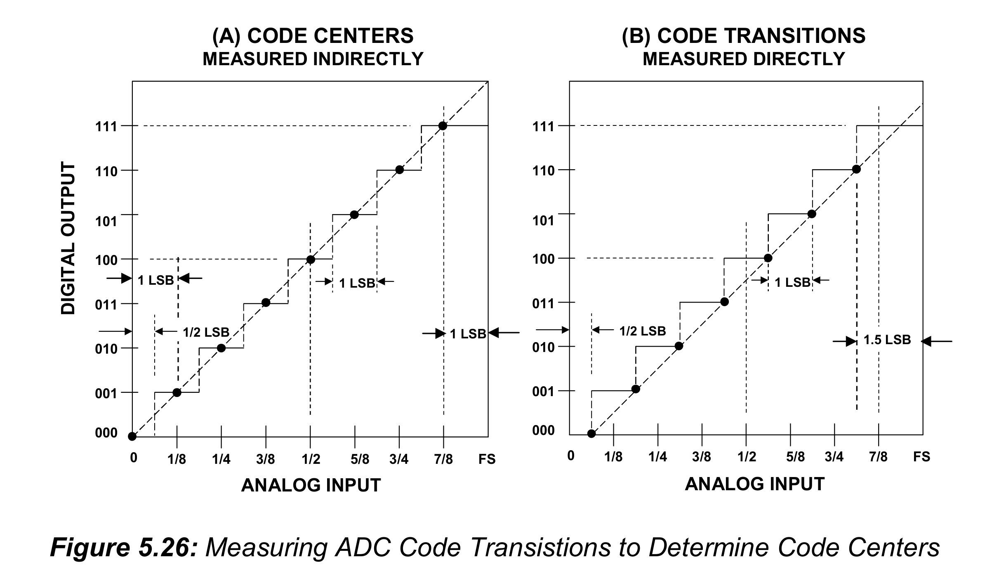

方法A考虑码字中心定义了静态传递特性（看图，也就是连接量化区间的中心得到了转移曲线）。但是，由于量化不确定性，这些点不能被直接测量。方法B考虑码字转移点定义了静态传递特性，这些点可以被直接测量。用于测量码字转变需要的全部。是一个模拟电压源和一个连接到ADC输入端的DVM（数字电压表？图5.28中有）和观察数字输出的方式，比如LED显示（也就是找一个仪器或电子设备显示数字输出）。模拟输入在不断变化，直到LED等在两个码之间“颤动（flutter）”，输入电压被记录了下来。但需要注意的是，只有在输入参考的噪声峰峰值在1LSB以内时这个方法才能很好地工作。更大的输入参考噪声会遮盖转移点，并让测量变得越来越困难。

但是，假定ADC是相对无噪地，并且转移可以简单地测量。一旦知道了码的转移点，码的中间位置就能被计算出来，就是码的转移点的中间电压。但实际上，整个ADC传递函数可以被整体地通过码的转移点来定义，如图5.26B中所示。注意到，码的转移点相对于图A中理想ADC的码中点定义曲线平移了1/2个LSB。直接使用码转移点定义的优点是：对一个特定的码，DNL就是简单的对应码转移点的差值。

使用码中点定义法会导致误导的结果，像图5.27中展示的那样：
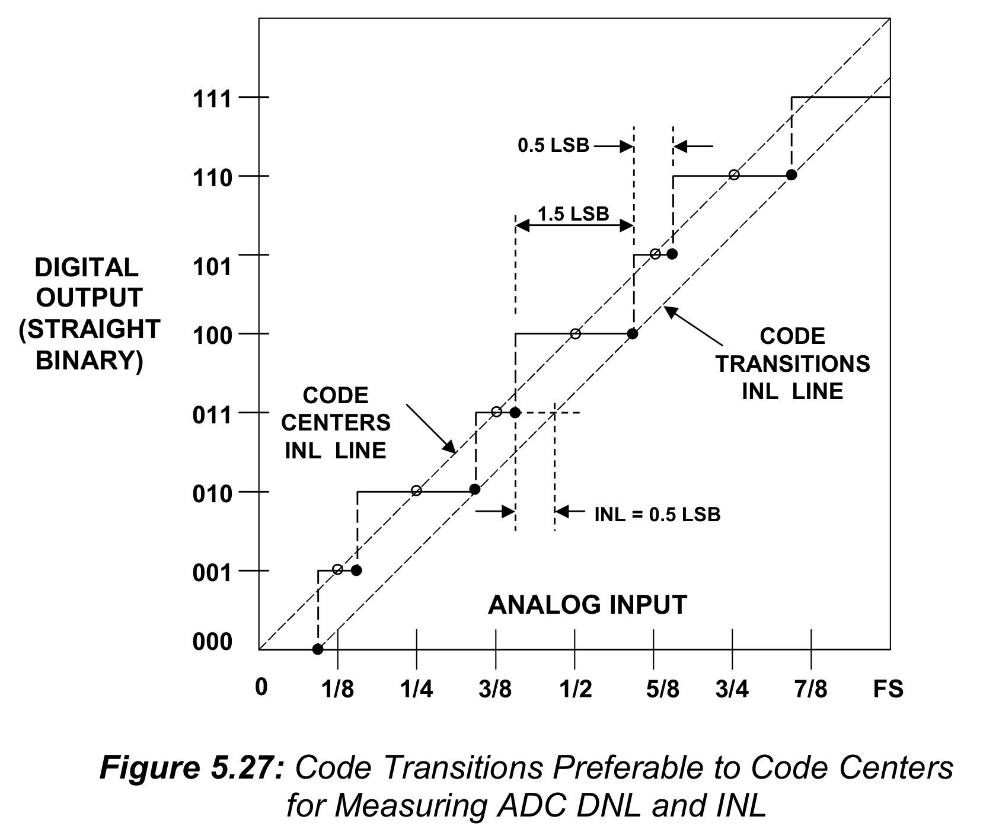
注意ADC传递函数有交替的宽窄码，但通过端点画出的线有着完美的INL。另一边，通过转移点画出的线能够展现出真实的INL是1/2LSB.

图5.28展示了一个用于测量ADC转移点的简单测试装置（setup名词义，equipment designed to serve a specific function）：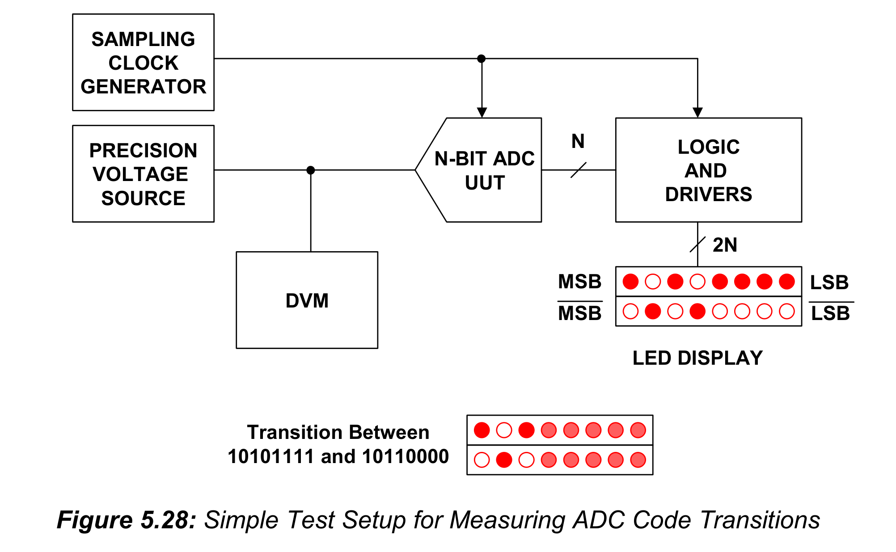
模拟输入从精准低噪声电压源驱动，ADC的数字输出通过LED显示来观察。通过显示ADC输出每一位的真值和补码（也就是原始值和取反后的值），调整ADC使得那些“颤动”的bits对应的真值和补码的LED显示的亮度一致，就可以确定码转移点的精确值。如果ADC的输出是串行格式的，那么还需要额外的逻辑电路。

尽管十分简单，这种手动的（manual）测试装置对于ADC来说十分有用，尤其是仅有码转移点需要测试的时候，比如测试失调和增益误差。图5.29展示了考虑码转移点时测量ADC增益和失调误差的细节。这个例子是一个3-bitADC，但适用于任何分辨率的情况：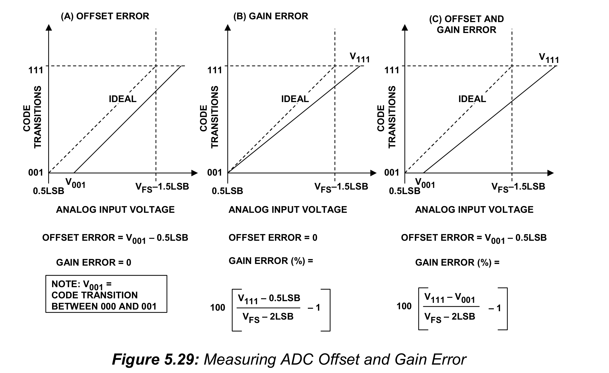
注意到，对一个理想ADC，第一个码转移点，也就是从000转变为001的点（命名为$V_{001}$），出现在模拟输入为0.5LSB的地方；而最后一个码转移点，也就是从110转变为111的点（命名为$V_{111}$），出现在模拟输入为 FS-1.5LSB 的地方，遵循之前图5.26B中的约定。
图5.29中的定义适用于单极性ADC，但可以简单地修改成双极性ADC。在一个双极性ADC中（如本书第二章讨论的那样）的约定是：零电压输入落在码100...0的中心(100...0应该对应的是零电压正负0.5LSB的区间)，而相邻的码转移点分别在零电压的上下0.5LSB.在DAC的情况，ADC的双极性零值是令人感兴趣的，可以简单地计算出码转移值。

### 背对背静态ADC测试

另一种有用的静态ADC测试方法能追溯到早期的数据转换器，包括将DAC连接到ADC的输出，并使用传统的模拟测试方法测量ADC性能。“背对背”方法的成功取决于能够否获得一个精度显著高于待测ADC的合适的DAC。例如，一个12-bit的ADC需要至少14-bit精度的DAC，尽管只有12bit的DAC被实际使用了。

图5.30展示了一个背对背测试的装置，通过生成ADC传递函数的误差波形来测试ADC静态性能：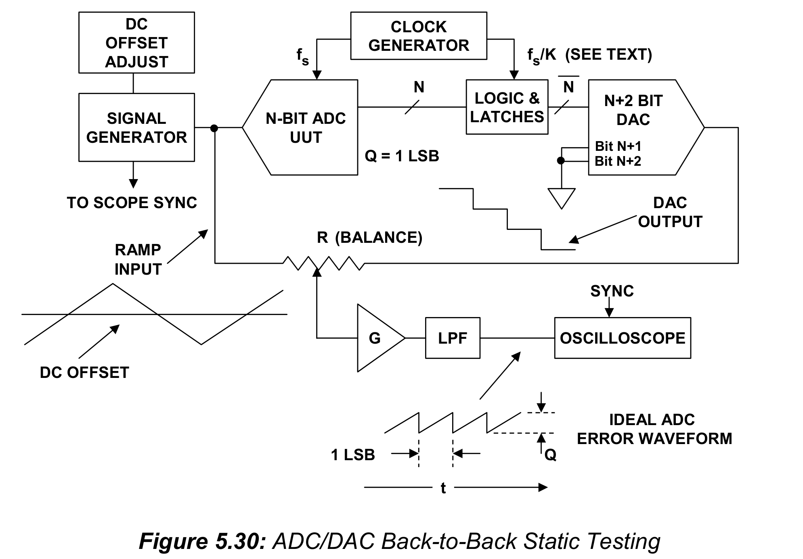
ADC驱动着一个精准的DAC，而DAC的输出减去了ADC的输入，放大（如果需要的话），滤波后用示波器观察。减法功能是通过在驱动DAC前对ADC输出码取反实现的，因此DAC输出是ADC输入的反向量化。一个使用电位器实现的简单的电阻加法器可以用来结合信号（理解：将取补，也就是取反后的信号与原信号相加，就实现了减法）。很低频的线性斜坡信号（5.30中的RAMP INPUT）被加到ADC上，并调整电位器来消除（null out）ADC和DAC之间的增益差异的影响。线性斜坡信号输入让错误波形更容易解释，因为水平轴（时间）可以直接在LSB中校准（也就是输入信号与时间成正比）。如果需要，DAC的更新时钟可以是ADC的时钟的约数倍（DAC是低频），来缓解对DAC的稳定时间（settling time）需求，让错误波形更容易来观察。示波器输入端的低通滤波器能有效移除那些可能会模糊实际的错误波形的高频分量。

图5.31A,B,C展示了由ADC的不同的错误导致的几种典型的错误波形：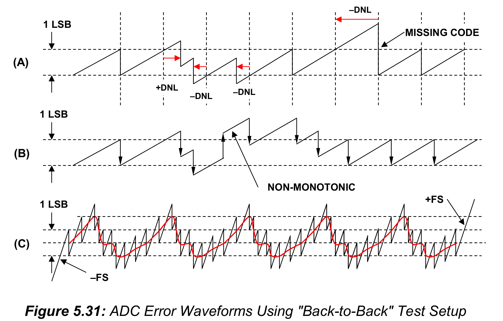
注意到锯齿形的错误波形由一些“牙齿”组成。牙齿的宽度对应着码宽，可以用来直接地测量DNL，如图5.31A中所示。沿着水平轴的垂直虚线展示了理想码转移点应该出现的位置，正与负的DNL的效果都在图中展示了出来，包括失码。

每个牙齿的高度由DAC决定，如果有失码，高度将会对应2LSB，而不是1LSB.图5.31B展示了非单调的情况，表示为箭头所示的误差波形的方向的临时反转。

>**关于“非单调（non-monotonic）”的理解：** 对于单调的情况，当error发生跳变时，都是向下跳变的，而这里向上跳变，也就是发生了反转。
对应的实际情况可能是：原来的输出码为011，增大之后变成了010，对应的值减小，这就是非单调。

当“背对背”方法用来进行静态DNL测量时，一个有着精准直流偏置调整的低幅度三角波工作地最好。直流偏置可以缓慢地调整，DNL误差波形会扫过整个ADC的区间。如果误差波形的频率过高，误差分量就不能观察。
另一方面，INL的测量，应该使用满量程三角波来进行，误差曲线与端点连接线的最大偏差可以用来计算INL，如图5.31C中所示。在这种情况下，没有必要观察构成整体误差波形的每一个单独的牙齿。应该调整平衡电位器，使两端在同一水平，使能够测量INL。图5.31中最坏情况的INL大约有+1LSB.

>**关于INL的看法：**
XY轴是相关的。在5.31A中，跳变点与垂直的虚线的距离就是INL；
同时，在垂直方向上也能观察INL。对于5.31C，标注着“1 LSB”的上边界就是理想情况的跳变点。跳变点在垂直方向上与这个点差多少，INL就是多少。

总而言之，“背对背”方法是在简单的台架测试装置中测量静态ADC线性的有用工具。随着ADC分辨率上升，输入信号的频率需要低一点，误差波形的幅度会降低，而ADC噪声和DAC误差的影响就会显著。

这项技术最适用于12-bit或者更低分辨率的ADC，同时转移噪声（也即：输入参考的噪声）低于1LSB的十分之一的情况。对12-bit ADC的测量需要相当小心，把这项技术扩展到14-bit是十分困难的。对于16-bitADC的测量至少需要18-bit精度的DAC，这样的规格在传统的直流规格中是并不广泛使用的。

### ADC线性度的交叉图测量

用于测量ADC线性度的交叉图方法发展于数据转换器早期，作为一个测量微分和积分线性的简单方法。这种测试适用于不需要高精确度的快速评估。这个概念与之前描述的“背对背”方法几乎一致，除了只有2-3个ADC的LSB被转换回了模拟形式。图5.32展示了交叉图测试的基本测试装置：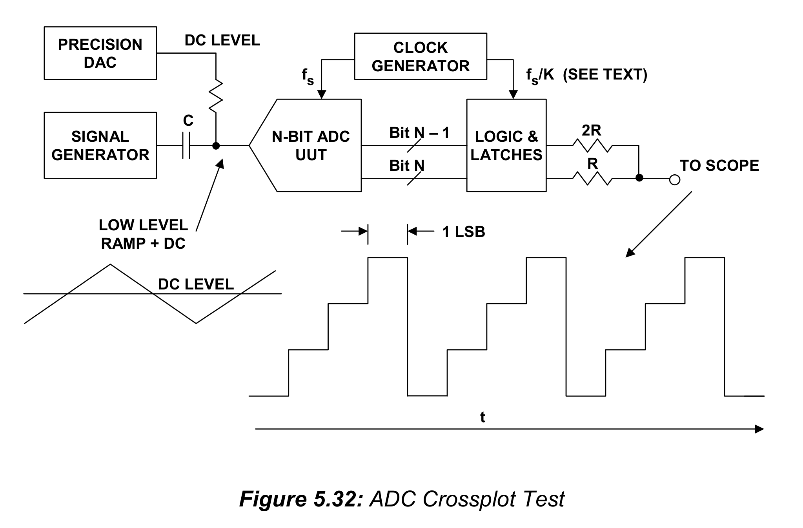

两个电阻被用来做一个简单的DAC，重建ADC输出的两位LSB。一个精准的DAC给ADC提供直流输入，一个低幅度的三角波用于调制直流电平。同“背对背”测试方法一样，示波器的水平轴可以根据LSB校准。2-bit DAC的输出是一个四级阶梯状的波形，如图5.32中展示。交叉图方法起初是为了测试围绕着内部二进制加权的DAC设计的逐次逼近式ADC来开发的。

如同这章前面讨论过的，叠加在这种DAC中成立，因此SRA ADC才会基于这样一个DAC。不需要检查所有的码，只要关注主要进位即可。作测试时，精准的DAC能够提供与特定的被测主要进位的码转移点对应的直流电平。示波器的水平轴可以根据LSB校准。图5.33中展示的三个波形描绘了DNL误差和一个失码误差：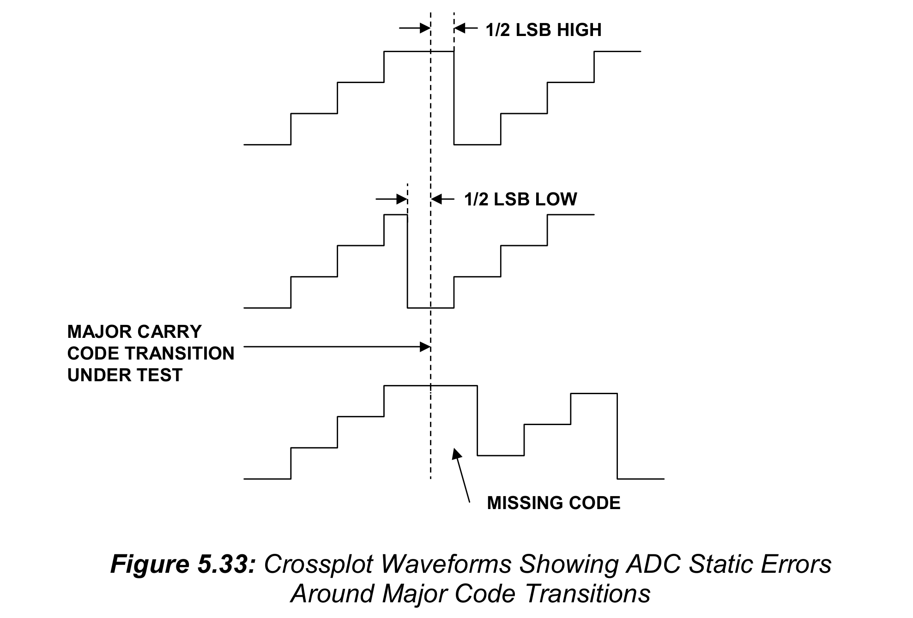
注意到，这种方法不能精准地检测待测主要进位上下地两个以上的失码。同样，当测试其他的不是逐次逼近结构的ADC时，会失去简洁和效率，因为这时需要测试更多的码。

### 伺服环路（servo-loop）码转移点测试

图5.34中展示的伺服环路码转移点测试装置适用于自动测量，无论是作为ATE系统的一部分，还是在以PC为基础的系统中。
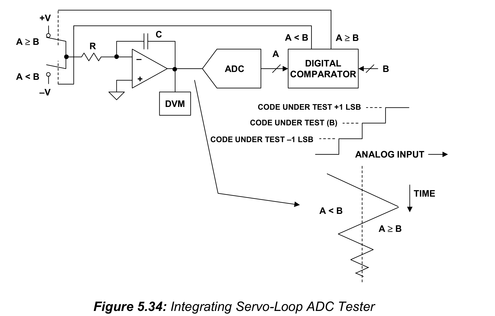

该回路从配置为积分器的运算放大器（op amp）开始。在积分器输入端的开关（通常是CMOS）用来在正负电压源直接选择。在积分器输入端有直流电平，那么一个线性斜坡信号就会生成，被ADC所采样。

>**积分电路**：
虽然有点忘记了，但是这个电路还是挺简单的。
根据运放的虚短虚断，回路上电流为恒定值。$I=C\frac{dU}{dt}$，那么电压就是线性变化的。

ADC的输出进入数字比较器的输入“A”端，而输入“B”端是指定的待测码转移点。如果ADC的输出小于指定的码字，也就是$A < B$，那么此时积分器输入端连接负电压源，积分器的输出就会上升。在$A\geq B$的点，正电压源会连接到积分器输入端，那么积分器的输出就会减小。

伺服环路的反馈让振荡继续，产生一个三角波，**这个三角波以码转移点为直流电平中心**。积分器输出处的电压表提供了码转移点的精确测量。当环路时间常数恰当调整时，三角波的幅度应该是一个LSB的一小部分。

>**对伺服环路法的理解：**
B输入是指定的码转移点。当输入电压小于这个点，让输入上升；大于则让输入下降。由于ADC不可能完全精准，积分器的输出（ADC的输入）就会在实际的转移点上下徘徊而振荡。通过看数字电压表的值就能确定这个值。

这项技术可以被用于测量传递函数的端点，例如，第一个和最后一个转移点，也就是$V_1,V_{N-1}$。根据这些值可以计算**标称LSB（nominal LSB）**：
$$LSB_{NOM}=\frac{V_{N-1}-V_1}{2^N -2}$$

端点码转移点和标称LSB权重提供了对任意想要的转移点而言计算DNL和INL所需的信息。增益和失调误差也能从端点码转移点计算出来。

ADC中的迟滞（hysteresis）与噪声能给伺服环路测试方法带来问题。在一些情况下，控制积分器的之间常数是有益的，从一个较短的时间常数开始，获得更快的初始响应，然后以更长的时间常数结束，来获得更高的精准度。

### 基于计算机的伺服环路ADC测试仪

图5.35展示了一个适用于ATE或基于PC系统的通用的基于计算机的ADC伺服环路测试法。这种配置通过完整的软件可编程性实现最终的灵活性。这项技术也允许使用平均技术来来减少ADC输入参考噪声的影响。它适用于需要大量测试的专用设备，但可能不适用于在测试台上简单评估ADC性能。
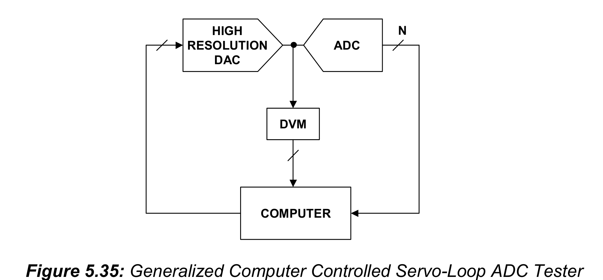

当被测ADC的输入参考噪声的峰峰值小于一个LSB时，上述的所有测量码转换点的方法能够工作地最好，像图5.36中描述的那样。
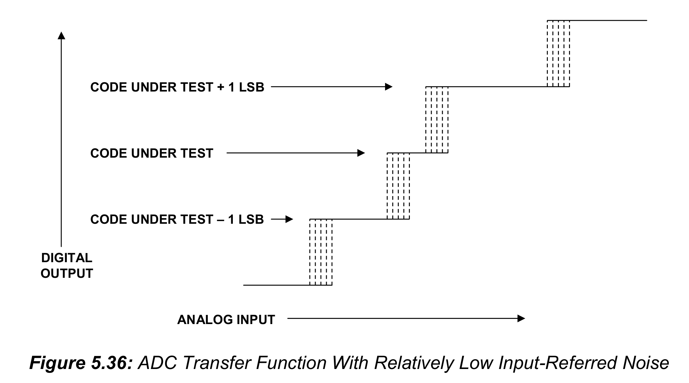

>**对5.36的理解：**
噪声较小时，即使每次测试的跳变点都不一样，但都在真正的点附近徘徊，且不同的跳变点不会互相干扰；如果噪声太大，不同的跳变点也会互相干扰，如图5.37那样。

但图5.35中的以计算机为基础的伺服环路测试法是个例外，因为它允许对数据进行平均，能够消除多余噪声的影响。一些对于低噪声ADC能够完美工作的测试算法，在用于高输入噪声的情况可能无法收敛，像图5.37中所展示的那样。
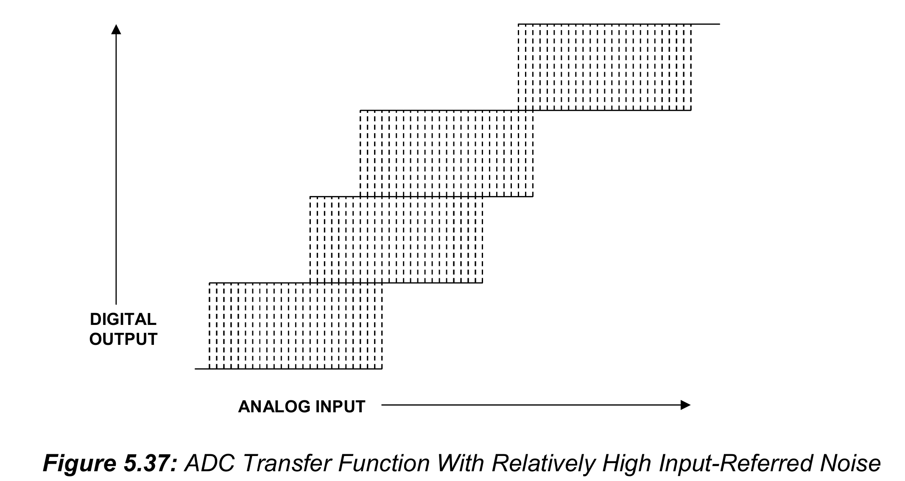

随着ADC技术这么多年来的发展，码转换点噪声对于6、8或者10bit转换器而言很少成为一个问题。甚至在12以及14bit的水平，20世纪70年代的早期ADC的输入带宽也足够低，位于一个能够使得“背对背”测试、交叉图和集成伺服环路测试方法能够满足大多数转换器工作的一个水平。

但是，在20世纪80和90年代，对于逐渐增长的高采样率ADC以及相关的高输入带宽，带来了更高的输入参考噪声，仅仅因为掌控电路设计的基本物理定律，比如电阻噪声和$kT/C$噪声。尽管有着低输入噪声的低采样率、低带宽的12、14、16和18bitADC今天仍然可用；许多通信应用的宽带ADC具有峰峰值超过1、2甚至更多LSB的输入参考噪声。这些ADC被使用于SFDR是限制性能的规格的应用场景中-过采样和平均技术带来的process gain被用于减少随机噪声的影响。

由于需要一种适用于所有ADC的，能够高速自动地测试DNL和INL的方法，不考虑噪声，直方图（码密度）测试方法（在下一部分中讲到）是迄今为止最受欢迎的方法。

### 使用线性斜坡输入的直方图（码密度）测试

ADC的直方图测试涉及在一段时间内收集大量数字化样本，用于一个有已知概率密度函数的良好定义的输入信号。然后通过对样本进行统计分析来定义传递函数。例如，一个稍微超过ADC两端的线性斜坡（实际使用中，使用三角波）是常用的测试信号。大量的样本从三角波输入被收集，然后每个码字出现的次数会被统计（tallied）。如果ADC没有INL和DNL误差，每个码字具有相同的出现概率（除了端点的全“0”和全“1”码）。那么每个码字区间就会有相同的数目。

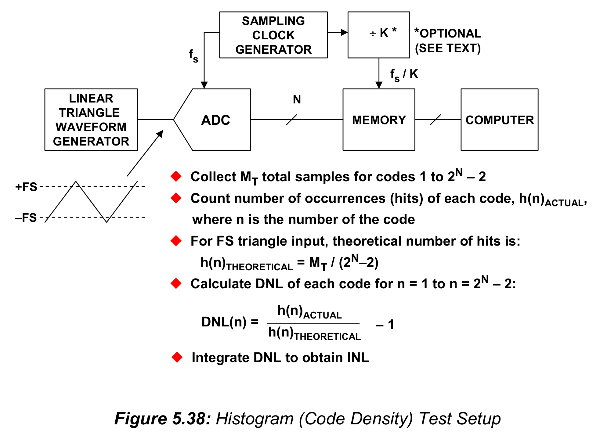
图5.38展示了典型的直方图测试装置。在ADC输入端加一个稍微过驱动ADC的线性三角波。三角波的频率需要足够低，以至于不会让ADC出现交流相关的误差，同时频率还不能是采样频率的子谐波倍（采样频率不能是信号频率的倍数）。码字$1-2^N -1$采到的样本数一共为$M_T$。注意到，“溢出”部分会落到全“0”码（也就是码字0区域）和全“1”码（也就是码字$2^N-1$），这些样本没有被记录到$M_T$中，但依然记录到了需要的总的样本数中。因此，使用的三角波需要被调整，以至于溢出的样本不必需要来确保ADC被过驱动的数目多，并且确保ADC范围内的线性度满足所需精度（10%过驱动对大部分ADC而言是合理的）.

在每个码字区间中，出现的样本的数量，$h(n)$，被记录下来，其中n的取值为$1-2^N -2$。每个码字对应的理想的“击中”次数（假设INL和DNL是完美的）是简单地$h(n)_{THEORETICAL}=M_T/2^N -2$。如果$h(n)_{ACTUAL}$是实际上每个码字区间的“击中”次数，那么这个码字的DNL由下面这个式子给出：
$$DNL(n)=\frac{h(n)_{ACTUAL}}{h(n)_{THEORETICAL}}-1 \tag{5.15}$$

图5.39展示了一个典型的直方图数据。宽码、窄码和失码，都能简单地在这个图中被发现。每个码字的实际的DNL由上面的式子计算。
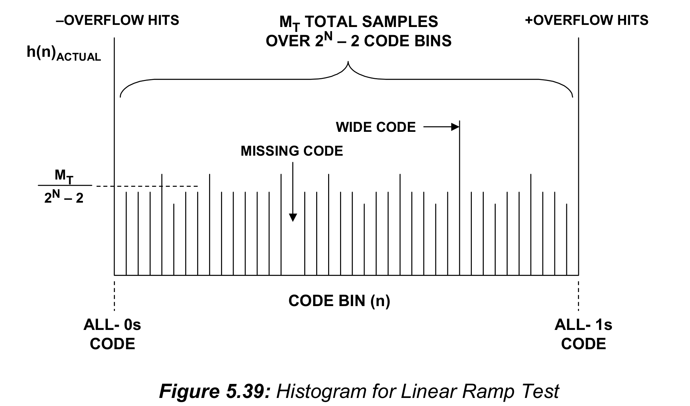

一旦计算出DNL，那么INL就是简单地对DNL进行求和，如图5.40中展示的那样。
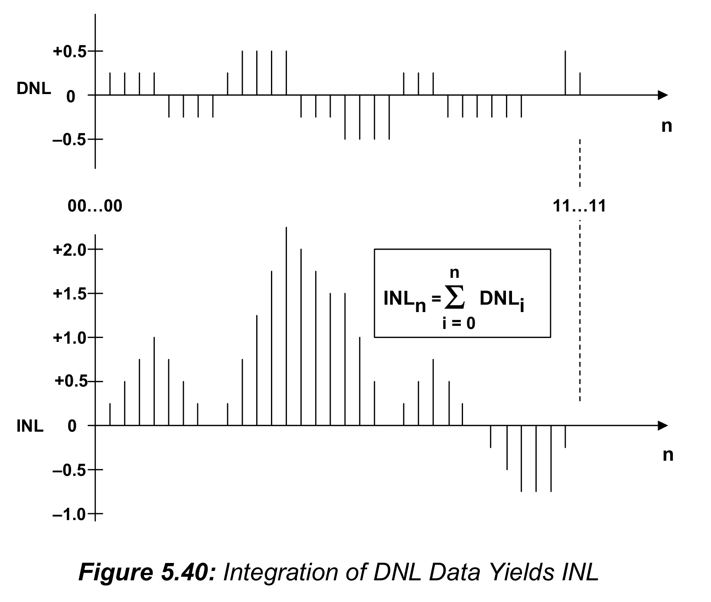

很明显，直方图测试通过在每个码点上进行平均来减弱输入参考噪声的影响。与每个代码转移点相关的噪声和迟滞也被平均了。因此，直方图测试适用于现在宽度高精度ADC，并且被广泛地接受，随着基于PC的标准软件和ADC生产商的评估板的大量增加（proliferation）。

但是，可以注意到，仅凭直方图不能确定ADC的单调性，也就是说（i.e.），码字相对于输入出现的顺序不能直接确定。但是，一个不单调的ADC会有高水平的失真，这种情况可以通过输出数据的FFT简单分析出来。由于直方图和FFT基本使用相同的硬件，二者都是完整的（comprehensive）ADC测试计划的一部分。

在进行直方图测试时，有一些重要的因素需要考虑。最重要之一就是需要用来精确测量DNL和INL所用的样本的数目。假定一个12-bit，1-MSPS ADC，期望它在每个码字区间有平均20次“命中”。对每个码字20次命中，DNL分辨率为$1/20=0.005LSB$是可能的。这意味着输入斜坡信号需要扫过$2^{12}=4096$个电平，停留在每个码字上足够长时间，确保每个电平有20次“击中”。因此，所需要的总的样本数$M_T=20\times4096=81920$。由于采样频率是1MSPS，这意味着斜坡信号需要在82ms内完成全量程的转换，以确保每个码字有20次击中。这里假定溢出样本没有开销（overheads）。

现在假定斜坡信号是由一个理想的16-bit DAC生成的。这意味着DAC把每个码字区间都分成了16个电平，或者说1/16=0.06LSB（理解：这里的16应该是$2^4$得来的，因为16bit比12bit多4bit）。因此测量DNL的总的不确定性就是0.05LSB（1/20）加上0.06LSB（1/16）为0.11LSB。

测量12bit以上的ADC时，使用DAC生成线性斜坡是不切实际的，因为设计相对高精度、快速建立的16bit以上分辨率的DAC是很困难的。另外，在DAC建立时间之内的样本必须忽略，因此让测试更加复杂。一个更实际的方法是使用输出频率不是ADC采样频率的子谐波的线性三角波函数发生器。在这种情况下，确定需要的样本数是一个相对复杂的统计问题，设计置信度、概率等等问题。深入统计数据的细节超出了本讨论的范围。幸运的是，测试装置的准确性可以经验地通过一些数据的记录来简单试验测试的准确性来验证，然后做一些恰当地调整。

前面提到过，三角波输入的频率一定不能是ADC采样频率的子谐波，否则每个输入循环内都有重复的码字，会让DNL数据有偏差，让它变得毫无意义。这种假象（artifact）与本书第二章中关于量化噪声的讨论相同。如果输入频率是采样频率的子谐波，那么量化噪声就会使周期的，就会有错误的失码和更大的DNL误差。在大部分情况下，实际测试装置中，采样时钟、模拟输入和ADC相关的抖动和噪声往往会在一定程度上减轻这种影响（子谐波带来的），但是直方图测试的完整性需要通过稍微改变采样时钟频率和输入频率来验证，确定DNL数据保持相对恒定。

最后，从处理高速ADC输出的数据所需要的速度以及处理大量样本需要的内存尺寸（可能是几十万）而言，直方图可以对缓存做一些限制。可以从ADC输出的每K个样本中取一个来降低所需要的速度，因为不需要样本是连续的。这本身（This in itself）并没有减少所需的样本总数-只是以更长的测试时间为代价，缓解了内存和速度需求。

如果采取了上述的恰当预防措施，在16-bit或更好分辨率的情况下，三角波直方图测试将会给出良好的DNL测量。另一方面，INL测量，也不能比三角波输入得到的INL更加精准。在12-bit以及更高分辨率的情况，保持合适的波形INL会是个问题。另外，三角波中可能出现的任何高频分量不能通过滤波来去除，因为那会影响波形的线性度。

由于这些原因，当使用直方图测量DNL和INL时，通常使用正弦波作为ADC的输入，而不是三角波。通过合适的滤波可以生成极高线性度和低噪声的正弦波。但是，不像三角波一样，正弦波对所有的码字并不具有相同的概率。对一个满量程的、输入正弦波幅度为A的N-bit ADC，码字出现的概率由下面的式子给出：
$$p(n)=\frac{1}{\pi}[sin^{-1} \{ \frac{V_{FS}(n-2^{N-1})}{A\cdot2^N} \} - sin^{-1} \{ \frac{V_{FS}(n-1-2^{N-1})}{A\cdot2^N} \}] \tag{5.16}$$

>**关于上面式子的推导**：
应该是求出x均匀分布的时候sinx的分布函数，然后通过积分求得每一段上的概率值。
之前推到过连续形式的概率分布，应该是后面图5.41中展示的那样。很像。

这个式子被画在了图5.41中。注意到出现的概率在正弦波两端接近$\pm V_{FS}$处增长，因为$dv/dt$比过零处的更小，因而这部分“命中”的数目更多；过零处$dv/dt$最大，“命中”的数目更少。
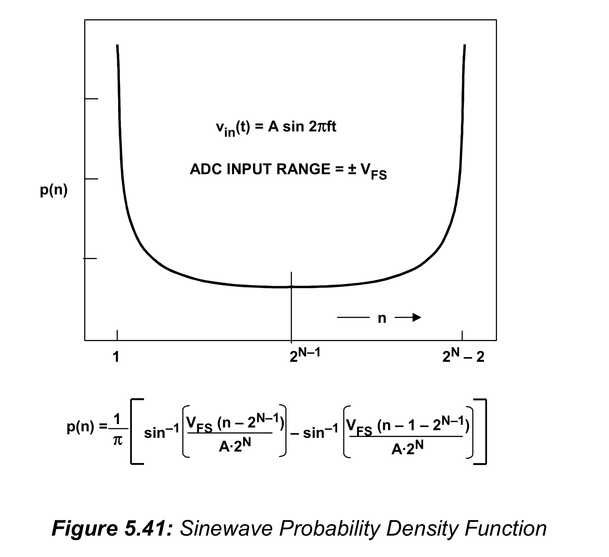

使用正弦波输入，第n个码字区间对应的“命中”数由下面这个式子给出：
$$h(n)_{THEORETICAL}=p(n)M_T \tag{5.17}$$

对应的DNL误差可以由下面这个式子给出：
$$DNL(n)=\frac{h(n)_{ACTUAL}}{p(n)M_T}-1 \tag{5.18}$$

为了使用正弦直方图测试得到精确的结果，需要采取一些预防措施。同之前讨论的三角波的情况一样，正弦波一定不能是采样频率的子谐波。正弦波的幅度A必须被选择为能够使ADC在两端被稍微过驱动的情况。然后需要调整正弦波的偏移量来消除直流偏置的影响，使得中刻度点上方和下方的“命中”次数相同，也就是从码字$0-2^{N-1}-1$的命中点数的求和等于从码字$2^{N-1}-2^{N}-1$的命中点数的求和。

最终，A的值需要使用实际的直方图数据从下面这个等式进行估计：
$$A_{ESTIMATE}=\frac{V_{FS}}{sin[\frac{M_T}{M_T+h(0)+h(2^N -1)}\cdot \frac{\pi}{2}]} \tag{5.20}$$

>**对于式（5.20）的理解**（回答关于式5.20的问题）：
考虑这个式子的意图，应该是过驱动。$\frac{\pi}{2}$前面的因子 是除去两端后的点数 占总点数 的占比。在时间轴上采样，可以认为时间轴上是均匀分布的。
把分母乘过去，Asin可以认为是$1,2^N-2$区间的边界值。让这个边界值是$V_{FS}$，就能保证过驱动。

式5.20估计出的A的值应该被用于式5.16中计算每个码字的p(n)。重要的是，要采取这些步骤来考虑实际测试装置中的增益和失调误差以至于能获得精确的p(n)值来使用式5.18来进行最终的DNL计算。

对AD9236 12-bit 80-MSPS ADC，典型的正弦波直方图DNL和INL测试如图5.42中所示，作为一个例子来展示这些数据是怎样典型地出现在ADC数据手册中的。
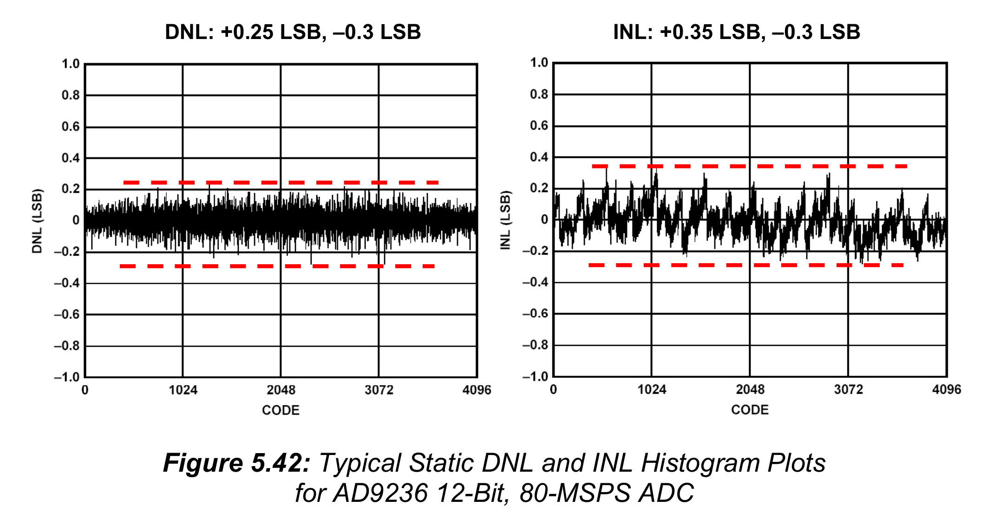

另一个直方图测试的有用应用是测量ADC的输入参考噪声（这一部分貌似在DATA CONVERTERS中也有）。这项任务是通过简单地给ADC输入端加上合适的电阻，施加直流电平（具体的值不重要，但为了方便可以使用接近量程中点的电压），然后记录大量输出样本。如果ADC输入参考早上的峰峰值小于1LSB，那么输出样本应该对应于一个单一的码字。如果直流输入恰好落在码转移点上，样本将会分到两个相邻的码字上--但是，为了让输出端只有一个单一码字，直流电平可以偏移0.5个LSB。输入参考噪声的作用，是将输出样本分散到多个码字区间上。如图5.43中所示。假定噪声是高斯分布的，输入参考噪声简单表示为分布的标准差$\sigma$，通常表示为LSB，均方根值。
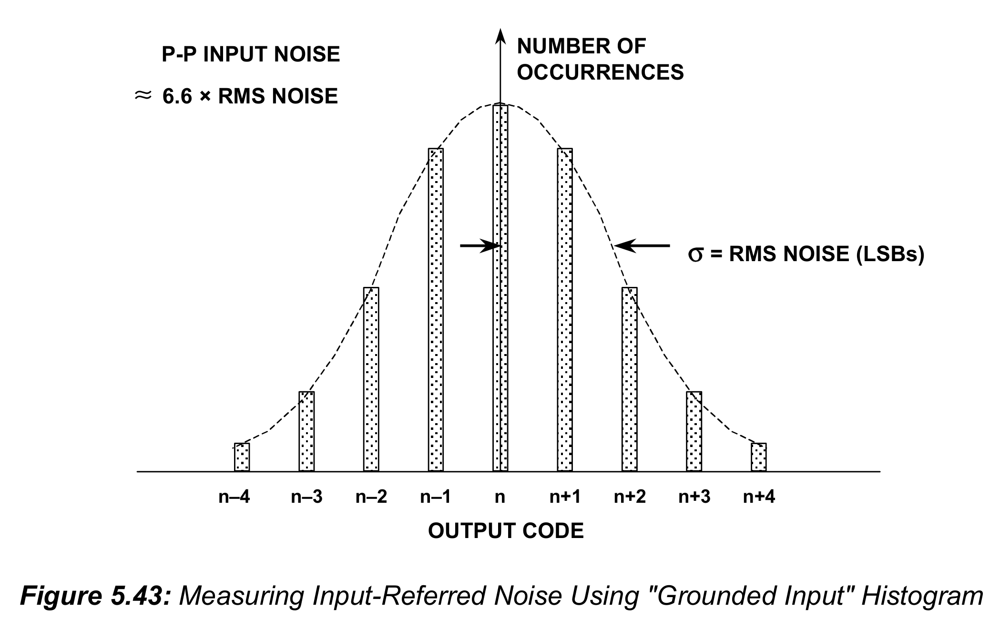

## 动态ADC测试

目前绝大多数（The vast majority of）集成电路ADC都是包含一种或另一种内部采样保持功能的采样ADC。除了传统的直流规格，采样ADC通常在交流性能方面被规定，比如SINAD，ENOB，SNR，SFDR，等等。在二十世纪七十年代早期，绝大部分交流测试都是使用“背对背”测试方法进行的，会使用一个高性能DAC来重建ADC的输出，因此允许使用传统的模拟测试装置。在二十世纪七十年代中期，以数字信号处理为基础的（DSP-based）ADC测试方法开始演变--今天，几乎（practically）所有的ADC测试都是对ADC的输出数据进行某种数字分析。尽管生产商提供的评估板，以及以计算机为基础的软件包，让数字技术可以被大部分严肃的ADC使用者获取到，但对一些旧的方法的考察还是一些有意义的工作。

在这一部分，我们将会讨论一些传统的“背对背”测试方法，它们在今天的台架测试装置中依然有应用；同时也会介绍更新的DSP-based方法。在适用的情况下，还讨论了关于信号发生的话题。

### 手动“背对背”动态ADC测试

图5.44展示了一个典型的“背对背”ADC交流测试装置。和在静态测试中使用这个方法一样，成功的关键是找到一个至少比待测ADC有着至少2-bit以上的直流和交流性能的DAC。在二十世纪七十到八十年代，这不是什么大问题，因为12-bit快稳定、相对低失真的DAC是寻常可见的--有时需要使用外部的deglitcher（glitch是毛刺）来获得相对低水平的失真。
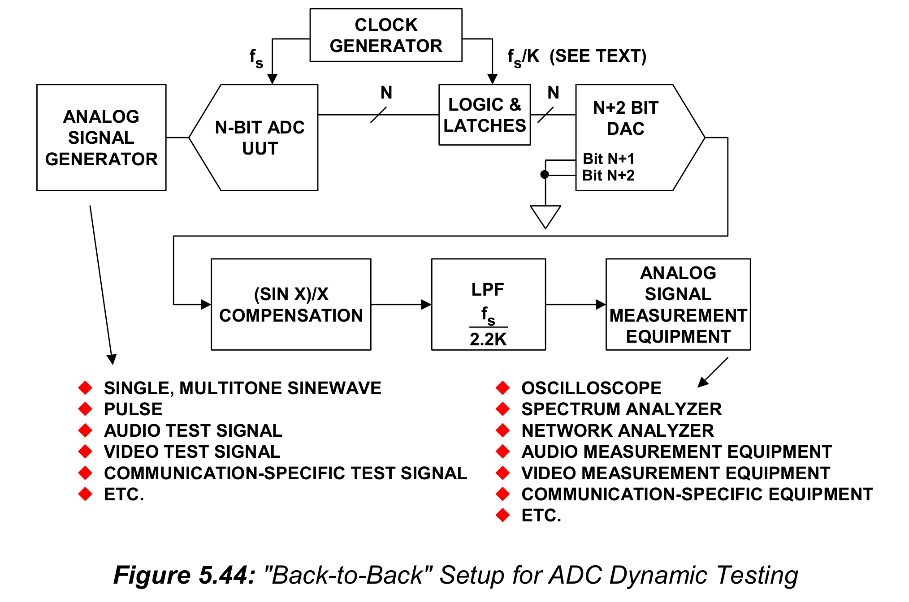

背对背方法被广泛应用于8和10-bit高速ADC中。在此期间大部分生产商的ADC评估板都半酣一个重建DAC，大部分情况下是足够用来做一下基本的交流测试的。但在今天，如果ADC评估板中包含一个重建DAC，它通常是为了方便实现一些简单的功能测试--实际的交流评估还需要使用DSP技术来做。

在今天，背对背测试仍然适用于将信号数字化、处理再转换回模拟形式的应用中，例如音频编码。在这种情形，ADC/DAC结合后的背对背表现能决定整个系统的性能，并且精确地知道交流误差是怎么在ADC和DAC之间分配是不重要的。在这些应用中，可以使用前面描述的测量SNR/SINAD/THD/SFDR的模拟测试方法。

今天，有许多高性能高速ADC，对它们而言挑选适合测试的交流兼容的DAC是很困难的。通信应用中的12-，14-和16-bit分辨率的ADC尤其如此。在很多情形中，最匹配的是有着完整交流规格的适用于DDS应用的DAC，比如TxDAC®系列。
>TxDAC®：ADI的一个产品系列

回到图5.44来，重建DAC的输出是一串矩形波，时宽等于采样频率的倒数（reciprocal）。如本书第二章中讨论的那样，信号的频率响应遵循$(sinx)/x$函数，因此依赖于频率效应的系统测量必须考虑理论滚降，或者包含一个合适的补偿滤波器。
>**补充说明**：
尽管没看这本书的第二章，但Data Converters第二章也讲了这一部分。重建信号的频谱等于采样后冲激串的频谱（也就是原始模拟信号周期延拓）乘$(sinx)/x$。

在许多情况下，把重建DAC的时钟设置为ADC采样频率的偶数K分之一（也就是采样频率是时钟频率的偶数倍）是很有用的，比如K=2、4、8倍，能够缓解DAC所需的建立时间。输出低通滤波器被选择为截止频率大约在$f_s/2.2K$，以至于在感兴趣的频带外频谱能够衰减。

如同之前提到的那样，“背对背”测试的一个优点是，可以使用与传统应用相关的模拟测试装置（像图5.44中列出的那样），而不需要额外的硬件或者DSP-based软件。

使用背对背测试装置进行交流线性度测试，最强大的两个测试是*包络测试*和*拍频测试*。包络测试使用接近$f_s/2$的信号来测量ADC交流性能，而拍频测试使用的信号接近$f_s$--两个测试使用了相同的测试装置，像图5.45中展示的那样。
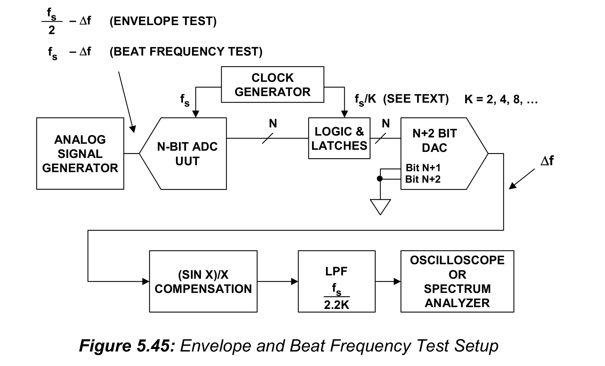

图5.46中展示了包络测试中的采样信号，在这里输入信号频率是$f_s/2$稍微低了$\Delta f$后的结果。注意到低频的$\Delta f$信号会出现在两个包络中。如果把DAC的时钟设为ADC时钟的一半，也就是K=2，那么每个ADC其他样本都被时钟送进重建DAC中，产生低频$\Delta f$信号，去除其中一个包络。在实际中，这样能够减少DAC稳定时间故障的影响，并且低频$\Delta f$信号能够轻松地通过示波器来观察非线性度和失码，或者通过频谱分析仪来测量失真。几百kHz的$\Delta f$通常能满足要求。采样时钟和输入信号都应该来自于稳定的频率合成器或晶振，来防止低频信号上的相位噪声。
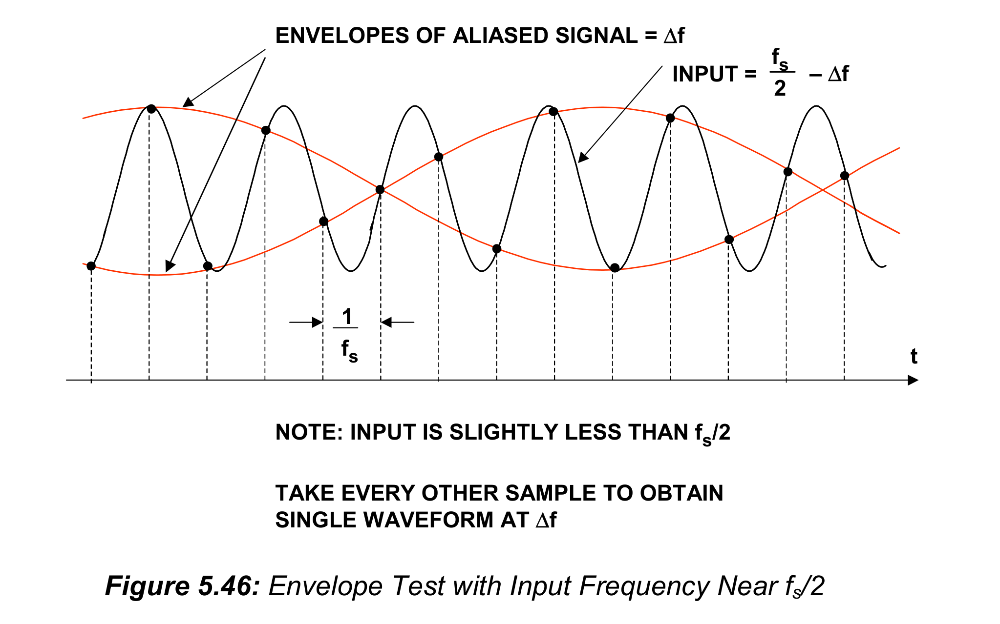
>**关于包络测试**：
这里将K设定为2，那么重建频率相当于$f_s/2$，用它来重建$f_s/2-\Delta f$的信号，信号频率自然是$\Delta f$。

而*拍频*测试基本上（essentially）与包络测试相同，除了输入信号放在接近采样频率$f_s$的位置，如图5.48所示。这种情况下，不需要将采样时钟进行分频，直接把时钟输入给DAC（也就是K=1），就能得到低频的“拍”信号。但是，如果将采样频率分频后再送给DAC，能够降低对稳定时间故障的敏感性，如同包络测试中那样。
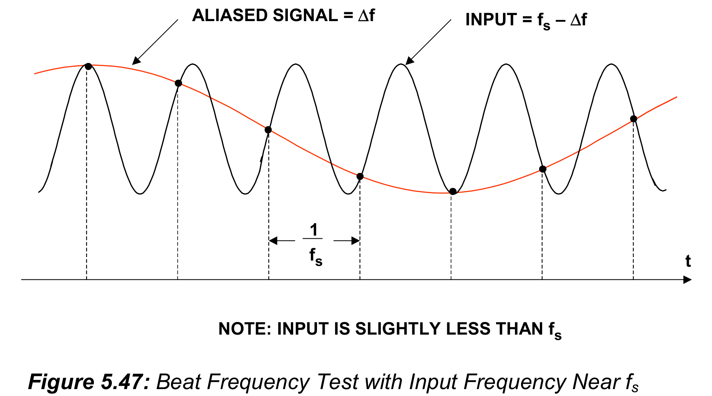

应当指出的是，如果DAC分频设置为K=2，则可以在接近$f_s/2$的任意倍数处观察到低频的$\Delta f$信号，因此允许ADC用于欠采样应用中的评估。因子K应该至少为2，来消除接近$f_s/2$倍数处的双包络。如果DAC需要更多的稳定时间来产生一个低频信号的清晰显示，K可以被选为4或者8.

大体的（gross）交流非线性和失码可以使用示波器观察，如图5.48中展示的那样。图中的测试是由8-bit flash ADC在20MSPS采样率进行的，输入信号微微偏移。右侧的expanded view展示了flash ADC中匹配不足的影响。
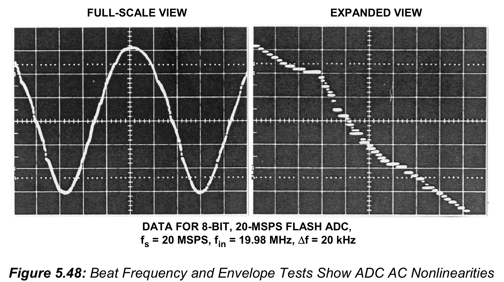

最后，背对背测试装置可以用来简单地测量ADC的大信号输入带宽。对这个测试，在补偿、滤波和同步到采样时钟之前，一个示波器直接连接到DAC输出。输入正弦波被设定在低频率并调整，直到DAC指示ADC几乎没有消除输入信号的正负峰值。然后可以增加输入频率，然后重复测试。为了造成削波而增加的输入信号电平对应着ADC增益的下降；而输入电平的下降暗示着增益的上升。这个测试可以扩展到奈奎斯特频率，因为DAC响应并不关键--它只是被用来探测ADC的削波点。小信号带宽也可以被测量，其中输入正弦波被设定为在每个测试频率能够激活相同地的预设数目的DAC电平（也就是规定好需要激活的DAC电平数目，在每个频率都调整输入正弦波来达到这个数目，比较不同频率输入正弦波的电平）。

总而言之，背对背ADC测试方法可以充当一个ADC整体交流性能的快速检查，这是对于分辨率高达10-bit的ADC而言。在将重建DAC与ADC结合的系统中，它也可以用来测试端到端性能。高性能ADC，12-bit或者更高分辨率，它们的严格评估需要数字技术的使用，会在接下来几个部分中讨论。对这种（高性能）ADC，背对背测试也是有用的，但只能用于功能的快速检查。
