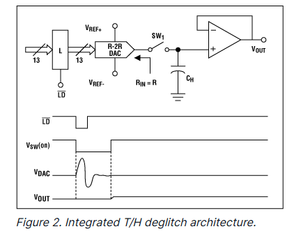
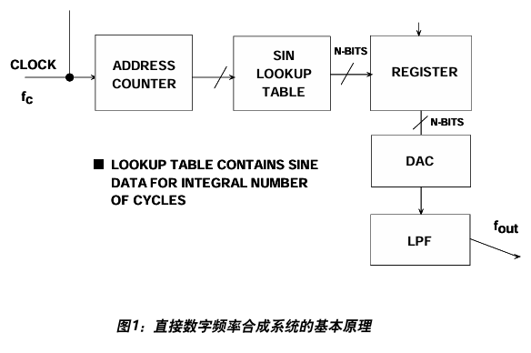

# ADI Chapter5 question

## 11.输入参考噪声相关（排除量化噪声可以理解为INL的相关部分吗）

这里我觉得是除去量化噪声以外的全部噪声。经问之后，INL会放大输入的噪声。

## 12.为什么使用反码？serial format

电路中存在噪声，输出码字具有一个概率分布，而不是固定的值，因此LED灯会来回跳动。只有当原码和反码亮度一致时，说明输出码字在两边的概率分布相同，此时的输入正是跳变点。

serial format的问题，我理解是，ADC输出结果是串行输出的，需要再用数字电路来串转并。

## 13.直接使用码转移点定义的优点

计算两个码转移点的差值，能够直接得到DNL。

## 14.测量offset与gain error需要那些码转换点

从图5.29来看，offset需要第一个码转换点的值，而gain需要第一个和最后一个码转换点的值。确实如此。

## 15.实现波形相减

在ADC的输出码字驱动DAC之前，先取补码，这样DAC输出电压就是ADC输出取负之后的结果，再与输入相加就能实现波形相减。

## 16.减小DAC频率

从结果上看，减小DAC频率也就相当于减小了采样频率。但我理解，如果想让“错误波形”看起来是连续的，采样频率应该本身就比斜坡信号的频率高很多，因此降低DAC频率也没有太大影响，如果降低太多就可能看起来不连贯了。

## 17.调整电位器

我理解的与问题中的理解不太一样。

这里应该是运放接成同相放大的形式，然后调整电位器来调整ADC输入和DAC输出相加时候的放大倍数（DAC输出和ADC输入可能存在一定增益？）。在误差为0时候调节相加后结果为0，应该能够得到正确的增益。

## 18.背对背测试中DAC性能高于ADC

书中提到，分辨率和直流、交流性能都要高于待测ADC。

## 19.DNL与INL测试使用的输入

为什么使用的输入不同？一个是"low amplitude"，一个是"full_scale"？

这里我也没太理解，只能根据原文内容推测一下。测DNL应该是一个点一个点地测，测完一个转换点之后再调整直流电压，去下一个转换点；而INL应该是测整体的，只需要关注整体的最大值就可以。

## 20."As the ADC resolution is increased, the frequency of the input signal must be made lower, the amplitude of the error waveform decreases, and the effects of ADC noise and DAC errors become more pronounced."这几句话的逻辑关系

个人推测是：随着分辨率升高，能够得到的ADC采样率自然会降低（高速高精度不可能兼得？），因此输入频率就需要下降。而误差波形的幅度下降是因为分辨率上升导致的。噪声影响增大应该也是因为分辨率上升，一个LSB对应的电压更小，因此更容易受影响吧。

## 21.为什么输入信号overdrive

为了保证ADC量程内的信号具有比较高的线性度。

## 22.Nonmonotonic相关

"However, a non-monotonic ADC will also generally have a higher level of distortion, and this condition is easily detected with an FFT analysis of the output data"这句话意思是虽然直方图无法看出单调性，但是非单调的ADC会在FFT中出现较大的失真，因此不必担心（直方图无法看出单调性）。

## 23.Eq.5.20推导

sin里面 $\frac{\pi}{2}$ 前面的因子是 除去两端区间后的点数 占总点数的比值。在时间轴上采样，时间轴上点是均匀分布的。通过这个式子来确定A，能够保证 $ 1\sim2^N-2$ 区间上的点占满量程，保证过驱动。

## 24."deglitcher"概念如何理解？

参考文章：[ADI-Deglitching Techniques for High-Voltage R-2R DACs](https://www.analog.com/en/resources/technical-articles/deglitching-techniques-for-highvoltage-r2r-dacs.html)

在DAC发生主进位转换时，由于开关之间的延迟，可能出现大的毛刺（glitch）。有两种消除毛刺的方法，一种是在DAC输出与地之间接一个大电容，构成一个RC低通滤波器消除毛刺。但由于需要较大的电容，这种方法会让DAC的建立时间变地相当大。

另一种方法是使用采样保持电路，原则上能够完全消除输出上的毛刺。但这种方法需要外部电路和延迟控制单元。

在更新码字前闭合SW1，在更新码字时断开SW1，在毛刺消失后重新闭合SW1。

## 25. Is there any ADC that is not sampling ADC?

Flash ADC？

>ADI MT020:
此外，各个比较器固有“采样保持”功能，因此理论上，只要比较器完全动态匹配， ash转换器就无需单独的SHA。不过实际操作中，由于比较器之间不可避免地存在细微时序不匹配，因此大多数flash转换器通常都需要添加合适的外部采样保持电路来改善动态性能。

## 26."The output low-pass filter is chosen to have a cut-off frequency of approximately fs/2.2K so that images are attenuated over the bandwidth of interest. "

重建的频率是$f_s/K$，实际上重建信号的频谱是输入信号的频谱以$f_s/K$周期延拓后，再与sinc函数相乘得到的结果，因此感兴趣的频带外也存在频谱，需要加低通滤波器抑制。

## 27.关于包络测试

K=2的时候，相当于重建频率是$f_s/2$，那么重建的信号频率就是$\Delta f$。

## 28.背对背测试装置测试带宽相关

这里就相当于，DAC充当了FFT的职能。先把输入信号调整到低频，DAC输出的信号几乎没有削波；然后提高输入频率，再调整输入幅度，直到DAC输出的信号幅度和之前类似。输出同样的幅度，需要的信号电平增加了，说明ADC的增益降低了。通过输入幅度的变化能够估计带宽。测试频率能超过奈奎斯特频率，因为这个测试只是为了测试带宽。

同样这个测试也能用于小信号带宽。把大信号的“几乎不发生削波”改成“恰好能激活规定数目的码字”即可。

## 29."end-to-end"是什么意思

我认为这里的端到端应该是ADC输入端到DAC输出端，通过DAC输出能够直观展示ADC的量化结果，对比两端的信号就能看出ADC性能。

## 30.如何推导式5.21

式5.21：$ENOB=N-log_2[\frac{Q_A}{Q_T}]$

这里应该是区别于$ENOB=\frac{SINAD-1.76dB}{6.02dB}$的另一个定义，认为整个ADC系统的噪声额度即为量化噪声。总的噪声与量化噪声值相等时，ENOB就等于输出的位数。随着噪声功率下降，ENOB也下降。

## 31.关于式5.21的理解

我认为这里应该不是“理想的量化误差和实际的量化误差”的关系。这里输入的并非三角波而是正弦波，而$Q_A$也不是“实际的量化误差”，而是量化噪声和其他噪声的总和。

这里应该是直接把$\frac{\Delta}{\sqrt{12}}$当作量化噪声rms值，然后进行计算。

>ADI MT-001和Bennett的论文中都说了这点，后者说“ Except for very special types of signals, the error samples are uniformly distributed throughout the range from minus half a step to plus half a step. ”

## 32.如何理解式5.23

此处的level of signal below FS应该是实际的输入信号比满量程信号低的dB。这会导致SINAD也低相同的dB，因此需要补偿上。

## 33.解释这句话："Digital filters can be constructed based on their impulse response, because the coefficients of an FIR filter and its impulse response are identical."

FIR滤波器的脉冲响应是有限长的，根据脉冲响应值能够直接构建FIR滤波器。

## 34."Although "complex" ADCs are not available, it is very common to use two ADCs to synchronously sample the I and Q data streams from a quadrature demodulator, in which the FFT input data is complex — however, this is a special case."

这里应该是信号的IQ分解？窄带信号可以分解：
$$X(t)=X_{I}(t)cos\omega_0 t-X_Q (t)sin\omega_0 t$$

## 35."repetitive patterns"的影响

如果采到的数据在一个FFT周期内是周期重复的，那么量化噪声也是周期重复的，丧失了随机性。

同时，由于量化噪声是周期的，那么会产生对应频率的谐波。（量化噪声形式不确定，产生谐波也是正常的。）

## 36.什么时候需要修改"default value"

## 37.为什么使用6dB attenuator

将输出彼此隔离开来，防止交叉调制。

## 38.为什么这样接电阻

衰减器的输出电阻是50欧，与25欧串联后变为75欧。三个75欧并联后为25欧，再与25欧串联得到50欧。这样衰减器输出电阻为50欧。

## 39.图5.72的overdrive

这里应该是说老的频谱仪对过高的输入幅度比较敏感，输入过高可能会对仪器造成损坏。

## 40."The residual signal inside the notch after passing through the transmission system represents clipping noise, thermal noise, and IMD distortion products." clipping noise指什么？

clipping noise应该指的是削波噪声，可能是因为信号经过放大后达到了VDD使得信号被削顶，引入噪声。

## 41.图 5.76， 什么是"locked-histogram"？为什么要⽤同⼀个 low-jitter clock generator 产⽣两路信号？这两路信号之间有什么区别？为什么时钟 jitter 同 adc 内部的 jitter ⽆法区分？

locked-histogram 指的是用直方图法测量抖动引起的噪声，推测"locked"指的是采样时钟和输入信号的相位锁定？

使用同一个信号发生器，是为了让时钟和输入信号具有相同的相位，这样采样的时候输入信号正好处于过零点。

两路信号一个是方波，一个是经过了滤波器后得到的正弦波。

因为时钟jitter和内部jitter都是在采样时造成的，故而无法区分？

## 42.flat强调什么？

在波形建立后波动要小，保证波动在1LSB以内使得码字不会再闪烁。

## 43.测INL/DNL的准备工作

根据第一个转换点测出offset error，根据第一个和最后一个转换点测出gain error。

## 47.假设ADC静态测试使用斜坡信号，为了达到0.01LSB的精度，对斜坡信号有什么要求？

生成斜坡信号的DAC的位数至少比ADC多7位：1/2^7 = 0.0078125.每个区间内的点数大于455（1/0.0022）.

## 48.为了保证静态测试的静态性， 斜坡信号的 update 周期有什么要求？

为了保持静态，生成输入信号的DAC频率应该比ADC采样频率低。

## 49.使⽤ histogram+sin 波测试 inl/dnl 的原理是什么？为什么要⽤ sin 波⽽不⽤ ramp？

输入sin波，能写出输入的概率密度函数。通过一段时间采集大量的点，再根据概率密度函数计算每个码字对应的点数的理论值，根据实际采到的点数能够计算出DNL；累加就能得到DNL。

采用sin的原因是：三角波的高频噪声不能通过滤波移除，但我们通过恰当的滤波能得到高线性度和低噪声的正弦波。

## 50.既然 sin 波可以同时⽤于动态和静态测试，那么⽤于动态和静态测试的正弦波在频率上有何不同？

在静态测试中，输入频率不能是

## 51.已知采样频率和FFT点数，如何确定输入信号的频率？

每根谱线之间的频率间隔是$f_s/N$，如果是相干采样能够看到明显的单独谱线；如果是非相干采样找最高的谱线，实际输入频率在其附近。

## 52.erbw 的定义是什么？为什么 adc 的性能会随着频率的上升⽽下降？

ERBW定义是SINAD下降3db时候的输入带宽。

推测是ADC采样电路的带宽限制了整体的带宽？

## 53.如何通过 ADC 输入短接时的噪声的 RMS 值来推导 ADC 的 ENOB

短接时算不出来信噪比，应该可以使用直方图方法计算噪声功率，使用式：$ENOB=N-log_2[\frac{Q_A}{Q_T}]$ 来计算

## 54.What is a DDS?

通过读取存储好的波形，重建，可以得到正弦波或任意波形的模拟输出。

## 55.什么是"overvoltage recovery time"

当方波的负电压在ADC输入范围以下时，ADC需要的建立时间。
