# Chapter 2 DATA CONVERTERS SPECIFICATIONS

## 数据转换器规格

使用或者设计一个数据转换器需要对它的规格有恰当地理解。这些规格能够给出数据转换器的基本信息，描绘其特征以及其静态和动态操作的限制。这一章我们将学习估计和比较已有设备的基本要素，并且学习如何测量新设备的规格。除此之外，这章的知识还会帮助我们为一个给定的混合系统选择合适的数据转换器。
这一章会讨论在供应规格中使用的技术术语的定义，同时阐明使用的术语。测量参数的测试方法会在后面的章节中提出。

## 2.1 TYPE OF CONVERTER

flash\sub-ranging\sigma-delta.
除此之外，还能分成两个主要的类别：Nyquist-rate and oversampling.奈奎斯特速率和过采样
前者的输入带宽占据了可用带宽的大部分，后者的带宽只占据奈奎斯特区间的一小部分，如下图

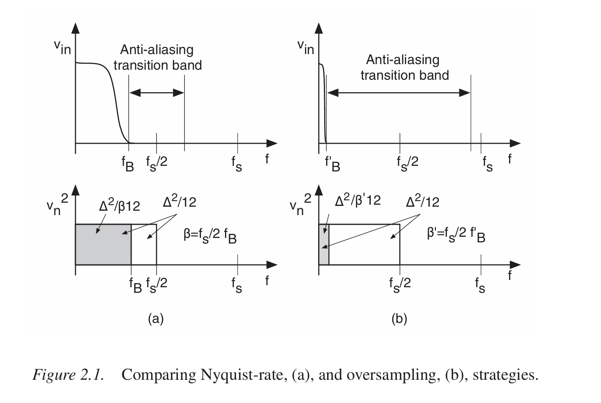

奈奎斯特带宽与信号带宽的比值$f_s / (2f_b)$称为oversampling ratio OSR过采样率。
OSR大的转换器称作过采样转换器(oversampling converter)，OSR小的（通常小于8）叫做奈奎斯特速率转换器(Nyquist-rate converter)。

## 2.2 CONDITIONS OF OPERATION

数据转换器的性能极大地取决于**实验装置**。

温度和供电电源相当重要。数据转换器需要在给定的一个范围内都能满足要求。供电电压可能会有5%或更多的波动，温度也会在很大范围内变化。在宽范围内保持性能是很困难的，尤其对于高分辨率设备而言。例如，一个14bit的adc需要600ppm/V(5V supply)、0.3ppm/℃(consumer applications 民用)的精度

PCB也很重要，这其中电源耦合以及接地很重要。
高性能的数据转换器会使用分开的模拟和数字电源。同时，确保电外部源与引脚之间的恰当链接也是很重要的。导线长度必须尽可能短，因为它们能等效成电感。避免两侧的接地回路。为了高频时高水平的信号完整性，有分开的电源平面和地平面多层板是必要的。

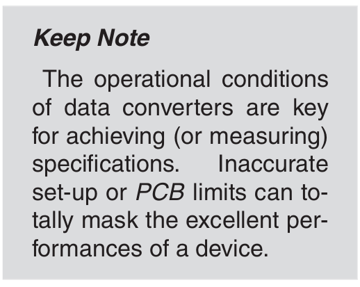

时钟和参考电压是很重要的。时钟会带来抖动、降低性能。不但使用低抖动的信号发生器是重要的，在相位发生器中的低抖动也很重要。引来时钟的走线必须短，下面必须有固体的地平面。

通常为了避免歧义，生产商会提供评估板，给出详细的指导来解释评估步骤。data sheets给出的数据假定它们在最佳的精确的条件下工作。但是，搞清楚这些设备在实际实验装置中使用时的性能，对于避免供应商和顾客之间的冲突而言是很必要的。

## 2.3 CONVERTER SPECIFICATIONS

有大量的规格能够描述数据转换器的性能表现，这能够帮助我们解释和理解产品的特性与使用。
一些规格是描写ADC或者DAC的，还有一些规格是ADC与DAC都具有的。这些规格能够分为下面积累：

- 常规特性
- 静态规格
- 动态规格
- 数字与开关规格

### 2.3.1 常规特性

大部分常规特性是不解自明的，但还是有一些特性，值得我们回忆一下定义并给出一些解释。

- **模拟信号的种类：** 模拟输入或者输出可以是：单端/伪差分/差分的。单端模拟信号以转换器的模拟地为参考，伪差分信号关于一个固定电平对称（这个电平与模拟地不同），差分信号是输入或者输出中 除去共模部分之后的那部分信号。
- **分辨率：** 是ADC用来表示其输入所用的比特数，或者是DAC接收到的用来产生模拟输出的数据的比特数。分辨率与参考电压一起决定了ADC和DAC的一些指标。对ADC而言，决定了其最小能够探测到的电压；对DAC而言，决定了其输出的最小变化。这也称为量化台阶。
- **动态范围：** 是转换器能处理的最大信号电平和噪声电平之间的比值，表示为dB。动态范围决定了最大SNR。
- **绝对最大额定值：** *（幸好查了一下不然还以为是最大速率）* 是可以使用的上限值，超过这个值后电路的能力就会有所削减。超过这个值后功能操作未必会受影响，但较长时间在绝对额定值条件下使用会影响设备的可靠性。最大额定值分为两种：电气的和环境的。环境方面包括工作温度范围，最大芯片温度，导线温度，最大焊接时间，存储温度范围等。对空运的应用系统，还有震动范围。
- **ESD（electrostatic discharge）警告:** 所有的IC都对高静电电压敏感。人体和测试设备可以储存高达4000V的经典，这可以通过设备放电。尽管所有的IC都有保护电路，高能静电冲击还是可能带来永久的损伤。生产商始终建议采取恰当的ESD预防措施来避免功能上的损失。
- **引脚功能描述和引脚配置：** 这是一个写有每个引脚的编号、名称和执行功能的表格。它通常和规格一起给出。另外，封装的图片也能提供引脚配置。
- **预热时间：** 是上电之后需要用来稳定性能所需要的时间。这个参数说明了由于上电后温度的瞬时变化而导致的性能变化。
- **漂移：** 是一些参数（比如增益、偏移和其他静态特性）在超过额定温度范围时候发生的变化。在这之中我们有温度偏移系数，通常规定单位是ppm/℃；电压偏移系数，规定单位ppm/V。这些值可以通过测量最大最小区间上的参数来计算，用温度变化除以参数变化得到。

## 2.4 STATIC SPECIFICATIONS

输入-输出传递特性描绘了数据转换器的静态行为。对一个理想案例而言，输入-输出特性是在整个动态范围上一个有着统一大小步长的台阶状图形。

如果第一个和最后一个步长是$\Delta/2$，那么满量程范围被划分为$2^{n-1}$个$\Delta$，而非$2^n$个。
上图大致展示了一个量化间隔可以同时用中间值和数字码编码。上图也展示了量化误差。如我们所知，量化误差在$\pm \Delta/2$之间变化，在中点时是0.

偏离理想特性的结果会像下图一样：

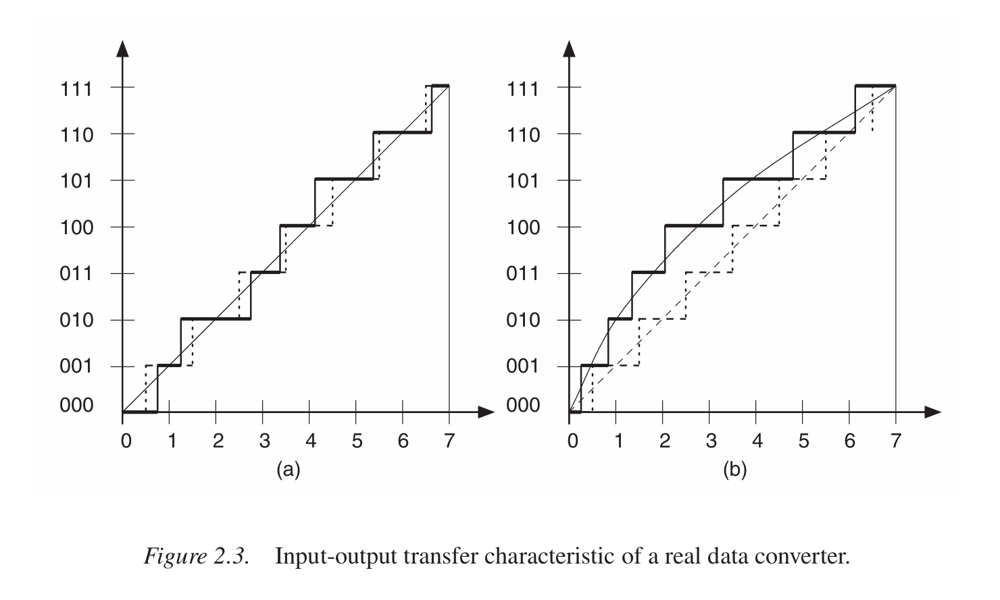

(a)曲线展现了一个几乎随机变化的量化间隔（黑色线），相邻的量化误差之间基本不相关。上面这张图也绘制了一个从原点到满量程的内插曲线。
(b)曲线展示了一个 曲线起始端量化间隔小，曲线终点端量化间隔大的情况。最终，内插曲线从直线变成了一个失真的形状。这些特征可以通过INL/DNL来量化，这两个静态规格在下面定义：
>关于**内插曲线**的理解：
为了让第一段和最后一段的模拟值是0和满量程，第一段和最后一段的量化长度都为0.5LSB.因此，（理想传输特性中）连接原点和终点（满量程-全1码对应的点），即可得到内插曲线。这个曲线与每一段量化区间的交点都是区间的中点，从上图中也可以看出。
实际传输特性中，对原点、每段中点、终点进行拟合，即可得到拟合曲线。如上图（b），得到一条曲线。

- **模拟分辨率：** 是1LSB码变化带来的最小的模拟信号增长。例如，$X_{FS}=1,16bit$时的分辨率为15.26u
- **模拟输入范围：** 是输入进ADC后能产生满量程响应的单端或差分峰峰值信号（电压或电流）。一个差分峰值信号是两个相位相差180°信号的插值；而差分峰峰值信号，是先把输入信号180°反相，然后求出峰值，再减去原来的峰值.
- **失调（offset）:** 失调描述的是零输入时候的移动。失调这个误差会影响ADC和DAC。下图(a)比较了真实和理想ADC的输入输出转移特性。失调改变了转移特性，所有的量化台阶都因为ADC的失调而移动了。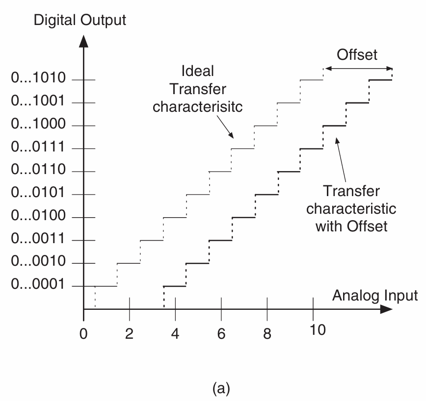DAC的失调是由下图中的真实响应来定义的：全0数字码生成的模拟信号就是DAC的失调。
失调可以使用LSB测量，绝对值（伏特或安培），也可以满量程的%或ppm。

>个人理解：*失调像一个整体偏移，类似给整个系统加了一个直流量*

- **零量程失调：** 一些ADC的数据手册会提供这个参数。这是能使输出码从全0转变成1的理想输入电压（1/2LSB）和实际输入电压之间的差值。
- **共模误差：** 这个规格适用于差分输入的ADC。它描述了共模电压发生了给定量的变化时输出码的变化。可以导致一位LSB码变化的两个输入信号的值通常用LSB表示。
- **满量程误差：** 是实际的最后一位数字码的跳变值和理想的跳变值的差距。
- **双极性零失调：** 当一个DAC能够双极性输出时，输入10000...00时，实际的输出值与理想的量程中点的差叫做双极性零失调。
- **增益误差：** 是转移曲线的内插直线的斜率的误差。对于理想转换器而言斜率是$D_{FS}/X_{FS}$，前者是满量程数字码，后者是满量程模拟信号范围。我们可以说理想的斜率是1。增益误差定义了实际转换器的斜率与理想值的偏移。下图展示了实际和理想的ADC/DAC的输入输出图表。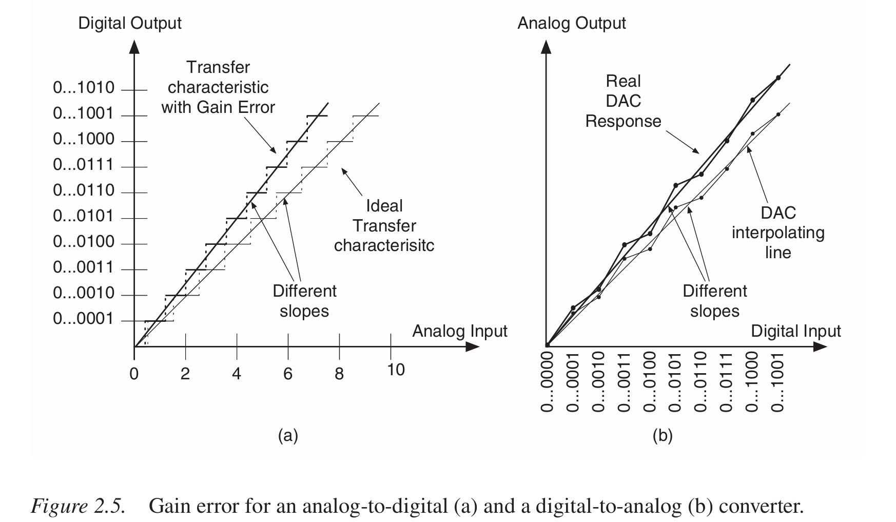
另一个增益误差的测量方法是由产生满刻度输出的模拟量与参考电压（减去0.5LSB）给出的。使用这个定义时，增益误差也就是满量程误差。
- **微分非线性误差（DNL,differential non-linearity erre）：** 是实际转换器的量化步长与理想步长$\Delta$的偏差值。假设$X_k$是连续的码$k-1,k$之间的过渡点，那么实际宽度是$\Delta_r(k) = (X_{k+1} - X_{k})$；那么微分非线性定义为：
$$DNL(k) = \frac{\Delta_r(k) - \Delta}{\Delta}$$
下图展示了一个12bit ADC的DNL，以LSB表示。DNL也可以用伏特/安培或者满量程的百分比%或ppm（百万分之几）表示。对$X_k$，12bit ADC，k的取值范围是1~ 4095，那么$\Delta_r(k)$中k的取值范围就是1~ 4094，对N-bit ADC有$2^N - 2$个积分非线性（原点到第一个点的宽度没算）
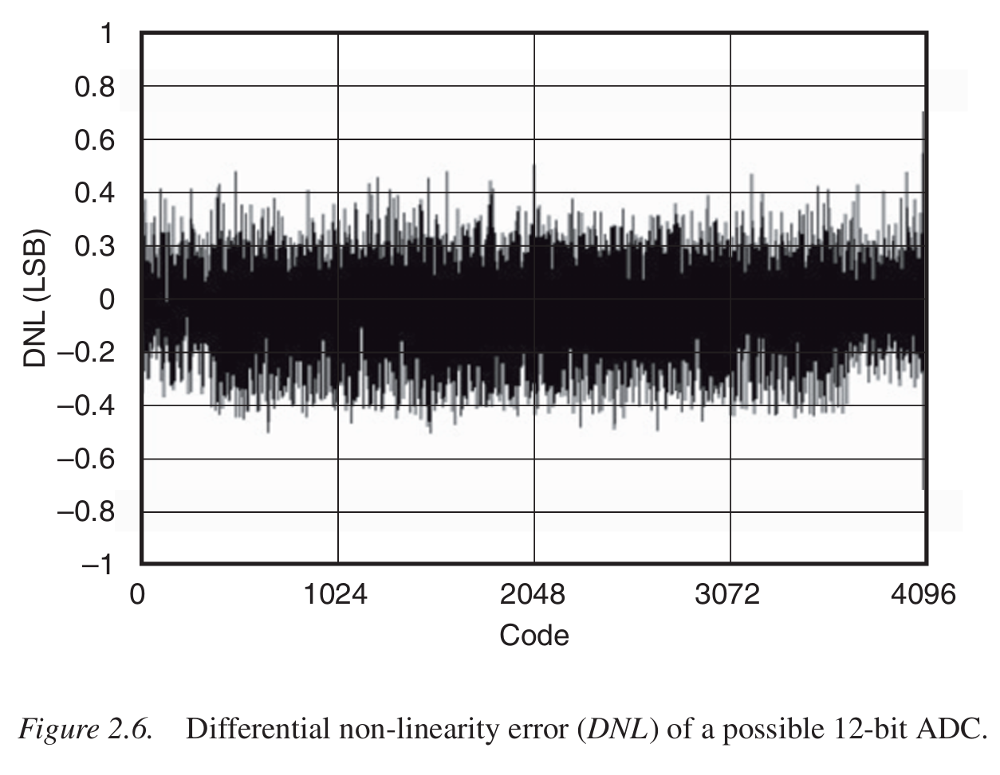
最大微分非线性就是$|DNL(k)|$中的最大值。通常最大微分非线性简称DNL。
有些数据手册中也会给出DNL的均方根值：
$$DNL_{RMS}=\{ \frac{1}{2^N-2}\sum_{1}^{2^N - 2}[DNL(k)]^2 \}^{1/2}$$
- **单调性：** 当输入信号持续增大时，输出码也一直增大；当输入信号持续减小时，输出码一直减小。也就是输出码要么不变，要么就与输入变化的方向相同地变化。
- **滞后性：** 表示输出码与输入信号方向的相关性限制（增大的或减小的信号）。迟滞性就是这些差值中的最大值。
- **失码：** 这指的是某些数字码从未在ADC输出中出现过。由于失去的码不能被任何模拟输入大胆，对应的量化间隔就是0，对应的DNL就是-1。
- **积分非线性（INL，integral non-linearity）：** 积分非线性是传递函数与理想插值线的偏差。另一个INL的定义是测量与端点拟合线的偏差。端点拟合线可以纠正增益和失调。第二个定义被选做标准，因为它能给估计谐波失真带来更多信息。
下图展示了使用两种方法绘制出的INL曲线：

左侧的曲线起点不是0，INL是逐渐爬升的。右侧的曲线修正了两端，量化区间的两个端点的INL都是0。INL的最大值就是$|INL(k)|$中的最大值，通常就把它称为INL。对上图中展示的情形，使用第一种方案得到的INL要大于2LSB，而使用端点拟合线得到的偏差时1.3LSB.INL与DNL都是用LSB测量与表示的。也可以用绝对值（电压或电流）或者满量程的百分比/ppm表示，

我们考虑纠正了失调和增益误差的端点拟合线。

------此处略过对矫正过的INL不理解的地方

DNL和INL能够提供对噪声功率谱具有不同影响的信息。假定DNL分为相关和不相关部分。相关部分的连续累加（running sum）是INL的主要来源。如果INL在整个范围上就是小几个LSB，那么DNL的相关部分就大约（in the order of）INL除以二进制数字的数目。它变成了可忽略的一部分：看DNL谱是很难预测INL会是多大的。DNL的不相关部分的累积看起来像噪声，可以加到量化误差上。下图展示了一个模型：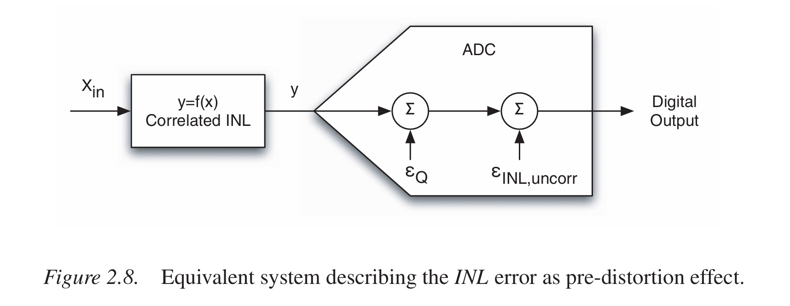
非线性函数f(x)是DNL相关部分的累加。量化误差和DNL的不相关部分可以看作噪声处理。由于DNL的相关部分通常可以忽略，我们可以把大的DNL看作额外的噪声源。它的连续累加被加到量化上，使得SNR降低。大的INL意味着传输曲线会与直线有较大偏差，因此导致谐波失真。谐波会影响SFDR与SNDR（稍后定义）。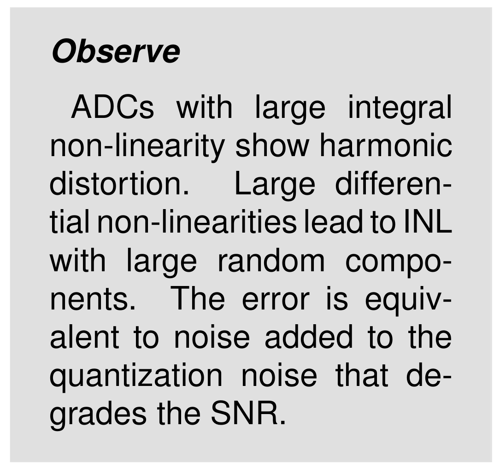

>**例2.1：**
评估INL导致的谐波失真。使用图2.8中的模型，建立一个1.2LSB INL响应。INL的随机变化在+-0.45内。估计输出频谱，输入正弦波幅度达到的满量程
**解法：**
Matlab代码Ex2_1提供了研究这个问题的基础。INL由两部分组成，一个变化在+-0.45以内的随机序列，和一个多项式函数$y=x+ax^2+bx^3+cx^4;x=(n-2^{N-1})/2^N$，n是数字码，N为12.其中参数为a=-0.01,b=0.01,c=0.02。对应的INL与DNL如下图所示：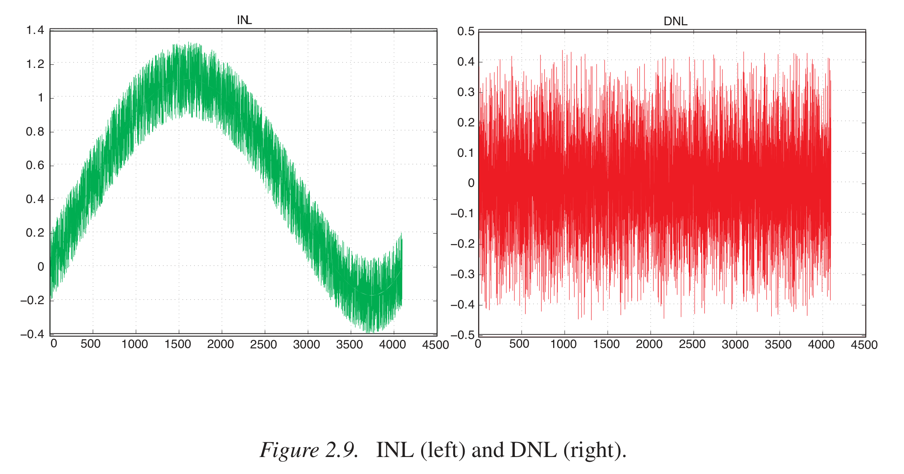

- **功率耗散：** 是设备在正常操作，或者是休眠模式下消耗的功率。
- **温度区间：** 是能保证设备正常运行的温度范围。运行范围给出了能保护设备功能的极限。存储范围给出了存储时候的状态。
- **热电阻：** 是器件耗散其自身消耗的功率的能力。一些封装会为PCB供电使用特殊的衬垫。这个规格也可以为PCB走线提供信息。热电阻通常以℃/W为单位。
- **焊接温度：** 是IC焊接时候的最大温度值，通常假定焊接时间小于10s.

## 2.5 DYNAMIC SPECIFICATIONS

数据转换器的频率响应和模拟部分的速率决定了它的动态性能。显然，当输入带宽和转换速率变高时，性能就很关键了。因此，这些规格要么对应于动态形式给出，要么以频率、时间或转换速率的函数给出。动态特性的一个质量指标时在动态运行的范围内保持不变的能力。

- **模拟输入带宽：** 指的是满量程数额u的ADC重建时输出降低3dB的频率。这个定义与小信号输入的放大器对应的定义不同。
- **输入阻抗：** 是输入端的阻抗。低频时输入阻抗是电阻；理想情况下，对电压输入是无穷大，对电流输入是0（这样使得能够理想的测量电压或电流）。高频时输入阻抗由容性器件主要决定。通常情况下，一个开关电容结构起到输入采样的功能。这种情况下这个规格能给出输入引脚的等效负载。在很高频时ADC的输入阻抗必须与输入连接端相匹配。
- **负载调节或输出阻抗：** 负载调节测量了一个DAC的输出台阶能保持它额定电压的精度的能力。它描述了输出端流出1mA电流时电压的改变，以LSB/mA为单位。用mV替换LSB后得到结果是Ω。单位即为Ω。
- **建立时间：** 是DAC的台阶响应进入并且随后保持在最终值周围的给定误差范围需要的时间。输入台阶信号在t=0时被世家。最终值定义为较长时间后的会出现的电压。
- **串扰：** 测量了由于与其他信号发生的不希望的耦合而出现在信号中的能量。除了IC级的耦合以外，一个差劲的PCB设计也会导致串扰。例如，在同一层PCB上的携带关键信号的平行的走线就会发生干扰。
- **孔径不确定性（时钟抖动）：** 是采样时间的标准偏差。也称为孔径抖动和时间相位噪声。通常假定时钟抖动是白噪声。
- **数模转换毛刺脉冲：** 是输入改变状态时数字输入端向模拟输出端注入的信号量。最大值通常出现在DAC在MSB附近切换时，例如：从01...1切换到10...0。这个参数是毛刺区域的积分，通常以V-sec或A-sec为单位。
- **毛刺功率：** 与上一个DAC参数相似，但它导致的原因更加广泛。它可以由bit控制之间的延迟导致，或者由模拟部分的时序失配导致。通常最大值在半量程导致。与前一个参数相似，它也是毛刺区域的积分，以V-sec或A-sec为单位。
- **等效输入参考噪声：** 是ADC的电路产生的电子噪声的测量。结果是：对于一个固定dc输入，输出并不是固定的，而是以直流输入对应的输出码为中心的一系列码的分布。通过大量的输出采样，输出码的直方图大致是高斯的。分布的标注按察定义了等效输入参考噪声。通常以LSB或者rms均方根电压为单位。下图展示了一个被0.63LSB噪声影响的数据转换器的输出的直方图：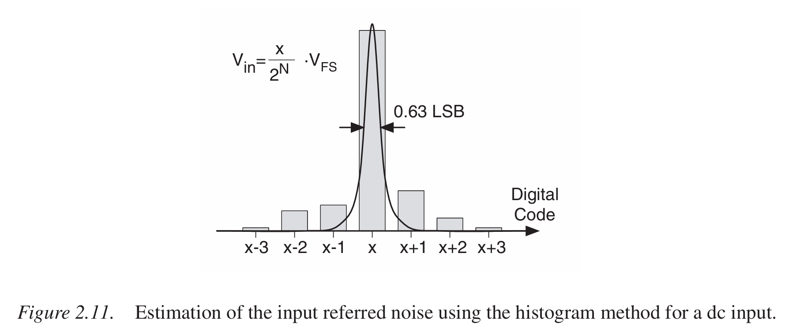
- **信噪比（Signal-to-Noise Ratio,SNR）:** 是信号功率（通常是正弦波）与量化和电路产生的总噪声的比值。SNR考虑整个奈奎斯特间隔中的噪声。SNR取决于输入的频率，且随着输入幅度成比例降低。下图展示了一个12bit数据转换器在50MHz采样频率下的SNR：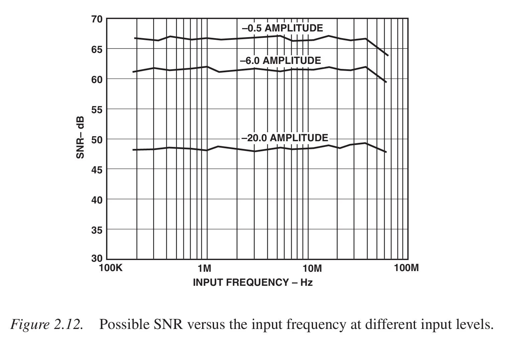
-0.5dB输入的SNR是67dB。SNR上的损失说明电子器件产生的噪声比量化噪声大（量化噪声与频率无关，其他噪声与频率有关）。当输入是-20dB时，SNR是48dB。观察到信噪比关于频率的性能表现是不错的：整个奈奎斯特区间上的SNR基本是恒定的。第二奈奎斯特区域上的SNR也只下降了几个dB。因此，上图中的ADC同样也适用于第二奈奎斯特区间上信号的欠采样。
- **信噪失真比（SINAD/SNDR,Distortion）:** 与SNR定义类似。除去噪声之外，输入正弦波噪声的非线性失真也被考虑了进来。SINAD是信号的均方根值和谐波分量加噪声的平方根值（不包含dc）的比值。由于静态和动态限制造成了非线性响应，SINAD取决于输入正弦波的幅度和频率。下图展示了一个假设的数据转换器的SINAD: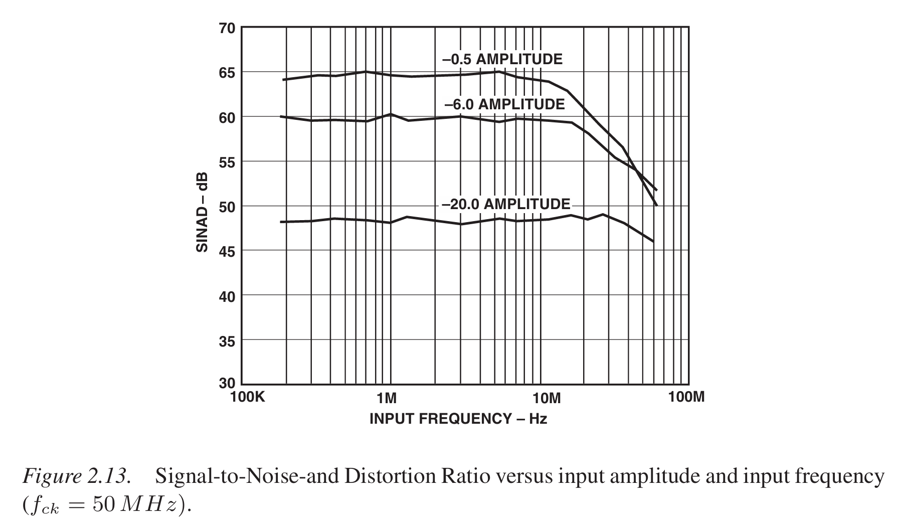
观察上图与SNR对应的曲线，如果输入信号幅度为-20dB或者更低，谐波失真时可以忽略的（信号的幅度小，谐波失真相比于其他噪声不值一提）。更大的输入幅度会带来失真，尤其是在高频。注意到SINAD在第二奈奎斯特区域是会显著降低的。因此，上面这个数据转换器在第二奈奎斯特区域的使用是充满问题的，因为高线性度是需要的。
- **动态范围：** 是SNR（或SINAD）为0dB时输入信号的值。这个参数对一些在0dB输入时达不到最大信噪比的数据转换器很有用。这种情况典型发生在sigma-delta数据转换器中。下图展示了一个sigma-delta ADC的SNR与输入幅度的关系：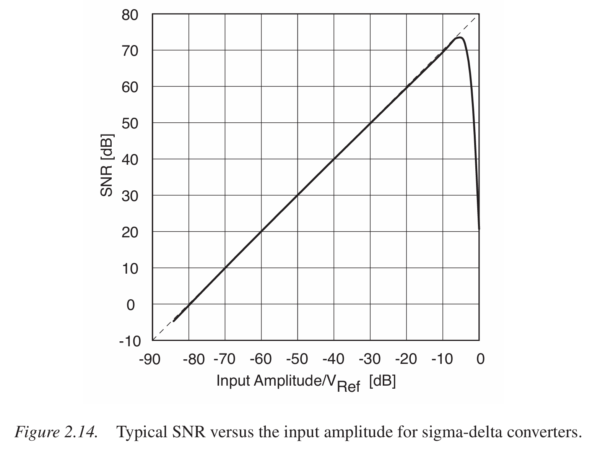.SNR的峰值是74dB，动态范围是80dB。因此，信噪比峰值出现在-6dB附近。

>也就是说，不考虑失真时，SNR显然大致与输入信号幅度呈线性关系。更具动态范围，代入线性关系可以近似求得SNR峰值对应的输入信号

- **有效位数（Effective-Numbers-of-Bits,ENOB）:** 利用位数表示信噪失真比，关系如下：
$$ EN0B = \frac{SINAD_{dB}-1.76}{6.02}$$
- **谐波失真：** 是信号功率的均方根值和含混叠成分的谐波分量的均方根值之比。除非另有规定，HD包含第二到十次谐波：通常认为高于十次的谐波可以忽略。如果$f_{in}$是输入信号的频率，$f_s$是采样频率，那么n次谐波分量就在$|\pm nf_{in} \pm kf_{s}|$处,k是一个合适的能够将高次谐波折叠进第一奈奎斯特区域的数。幅度大、频率高时最大的因素肯定是第二和第三次谐波。一些数据手册会以输入频率的函数的形式给出它们（谐波）的幅度，单位是dBc(dB below carrier，低于载波的dB值)。下图展示了一个100MHz时钟,12bit ADC的谐波：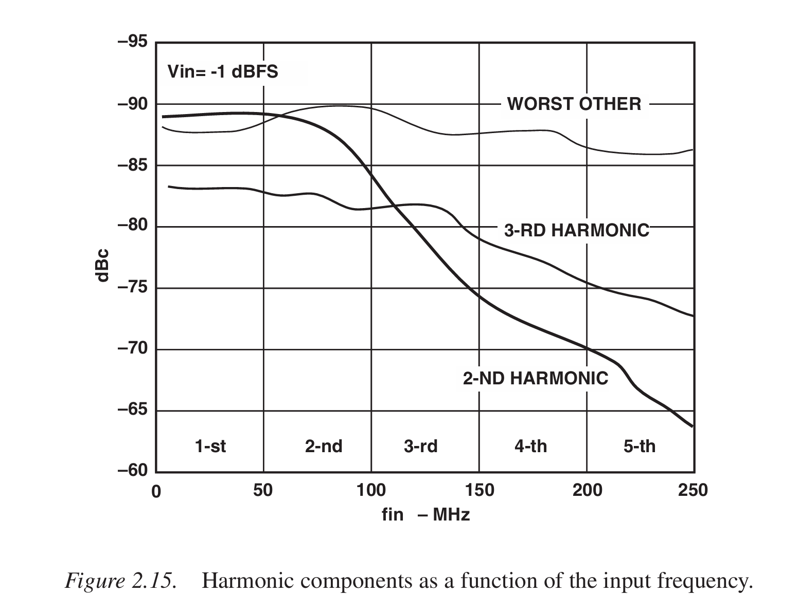
输入频率最高达250MHz（第五奈奎斯特区域）。一个全差分系统会让二次谐波在前两个奈奎斯特区域可以忽略（dBc低至-90dB，说明谐波分量小），但在高频处全差分结构的好处减弱，二次谐波占据主要地位。
- **总杂散失真（Total-Spurious-Distortion，TSD）：** 是ADC输出频谱中的杂散分量的平方和的平方根值。输入是一个指定幅度频率的纯正弦信号。TSD通常以dB为单位，以该输入频率下的输出分量的均方根值作为参考。
- **无杂散动态范围（Spurious-Free-Dynamic-Range,SFDR）:** 信号的均方根值与第一奈奎斯特区域中最高的杂散频谱分量的均方根值的比值。SFDR提供了与总谐波失真相似的信息，但关心最差情况的频率处。SFDR与输入幅度相关。对大输入信号，最高的杂散频率在信号的谐波处；对输入幅度远小于满量程的信号，信号造成的失真可以忽略，其他不由输入导致的频点变得占据主要地位，这些杂散是转换器的非线性本质导致的。
SFDR对通信系统而言是很重要的。通常而言，对一个代表了天线与其他大信道一起接收信息的小信号做模数转换是很有必要的。有可能会发生：其他大的信道产生了大的杂散，落入了小信道中，掩盖了相关信息。下图阐述了这个问题：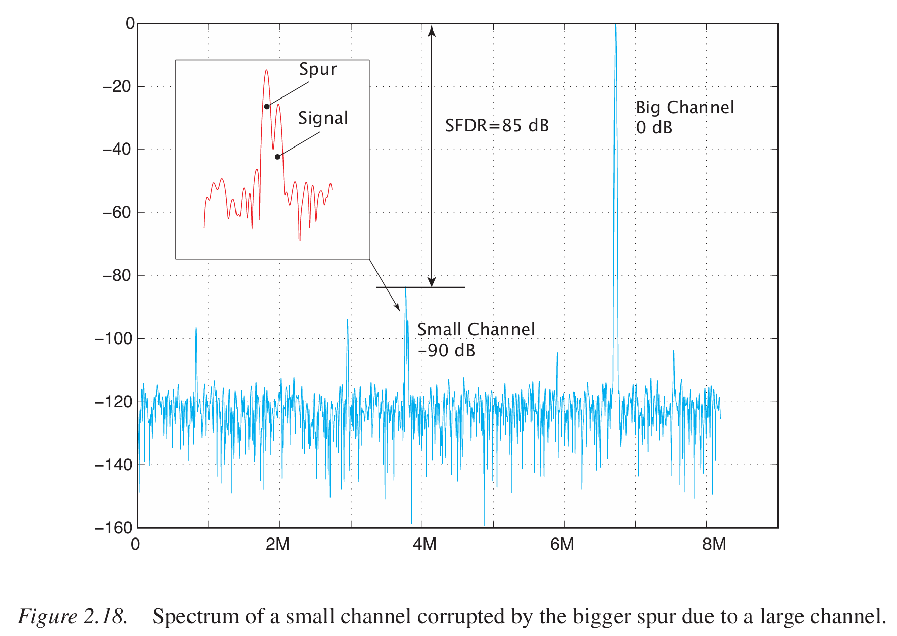
输入信号有两个信道，大的在6.72MHz附近，幅度0dB；小的在3.8MHz附近，幅度-90dB.采样频率是16.4MHz.大的分量在20.16MHz处会产生一个大的三次谐波，会折叠进3.76MHz处，只和小信道相距40kHz。尽管SFDR是85dB，产生的杂散依然几乎全部掩盖了-90dB处的信号。
SFDR基本会被绘制成信号幅度的函数。通常以dBc表示。一些数据手册会提供最大毛刺的均方根值，以ADC满量程值做了归一化。下图展示了一个假设的ADC的SFDR：
曲线对应的是60.2MHz的输入,80MHz的采样频率，因此输入是在第二奈奎斯特区域的。这张图片说明SFDR(dBFS)与输入幅度无关，因此dBc也就随着输入幅度上升而接近线性上升（都是以dB为单位）。输入为-86dB时SFDR为0dBc。在这个时候最大毛刺与输入相等。
- **互调失真（Intermodulation Distortion,IMD）：** 当输入是复信号时考虑非线性导致的杂散。非线性不仅会导致单频信号的失真；同时，当输入是多个正弦波时，它们之间的交互就会产生互调项。数据转换器的非线性导致了频谱成分的混叠，在所有可能的输入频率的整数倍的和与差处产生毛刺。IMD是用参数或图表量化的。
- **双频互调失真（Two tone IMD,IMD2）：** 是其中一个信号的均方根值和最坏的三阶互调积的均方根值得比值。输入是由两个紧密相近的单频信号f1和f2组成。通常这个指标只考虑三阶杂散，会出现在$(2f_1-f_2),(2f_2-f_1)$处。只考虑三阶杂散的原因是它们和输入频率f1/f2很接近。其他互调项离输入频率很远，可以在数字域中滤除。
- **多频功率比（Multi-Tone Power Ratio,MTPR）：** 为使用在通信系统中数据转换器规定。它定义了多频传输系统的失真。这个参数使用幅度相同为$A_0$的一系列单频信号测量，基频是$f_0$。少数的频率会丢失。谐波失真会在失去的频率处产生干扰信号。MTPR定义为信号的均方根幅度，也即$A_0$，与失去的频率处的均方根值的比值。
- **噪声功率比（Noise-power ratio,NPR）：** 与MTPR相似，它描绘了一个使用在频分复用链路（FDM links）中的ADC的线性性能。NPR是一个通常用来描述功率放大器的参数，但同样的概念也适用于数据转换器。在一个FDM系统中信号是由不同幅度和频率的载波组成的。信号像一个通过带通滤波器的白噪声。如果其中一个信道被移除，在丢失的信道频率处频谱将会呈现一个深的凹痕。如果用得到的信号激励一个ADC，那么转换器噪声和IMD会填充这个凹痕。经过ADC后的凹痕深度就是NPR。下图展示了一个用来测量NPR的典型频谱：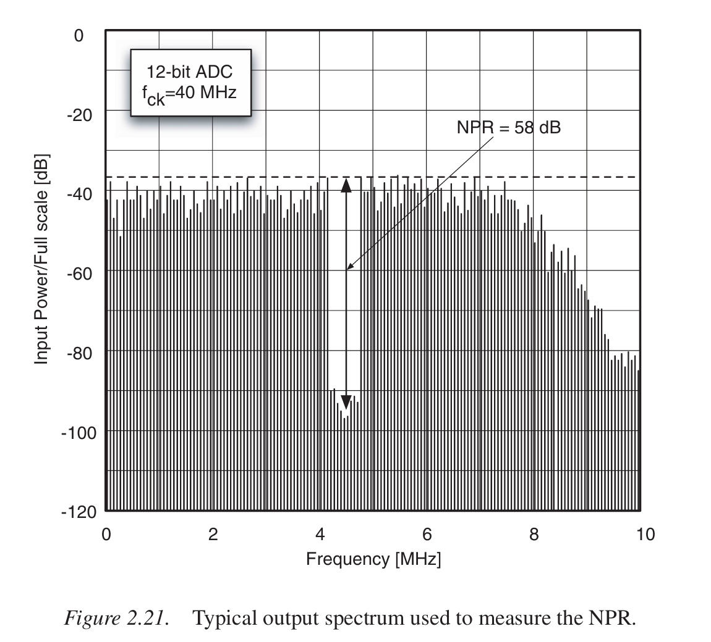
NPR与输入信号的均方根值有关。对小的输入信号，凹痕主要由量化噪声和热噪声填补，这两项噪声基本与输入功率无关。对大的输入信号，ADC的饱和与失真起主要作用，导致NPR快速下降。如下图所示。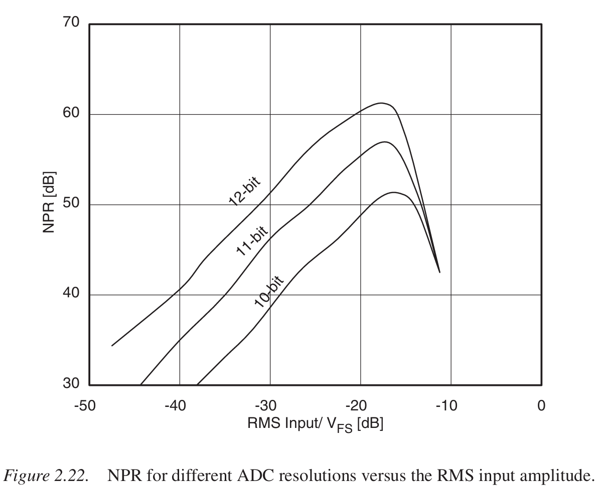
- **有效分辨带宽（Effective Resolution Bandwidth,ERBW）：** 定义为与低频时相比SINAD下降3dB时的模拟输入频率。ERBW给出了转换器能处理的最大信号带宽。ERBW应该在奈奎斯特限之上。
- **品质因数（Figure of Merit,FoM）：** 是用来测量ADC的功率有效性的参数。它假定总的功率全部由转换器的带宽（BW）和等效位数（ENB）来消耗。不同出版物和手册使用FoM的不同定义，但这些定义的基础都是：
$$ FoM=\frac{P_{total}}{2^{ENB}2\cdot BW}$$
有些情况用比特数bits代替ENB；或用有效分辨带宽ERBW代替带宽。其他的定义用时钟频率，不用信号带宽（对奈奎斯特速率转换器而言）。FoM与使用的结构和技术线宽有关。有效的解决方案中FoM低于1pj/conv-step.为了协调不同结构和技术之间的差异，应当使用一个更清晰的FoM的定义，应该有与技术值和操作环境有关的参数。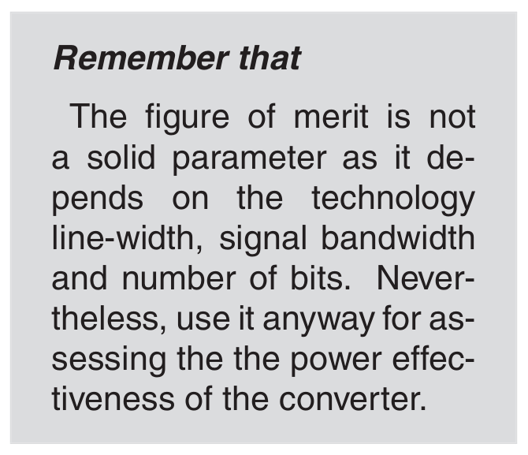

## 2.6 DIGITAL AND SWITCHING SPECIFICATION

数字特性也由一系列给定的参数而指定。这能确保内外部电路之间的恰当接口，同时对数据转换器内部的逻辑电路的同步很有用。下面给出的这些菜单树是商业数据手册中最常用的一些。

- **逻辑电平：** 是用来表示逻辑状态的一系列不重叠的幅度范围。所使用的逻辑电平能够确保与定义的逻辑标准兼容（项CMOS或TTL）。
- **编码或时钟速率：** 是能保证达到规格性能的可能的编码速率范围。这个速率可以在十倍或更多的范围内变化。操作数据转换器时最好在规定的最大时钟速率规格的25%条件下进行。
- **时钟定时：** 规定了时钟的特性。这个信息通常使用图表来给出。外部时钟通常在集成电路内部通过边沿触发器再次生成，会将输入锁存在上升或下降沿。时钟占空比可以在一些限制条件下任意选择。50%占空比通常是最佳动态性能的选择。
- **时钟源：** 时钟信号规定了转换器的工作时序。电路要求用差分输入正弦波生成非常低抖动的时钟。晶振（有或没有外部滤波器）用来获取输入正弦波。这保证正弦波是纯净的，并能提供精准的过零时间。内部放大器，处在饱和状态下，用来将输出变成方波，因此生成内部时钟。
- **睡眠模式：** 规定了一个断电模式，会切断主要的偏置电流并使功耗最小化。将一个逻辑电平加到恰当的引脚上能够激活断电模式。启动和端点激活时间取决于睡眠电路相关的时间常数。或许需要几us的时间进入睡眠模式，几ms的时间再使电路恢复供电。
