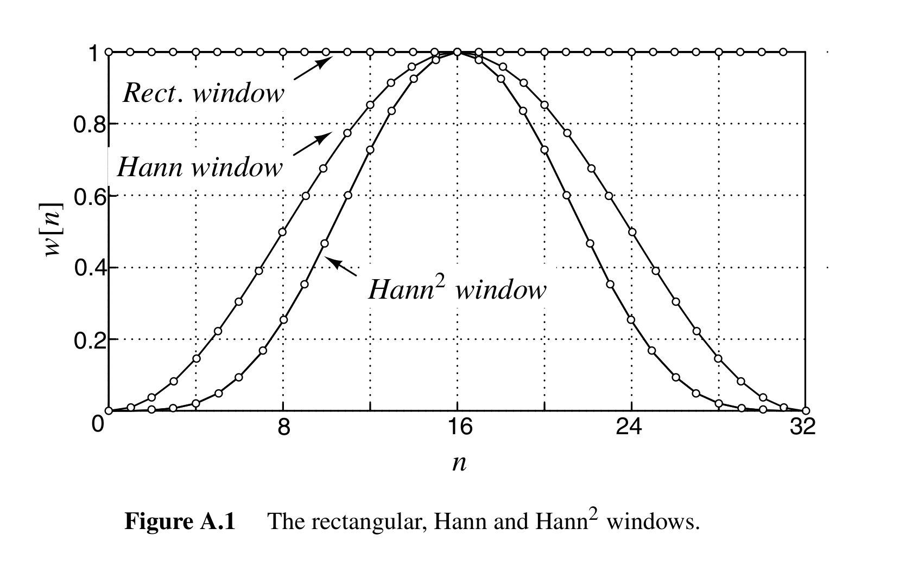
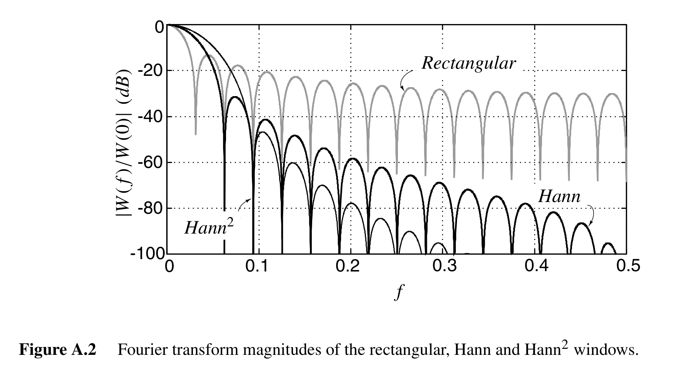
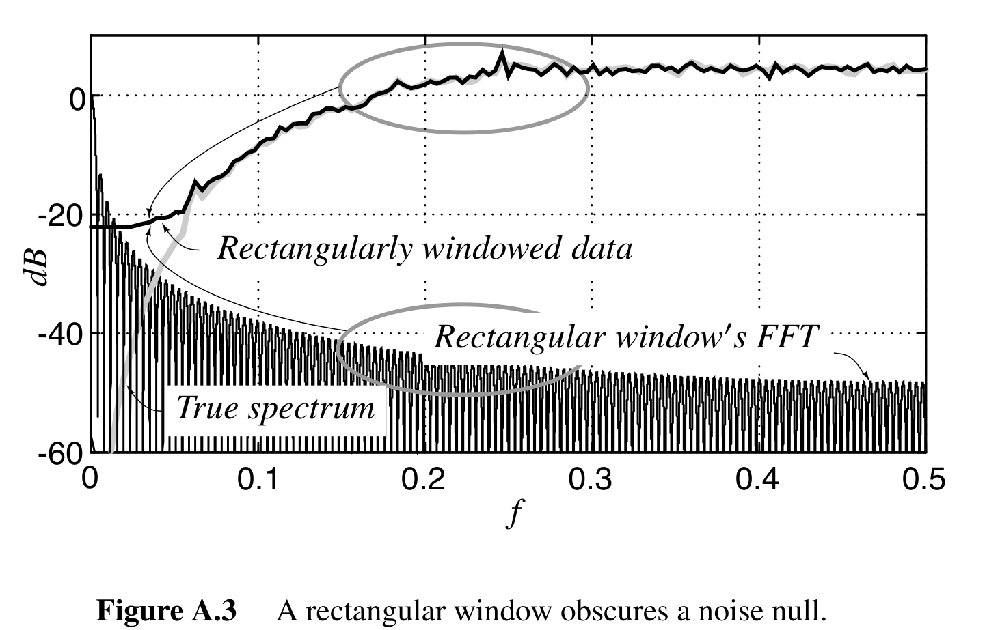
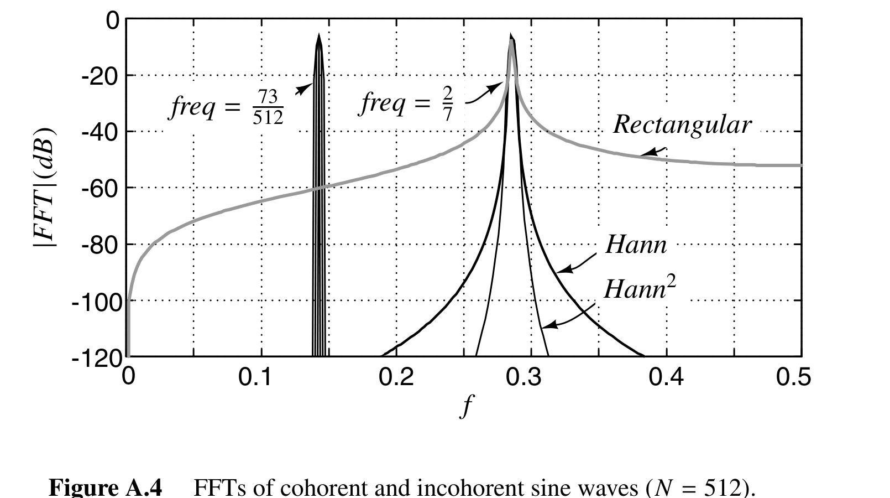

# Understanding Delta-sigma ADC APPENDIX A

这个附录的目的是解密使用FFT分析delta-sigma adc的步骤。FFT在sigma-delta数据的功率谱估计中被广泛使用，但有时它会被滥用。当使用FFT分析数据时，设计者需要熟悉几个重要的概念，即加窗、缩放、噪声带宽和平均。此附录将会依次处理这些主题，将它们应用到实例中，并在最后简单介绍数学背景。

FFT是计算离散傅里叶变换的快速算法。具体式子此处不再写出。

一个周期为N的离散时间信号由直流分量和基频的谐波组成。对周期信号而言，用FFT可以很轻松地计算出功率谱。但不幸的是，数据往往不是周期的，直接使用FFT通常不是明智的。

我们将把数据相关的“噪声”看成一个随机信号，更专业的术语是随机过程。如果数据来自于测量，那么它就包含真正的噪声分量，我们的观点被证实了。对于仿真中的数据，噪声是一个确定过程的结果，所以把这个过程称为随机的是不恰当的。但这个过程是复杂、非线性的，通常还是混沌的，因此这个过程是确定的并没有太大影响。

## A.1 Windowing

加窗是在进行FFT前将信号与窗函数$w(n)$相乘的行为。这一看，似乎这个操作会改变信号的频谱内容，因此不可取。尽管加窗会改变信号的频谱内容，但有些加窗是不可避免地，因为我们不可能记录无限长度的信号。我们能做的就是在一个有限长度N上记录。有限长度的记录可以认为是无限长序列与矩形窗相乘（N长的全1序列），因此加窗就带来了损害。因此，我们需要考虑的问题不是“我该不该给数据加窗”，因为无论如何数据都已经是加过窗得了，而是“我怎么给数据加窗”。

这个问题在于原始数据频谱和加窗后数据频谱的关系。由于时域相乘对应频域卷积，因此泛泛的说，加窗后信号的频谱是不加窗信号频谱与窗函数的频谱的卷积。为了得到精确的频谱，设计者必须选择一个频域卷积后能够带来足够少误差的窗。

考虑下图中的三个窗:

下表列出了它们的定义，并概括了一下待会儿要讨论的参数：

|Window|Rectangular|Hann|Hann2|
|---|---|---|---|
|w[n]|1|$\frac{1}{2}[1-cos(\frac{2\pi}{N})]$|$\frac{1}{4}[1-cos(\frac{2\pi}{N})]^2$|
| $\|\|w_2\|\|^2$ |N|3N/8|35N/128|
|主瓣点数|1|3|5|
|W[0]|N|N/2|3N/8|
|NBW等效噪声带宽|1/N|3/2N|35/18N|

由于矩形窗在断点处有不连续，而Hann和Hann2窗（Hann窗的平方）是连续的，我们怀疑相比其他两个窗矩形窗有更多的高频内容。这个怀疑在图A.2被证实，此图展示了傅里叶变换的幅度（也即对窗函数做FFT，公式不再列出）：

以直流分量$W(0)$做了归一化。使用的是N=32点。如图A.2所示，矩形窗高频瓣的峰值接近一个常数，而另外两个窗的高频瓣分别以-60dB/decade和-100dB/decade归零。一个窗函数频谱的高频表现，在决定卷积带来的误差是至关重要的。

作为一个卷积问题的演示，图A.3展示了一个噪声成型数据的频谱，256点矩形窗的FFT和加窗数据的FFT。如图A.3中指出，窗边缘与带外噪声卷积，因此填补了噪声空缺，显著降低了SNR。

设计者必须确保：与带内量化噪声强度相比，噪声泄露是很小的。在高精度delta-sigma调制器的情况下，带外噪声密度和带内噪声密度的差可以有80dB或者更多。图A.3指出对256点FFT，可观测到的带内和带外噪声的密度只有约23dB的差异。增大也无济于事。

因此设计者不得不使用矩形窗以外的其他窗函数。存在许多函数，但是对设计者而言最重要的特性还是给定的窗函数的高频衰减。具有有限的高频衰减的窗，比如汉明窗，不如高频衰减无限增加的窗函数更可取。特别地。512点的Hann窗过能够在噪声密度上提供80dB衰减，而256点的Hann2窗有相近的性能。由于实际上使用的Hann窗在几千的数量级（为了提供足够的频域分辨率），简单的Hann窗也能提供足够的噪声泄露防护。

在数据分析中另一个很重要的考量是信号泄露。在实验室或者仿真过程中，使用正弦波来激励是很方便的。但是，正弦波的频率必须精准地落在FFT点上；否则，信号的能量将会涌入所有点。图A.4通过；两个正弦波的512点FFT描绘了这个现象：

第一个正弦波频率是$\frac{73}{512}$，精准位于FFT的第73个点上，而第二个正弦波频率为$\frac{2}{7}$，并不是精准地位于FFT点上。在第一个例子中（信号不连贯），正弦波的能量集中在小小的几个点上（对矩形窗是1，对Hann窗是3，对Hann2窗是5）。对第二个例子（信号不连贯），正弦波的功率散布到了所有FFT点上。扩散的严重程度取决于信号频率与最近的FFT点相距多远，以及窗的形状。跟噪声泄露中一样，矩形窗展现出最严重的信号泄露，因为它的边缘最宽。

在仿真中，将信号频率放在FFT点上比较容易，因此可以减小整体的信号泄露。在计算$x[n]=cos(2\pi fn/N)$的采样信号时，注意要使用$\pi$的精准值。使用Hann窗时，将$\pi$约到4会带来信号的裙边（？），总能量是-84dBc；使用矩形窗时，裙边能量是18dB更高。在实验中，信号泄露可以通过将生成器锁相来实现，能够精准设定信号频率。如果将信号频率放到FFT点上不太可能的话，加窗可以用来减少频谱污染。另外，信号的频率幅度和相位可以被估计，估计出的信号可以从数据中减去，只留下噪声。

我们将解决的关于加窗的最后一个问题是，用来获取信噪比的精确估计所需要的窗长。估计信噪比的最简单的方法是：计算信号点上的功率与带内噪声点上功率的比值。为了对SNR估计有一个小的影响（小于1dB），信号占据的点数应该相对的少（小于带内总点数的20%）。如果我们使用Hann窗，信号会占据3个点，那么我们至少要有15个带内点，因此需要总的点数为$N\geq(30\cdot OSR)$，其中OSR为oversampling ratio，$OSR=\frac{f_s}{2f_b}$，这里应该很好理解。
