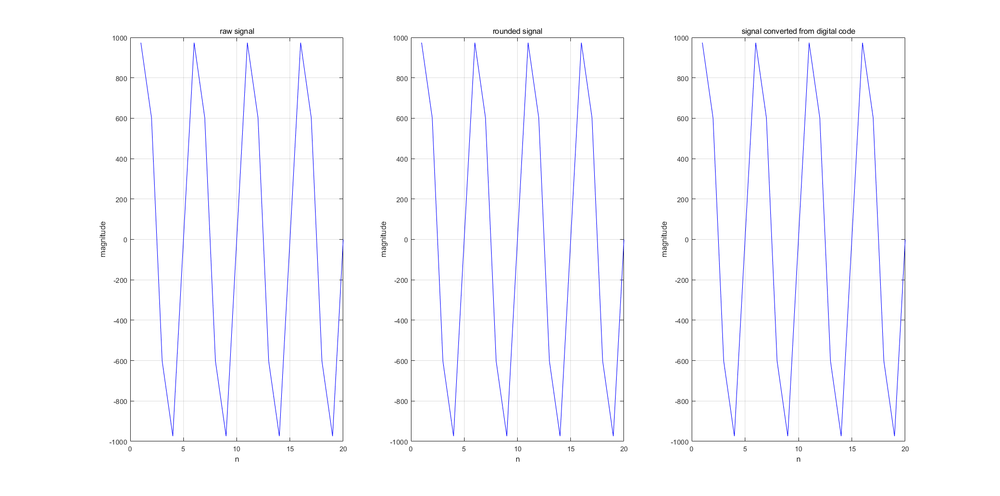
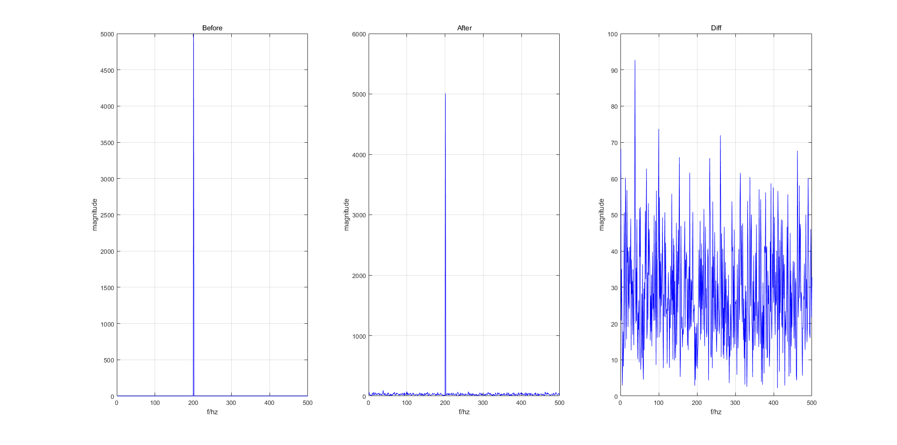
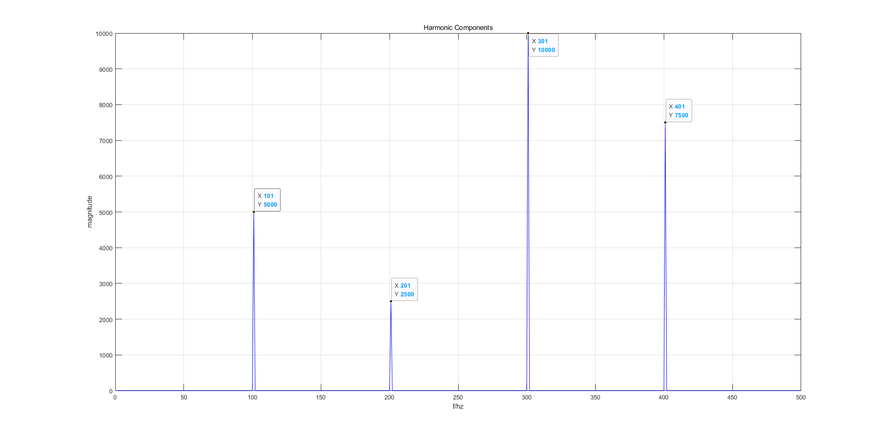

# MATLAB程序

## 利用MATLAB做一个最简单的ADC

```matlab
%% simple adc
clear;
close all;
clc;
%% generate sine sequence
fs = 1000;%sampling rate
f1 = 200;%signal frequency

T =1/fs;%sampling period

n = T:T:20*T;

x = 2^10*sin(2*pi*f1*n);
subplot(1,3,1);plot(x,'color','b');title("raw signal");xlabel("n");ylabel("magnitude");grid on;

x = round(x);
subplot(1,3,2);plot(x,'color','b');title("rounded signal");xlabel("n");ylabel("magnitude");grid on;
%% analog-digital-analog
x_d = dec2bin(x);%digital code

x_a = my_bin2dec(x_d);%signal converted from digital code

subplot(1,3,3);plot(x_a,'color','b');title("signal converted from digital code");xlabel("n");ylabel("magnitude");grid on;
```

**运行结果：**


## 给正弦序列加白噪声，验证理想白噪声模型

```matlab
%% add white noise to sine sequence
clear;
close all;
clc;
%% generate sine sequence-add white nois-FFT
f1 = 200;%signal frequency
fs = 1000;%sampling rate
T = 1/fs;%sampling period

n = 1*T:T:1000*T;

x = 10*sin(2*pi*f1*n);

n = randn(1,1000);
xn = x+n;

Y = abs(fft(x));
YN = abs(fft(xn));

Yd = YN-Y;%diff

subplot(1,3,1);plot(Y(1:500),'color','b');title("Before");xlabel("f/hz");ylabel("magnitude");grid on;
subplot(1,3,2);plot(YN(1:500),'color','b');title("After");xlabel("f/hz");ylabel("magnitude");grid on;
subplot(1,3,3);plot(Yd(1:500),'color','b');title("Diff");xlabel("f/hz");ylabel("magnitude");grid on;

```

**运行结果：**

不同频点处的噪声高度基本一致，能够认为是白噪声。

## 理解图2.17中谐波的反折

```matlab
%% harmonic component folded into the first nyquist zone
close all;
clear;
clc;

%% 
fs = 1000;%sampling rate 1000hz
f1 = 300;%300hz
f2=600;%600hz,folded to 400hz 
f3 = 900;%900hz,folded to 100hz
f4 = 1200;%1200hz,floded to 200hz

T = 1/fs;

n = 0:T:999*T;

X = 20*sin(2*pi*f1*n) + 15*sin(2*pi*f2*n) + 10*sin(2*pi*f3*n) + 5*sin(2*pi*f4*n);


Y = abs(fft(X));

plot(Y(1:500),'color','b');
xlabel("f/hz");ylabel("magnitude");title("Harmonic Components");
grid on;

```

**运行结果：**


