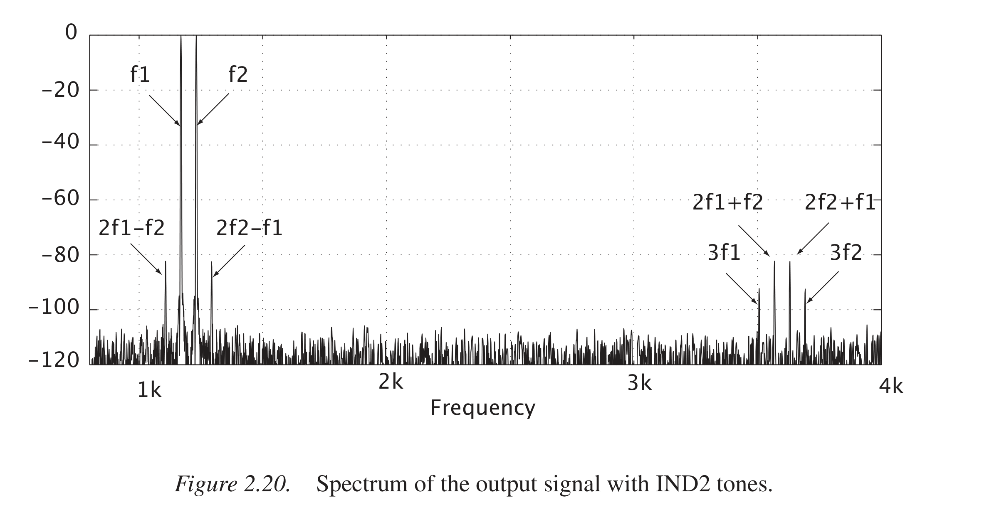

# 一二章问题

## 第一章

### 1 为什么sin1只有两个峰值 为什么幅度变化不是1/2

因为sin1的频率是2hz,sinc函数的带宽是4hz，经过sin1调制后正负频率的频谱抵消掉一部分，导致经过sin1调制的信号的带宽是其他信号的一半，峰值自然也少了两个
我又自己画了一遍频谱图，就峰值而言幅度确实变为了一半，虽然不是完全准确。这个误差可能是因为时域截断相当于频域卷sinc这个操作带来的？

*纠正后：* 幅度变化的问题是因为没有对加窗造成的幅度损失进行补偿。

### 2 过渡带宽度为什么是$(f_s-2f_b)/fb$

$0-f_b$区间的信号需要保留，$(f_s - fb)-f_s$区间的信号需要抑制，而$f_b - (f_s - f_b)$区间的信号不会折叠进有用信号的区间，则过渡带宽度为$(f_s - 2f_b)$，转换到对数坐标上就是$log_{10}[(f_s - 2f_b)/f_b]$

### 3 P11 "inherent demodulation"怎么理解

欠采样可以将窄带信号的频谱搬移到基带区域，相当于同时进行了解调操作

### 4 P14 什么是noise budget

系统的很多部分都会产生噪声，noise budget就是某一部分被分配的允许产生的噪声的上限？

*纠正后：* noise budget意思是如何分配电路的噪声，用以指导电路设计。根据信号的幅度和ENOB计算出**tital noise**，再把noise分配给电路中常见的噪声。不同的噪声分配会影响到电路的架构、功耗和设计难度。

### 5 P18 如何理解"when the ratio between the sampling frequency and the input sine wave frequency is a rational number the quantization noise becomes correlated with the input"

当$f_s/f_in=a/b$时，量化信号以$af_s$为周期，那么量化误差同样以$af_s$为周期，这样量化噪声就与输入信号有关了。

### 6 P19 利用量化白噪声模型，推导采样频率同量化噪声的关系，更新SNR公式

根据1.3中的推导噪声可以看作分布在$[-f_s/2,f_s/2]$区间上的白噪声。
之前推导出$P_N = \frac{\Delta^2}{12}$，考虑采样频率对噪声的影响$P_N^{'} = 2f_h/f_s\times P_N,f_h$是抗混叠滤波器的通带频率。
则$SNR = 10lg(P_S/P_N^{'}) = 10lg(\frac{f_s}{2f_h}P_S/P_N) = (6.02n + 1.78 + 10lg\frac{f_s}{2f_h})dB$

### 7 P23 什么是噪底noise floor,最小可分辨的信号幅度和噪底的关系

noise floor是电阻产生的热噪声，功率为$4kTR_s$.

*疑问：采样系统的噪声与$R_s$无关，可以说与noise floor无关吗？那么可分辨的信号幅度是否与噪底无关*

*纠正后：* 频谱中噪声项地板一样的基底。

### 8 P23 为什么采样保持电路要用开关电容算图1.18

应该是用开关电容可以将开关等效成电阻，去近似计算噪声功率，便于分析
$P=kT/C$

### 9 P24 梳理Ex1.3的计算流程和逻辑

首先确定除了量化噪声外其他噪声的预算是多少，题解中给出的值是50%的额外噪声，据此可以计算出热噪声和抖动噪声的值
然后根据输入频率、输入范围和抖动时间计算出抖动噪声，进而计算出热噪声的预算
由于是两级sample-hold电路，将热噪声均分给两个噪声源（两级sample-hold应该是相同的）后，代入$kT/C$即可计算出电容值

### 10 常用window 主瓣bin side band衰减

- 矩形窗 主瓣宽度$4\pi/N$ 旁瓣衰减13dB
- Blackman窗 主瓣宽度$12\pi/N$ 旁瓣衰减74dB
- Hanning窗 主瓣宽度$8\pi/N$ 旁瓣衰减44dB
- Hamming窗 主瓣宽度$8\pi/N$ 旁瓣衰减53dB
- Gaussian窗 没搜到 画了一下它的谱好像也是高斯的，没有主瓣副瓣？
- flat-top窗 也没搜到 好像也没有主瓣副瓣？

ADC中常用的窗函数：

|Window|Rectangular|Hann|Hann2|
|---|---|---|---|
|w[n]|1|$\frac{1}{2}[1-cos(\frac{2\pi}{N})]$|$\frac{1}{4}[1-cos(\frac{2\pi}{N})]^2$|
| $\|\|w_2\|\|^2$ |N|3N/8|35N/128|
|主瓣点数|1|3|5|
|W[0]|N|N/2|3N/8|
|NBW等效噪声带宽|1/N|3/2N|35/18N|

### 11 P30 如何理解 信号幅度衰减大半，但是幅度比例不变

加窗前的FFT值分别为305/189，加窗后的FFT值分别为128/83，幅度发生了衰减，但是比例大致是不变的
绝对的幅度没有太大意义，根据幅度的相对比例能够计算出不同频率出的信号比值才算有意义的

### 12 P31 什么是processing gain 为了测试12bit adc，需要至少多少processing gain

processing gain:$10\lg(N/2)$,FFT将噪声均分到了$N/2$条谱线上。
$P_{sign} - P_{noise} = 1.78 + 6.02M+10lg(N/2)$，代入M=12，满量程信号 和 噪声相差的分贝为74.74+10lg(N/2) 但是能分辨的dB是多少呢？

*解答后*：通常processing gain要足够大，rule of thumb（经验法则）是FFT点数等于2^(N+4)，N是分辨率

### 13 MATLAB产生的正弦序列是采样以前的还是采样以后的

采样后的。

## 第一章 Extended Problems

### 1 检查公式1.4推导是否正确

感觉结果没错误？
可能需要注意的是冲激串采样后的频谱不仅是原来频谱的周期延拓，还要乘$\frac{1}{T}$?

### 2.P13 式1.6与1.7

理解/推测：经过比较长的时间或者采样率足够高时，周期内的每个点都会被遍历到，因此直接当作连续时间信号分析就行？

### 3.P17 第二段"Also"这句话的意思

不是，这个时候量化输出是固定值，这样的输出是没有意义的，不能体现信号的特征；此时量化误差是输入信号搬移后的结果

### 4.P19 1.18下方第二段"speed limitation"是什么意思

*不太理解*高频的时候电路的寄生电容之类的参数对带来了一些新的噪声？

*纠正后：* 结合图1.18，这里就是在说采样电路的"speed limitation"。对一个RC电路，单位阶跃响应为：$U\cdot(1-\frac{1}{RC}e^{-\frac{1}{RC}t})$。如果采样保持电路的RC值大，采样速度就会变慢，产生额外的误差，带来额外的噪声。

### 5.P20 推导验证公式1.21

确实有问题。更正后SNR对应项应该是：
$$-10log[(\pi f_{in} \delta_{in})^2+ \frac{3}{2}2^{-2n}]$$

### 6.P21 关于自相关函数的说法

自相关函数的傅里叶变换即是功率谱密度。在$|n|>0$的时候自相关迅速衰减到0，因此自相关可以看成是冲激，那么功率谱就是常数，因此可以看成白噪声。

### 7.P20 为什么计算SNR是按照连续信号计算的

感觉和问题2抖动噪声可以按照连续信号计算功率那里原因相同

*纠正后：* 虽然量化后的信号是离散的，但是其本身是一个连续的随机信号。其功率在自相关函数那里求出。

### 8.P25 关于抖动噪声

想知道采样电路是什么时候关闭开关？如果第二个开关闭合的时候第一个开关还没有闭合，是不是会出现问题？

*解答后*：不能让两级开关同时动作。第一级采样结束后断开第一级，然后再闭合第二级采样开关。同时动作会发生漏电或电荷注入。

### 9.P26 推导验证公式1.31

(1.30)中，采样信号的频谱：$\sum_{-\infty}^{\infty}x(nT)e^{-j\omega nT}$.
如果采样信号是N长周期的，那么只在基频整数倍处有分量，则上式中$\omega = 2\pi k/(N-1)$且求和范围变成0~(N-1)，则得到(1.31)：$X(f_k) = \sum_{-\infty}^{\infty}x(nT)e^{-j2\pi kn/(N-1)}$

### 10.P34 为什么不能直接连接低通滤波器，而要使用采样保持器

这里之前也很疑惑，不知道这个理解对不对：首先采样电路不可能产生理想的冲激串；其次在实际重建的时候，采样系统和重建系统不会真的连接在一起，我们所拥有的关于原始信号的信息，只能是一系列电平，或者一串数字码，通过DAC来重建，因此只能采用采样保持这种方法重建。

### 11.P35 推导验证公式1.40

冲激响应是高度为1，宽度为T的[0~T]区间的方波，做傅氏变换得到$H(j\omega) = Tsinc(\frac{T}{2}\omega)\cdot e^{-j\omega T/2}$，这个j和$\tau$是哪儿来的？这个j变换后确实没有

### 12.P41 sigma-delta ADC相关?

$\tau$的目的是消除量纲，让重建信号的面积与其对应的点的值相同。
而对于$H(s)=\frac{1}{s\tau}$，对应的冲激响应是单位阶跃函数，起到积分器的作用。

---

## 第二章 Basic Problems

### 1.除了摊薄量化噪声外过采样还有哪些好处？从电路设计滤波器的角度去考虑

抗混叠滤波器的过度带宽是$log_{10}[(f_s - 2f_b)/f_b]$，当f_b减小时过渡带宽大，降低了需要的滤波器的阶数，更容易设计。

### 2.设计数字滤波器常用的Kaiser方程？

$$
w(n) = \frac{I_0[\beta\sqrt{1-(1-\frac{2n}{N-1})^2}]}{I_0\beta}, 0 \leq n \leq N-1
$$
其中$I_0[x]$是修正的零阶贝塞尔函数，参数$\beta$控制最小阻带衰减
对于过渡带宽、滤波器长度和凯瑟窗参数$\beta$，可以按照下面的方程给出
$$\Delta\omega=\omega_{st}-\omega_p$$
$$N\approx\frac{A_s -7.95}{2.285\omega}+1$$
$$
\beta =
\begin{cases}
0.1102(A_s - 8.7),A_s \geq50\\
0.5842(A_s -21)^{0.4}+0.07886(A_s-21),21<A_S<50
\end{cases}
$$

### 3.推导VDD变化对ADC的ENOB的影响

VDD下降太多时，量化噪声与其他噪声变得相当，这时候信号功率下降，而噪声下降的速度变慢，因此使得SNR降低。也就是说，系统内哦除了量化噪声、热噪声，还有与输入信号功率相关的其他噪声。

### 4.什么是伪差分信号

信号关于一个固定的电平对称，这个电平与模拟地不同。

*纠正后：* 一端输入，一端接地

### 5.ADC如果用全差分输入的好处是什么？从SNR角度考虑

抑制共模噪声，减少信号线之间的干扰，提高SNR。**

### 6.动态范围跟信号幅度和噪底之间的关系是什么？

动态范围是SNR/SINAD为0dB时信号的幅度。也就是说，不断减小信号幅度直到信号高度与噪底高度一致，此时信号的幅度即为动态范围。

*纠正后：* 书中找到了两个“动态范围”的定义，一个是上面所说，在动态规格中；另一个在常规规格中，是转换器能处理的最大信号电平和噪声电平之间的比值。

### 7.ESD有几种模型？一般芯片ESD测试时要达到多少kV

三种。单位是V：

- 人体模型（HBM）：250/500/1000/2000/4000/8000 1/2/4/8kV
- 机器模型（MM）：100/200/400/800 100/200/400V
- 充电器件模型（CDM）：125/250/500/1000 500/1000V

### 8.从系统的角度如何理解INL与DNL

DNL是局部的误差特性，刻画了某一段上量化步长和理论值的差值；INL是整体的误差

### 9.测试INL和DNL时是否需要考虑offset和gain error的影响

DNL不需要考虑；INL需要考虑，使用端点拟合线能够校正失调和增益误差的影响。

*纠正后：* 都要先校正offset 和 gain error

### 10.例2.1中的INL多项式模型，尝试推导一下INL和ENOB的关系

*纠正后：* $ENOB = N-max(|INL|)$

### 11.采样电容对setting time的影响？

采样电路等效为RC电路，当输入电压为U时电容上的电压为：$U\cdot(1-\frac{1}{RC}e^{-\frac{1}{RC}t})$
当C越小时，电压越快能达到最终值附近，因此setting time就越小；C越大时setting time越大。

### 12.如何利用图2.11测试ADC/DAC的性能？

**对ADC：** 输入dc值，多次采样得到输出码，计算输出码对应的标准差，标准差越小，噪声越小，性能越好。

**对DAC:** 与ADC类似，输入固定的数字码，计算输出模拟值对应的标准差。

### 13.HD和INL之间的关系？

$SFDR = -20log(|INL|2^{-N_{bits}}+2^{-1.5N_{bits}})$

### 14.理解图2.17中谐波的反折，运行matlab模型加深理解

见matlab程序中

### 15.SFDR与SNDR之间的关系，SNDR有可能比SFDR大吗？

SFDR是信号功率与最高杂散分量的比值，而SNDR是信号与失真/噪声综合的均方根值的比值。可以认为SFDR是噪声和失真的最大值，而SNDR是平均值。
SNDR不可能比SFDR大。

### 16.为什么要考虑IMD2

因为IMD2和输入频率很接近，而其他互调项离输入频率很远，可以在数字域中直接滤除。

### 17.理解图2.20里面谐波的交调带来的影响

$f_1 = 1.169kHz,f_2 = 1.231kHz$.youyuf1和f2比较接近，三阶互调积$(2f_2-f_1),(2f_1-f_2)$与输入频率相当接近，因此必须考虑；而$(2f_1+f_2),(2f_2+f_1),3f_1,3f_2$都与输入频率相距较远，更高阶的互调项应该与输入频率相距更远，都能够在数字域中滤除。

### 18.如何测试ADC的ERBW

ERBW是相比于较低频输入时SINAD下降3dB时的模拟输入频率。先使用较低的频率输入，记录信号幅度；之后提高输入频率，再观察FFT频谱，直到信号幅度下降3dB，此时的输入频率即为ERBW。

### 19，记住FoM的公式，搜索Boris Murmann的ADC survey，看一下Pipeline SAR ADC的FoM

书中给出的公式是：$$ FoM=\frac{P_{total}}{2^{ENB}2\cdot BW}$$
Boris Murmann的ADC Survey中给出了两种FoM:
$$FoMW=\frac{P}{f_{snyq}\cdot 2^{ENOB}}$$
$$FoMS=SNDR + 10log\frac{f_{snyq}}{2P}$$
其中fsnyq - Nyquist sampling rate, equal to the sampling rate (fs) divided by the oversampling ratio (OSR)
