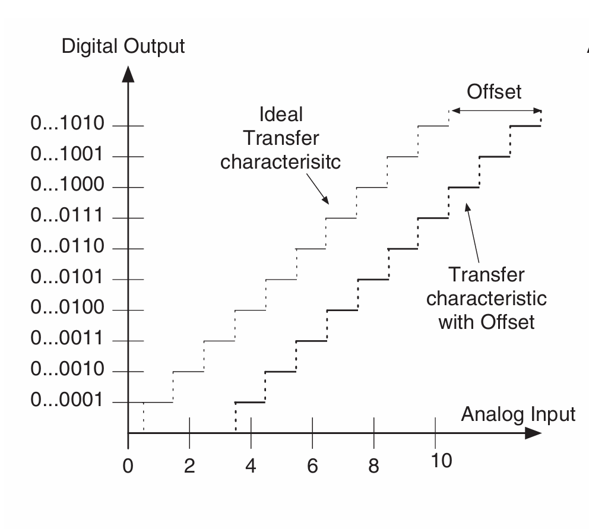
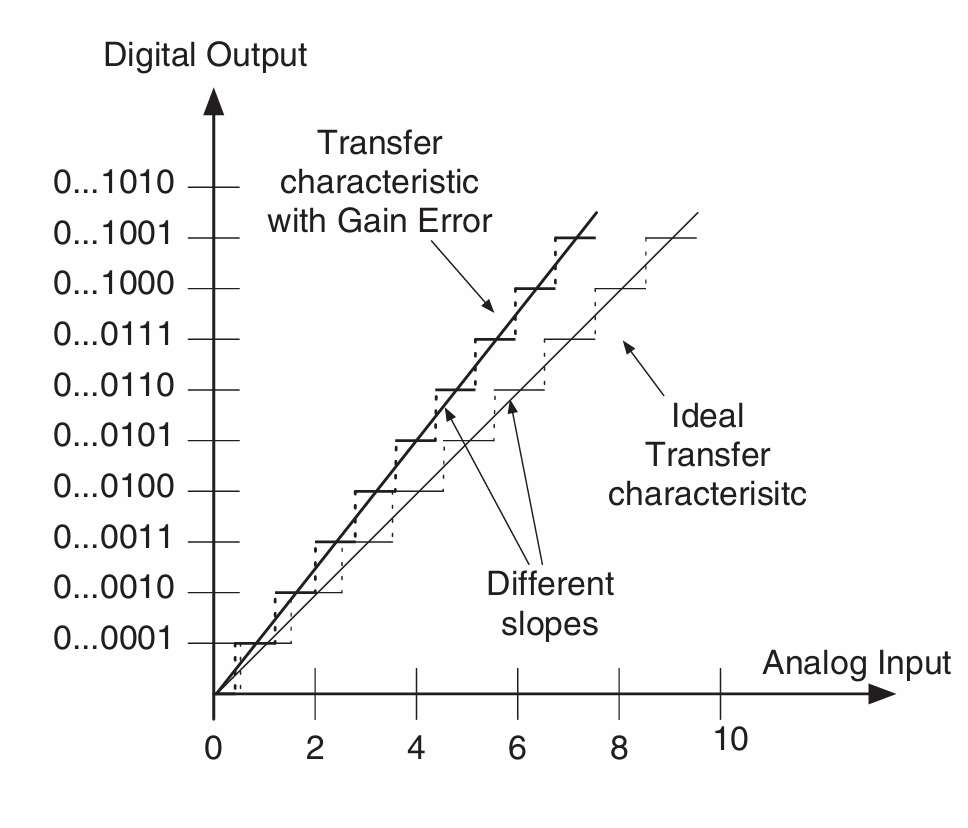
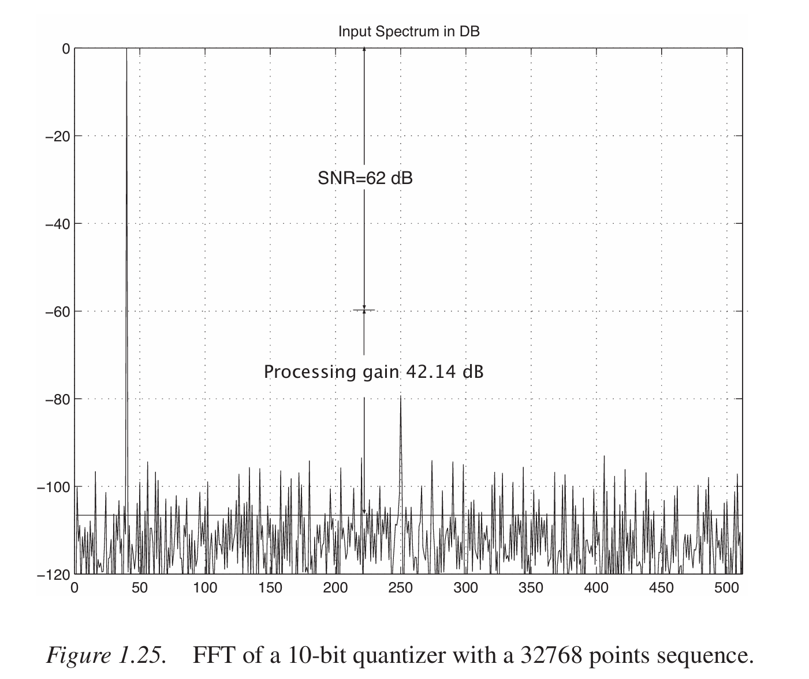

# 第二章疑问

## 1.失调相关

这幅图中标出的offset是整体的偏移。但这幅图中，实现转移曲线好像只有失调，没有其他误差。
对于更一般的转移曲线，失调是否可以理解为：实际曲线中第一个跳变点与理想曲线的差值？

## 2.增益误差相关

书中说gain error就是内插直线斜率的误差。也给出了一个ADC的例子：
但这个“transfer characteristic with gain error”貌似每一段的量化步长都是一致的。如果是一个更一般的转移曲线，每一段的DNL都不同，内插线的斜率怎么计算？
这里的疑问让我对端点拟合线定义的INL也不太理解。

## 3.INL相关

对于不考虑校正增益误差和失调误差时计算INL，能够理解；
但当考虑校正误差，使用 端点拟合线 时，有些地方不理解：

1. 书中说使用端点拟合线能够让量化区间两端的误差都是0（corrects the two limits and shows zeros at the two endings of the quantization range.），这里的端点拟合线是连接哪两个点得到的呢？
2. 这里计算校正了增益和失调误差的INL，意义是什么呢？在实际使用时候，误差不是依然存在吗？

## 4.SNR/SNDR/SFDR相关

SNR和SNDR在计算时候的细节

在第一章中找了一个FFT的图片：这里标注noise floor的直线是通过SNR公式+processing gain直接得到的，还是通过计算其他谱线的均方根值得到的呢？实际计算SNR应该怎么计算呢，是不是不需要考虑明显的谐波失真（与SNDR区分开）？
