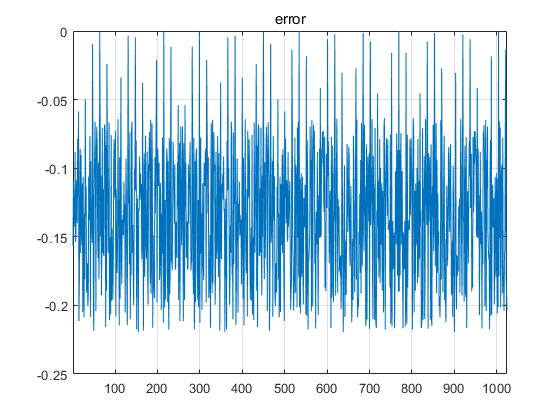
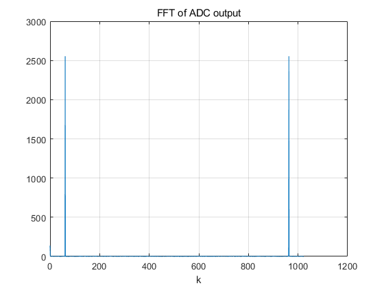

# pipelined ADC 建模

## 代码

```matlab
%% 1.5bit/stage pipelined adc modeling
clear;
close all;
clc;
%% input signal & sampling frequency
f_in = 0.61*10^3;
f_s = 10.24*10^3;%f_in/f_s=361/1024
M = 1024;%FFT bins
n = (0:1023)/f_s;

V_REF = 5;

V_in = V_REF * sin(2*pi*f_in*n);%input signal


%% resolution & comparator offset & pipeline
N = 6;%number of stages
V_in = [V_in,zeros(1,N-1)];

decision = zeros(1,N);%comparator output
DAC_output = zeros(1,N);% DAC output

comp_offset1 = -V_REF/4 + (V_REF/2)*rand(1,1);
comp_offset2 = -V_REF/4 + (V_REF/2)*rand(1,1);%comparator offset,[-V_REF/4,V_REF/4]

ADC_output = zeros(1,1024);%measured in LSB

%% start pipelining
for i = 1:1024+N-1
    
    for j = N:-1:1
        if i >= j
            
            if j == 1%input from previous stage
                input = V_in(i);
            else
                input = DAC_output(j-1);
            end
            
            if input >= V_REF/4 + comp_offset1
                decision(j) = 1;
                DAC_output(j) = 2*input - V_REF;
            elseif input < -V_REF/4 + comp_offset2
                decision(j) = 0;
                DAC_output(j) = 2*input + V_REF;
            else
                if j == N
                    decision(j) = 0;
                else
                    decision(j) = 1/2;
                end
                DAC_output(j) = 2*input;
            end
            
            if i-j+1 <= 1024
                ADC_output(i-j+1) = ADC_output(i-j+1) + 2^(N-j) * decision(j);
            end
            
        else
            disp("The  stage have no data yet");
        end
    end
    
end

ADC_output_analog = (ADC_output-2^(N-1))*(10/2^N);%1LSB = (10/64)
plot(ADC_output_analog- V_in(1:1024));title("error");xlim([1,1024]);grid on;
%% FFT & INL & DNL
Y = abs(fft(ADC_output_analog));
figure(2);
plot(0:1023,Y);xlabel("k");title("FFT of ADC output");grid on;

transition = -5:10/(2^N):5;

group_count_actual = zeros(1,64);
group_count_theoritical = zeros(1,64);

g = discretize(ADC_output_analog,transition);

for i = 1:1024%group_count_actual
    group_count_actual(g(i)) = group_count_actual(g(i)) + 1;
end

for i = 1:64%calculate group_count_theoritical
    group_count_theoritical(i) = 1024 * (asin(transition(i+1)/V_REF)-asin(transition(i)/V_REF))/pi;
end

DNL = zeros(1,64);
INL = zeros(1,64);

for i = 1:64
    DNL(i) = group_count_actual(i)/group_count_theoritical(i) - 1;
    if i ==1 
        INL(1) = DNL(1); 
    else
        INL(i) = INL(i-1) + DNL(i);
    end
end

figure(3);
subplot(1,2,1);
plot(DNL);xlim([1,64]);xlabel("n");title("DNL");grid on;
subplot(1,2,2);
plot(INL);xlim([1,64]);xlabel("n");title("INL");grid on;
```

## FFT & INL/DNL结果图

ADC输出与实际值误差：



FFT：



INL&DNL：


