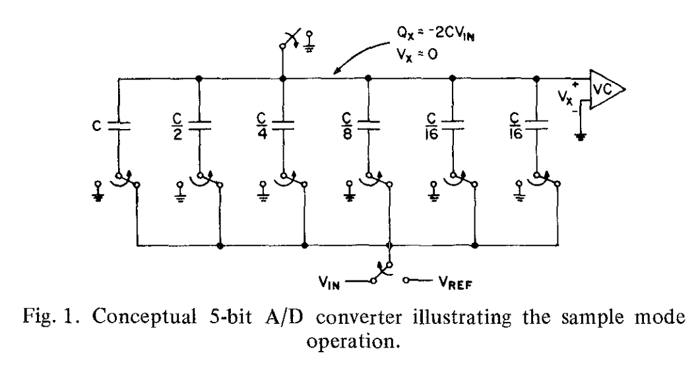
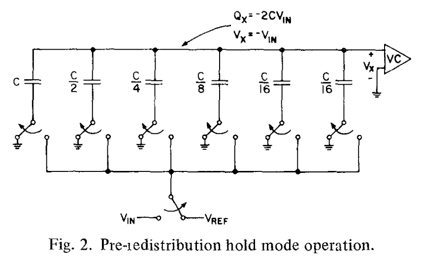
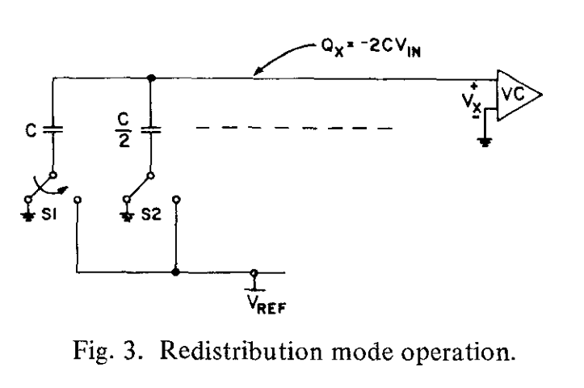
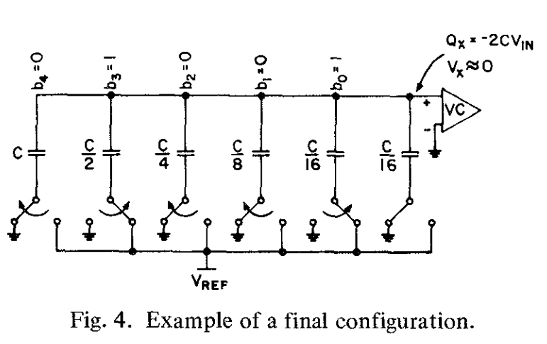

# 全MOS电荷重分配AD转换技术-第一部分

## 摘要

这两篇文章描述了两种使用标准单通道MOS实现AD转换的不同技术。第一篇文章中，讨论了使用二进制加权电容阵列来实现高速逐次逼近式转换。这项技术提供了内在的采样保持功能，能够单单通过一个正的参考来接收两种极性的输入。对限制该项技术的精度和转换速率的因素进行了分析研究。呈现了单片原型机（monolithic prototype）的实验结果；实现了10bits分辨率，转换时间为23us.完整单片版本的预计系统晶粒尺寸（die size）是8000mil2。

第二篇文章描述了一个两电容的逐次逼近技术，与第一篇相比较，需要相对小的晶粒区域，在存在电容比误差的情况下，它本质上是单调的，并且工作在更低的转换速率。对限制该项技术的精度和转换速率的因素进行了分析研究。呈现了单片原型机的实验结果；实现了8bits转换率，AD转换时间是10us.作为 D/A 转换器使用时，反应时间为 13.5 秒。据估计，包括逻辑电路在内的完全单片式芯片的总晶粒尺寸为 5000 mil2。

## Ⅰ.引言

大部分AD转换的传统技术需要高性能模拟电路（例如运算放大器）和用于计数、排序和数字存储的数字电路。这往往会产生混合电路，由一个或者多个双极模拟芯片组成，以及一个MOS芯片，来经济地执行数字功能。这篇文章描述了一个新的，全MOS技术，通过一个单一芯片实现，以23us的转换时间实现了10bit转换。它包含了一个内在的采样保持功能，能够接受单极性或者双极性输入，通过标准的N通道金属栅极技术实现。

为了使用MOS技术实现快速地逐次逼近式AD转换，传统的电压驱动R-2R技术是相当复杂的，因为标准单通道技术不能实现恰当的片电阻的扩散电阻。还需要复杂的薄膜工艺（thin-film process）。此外，这些方法需要在很大的数值范围内仔细控制 MOS 开关的 "导通 "电阻比。

相比于作为电流开关使用，MOS器件用作电荷开关时，本身的偏移电压为零。作为放大器有很高的输入阻抗。此外，采用金属栅极技术制造电容器也很容易。因此，人们会使用电容器而不是电阻器来作为精密元件，使用电荷而不是电流作为工作介质（working medium）。这项技术，称为电荷再分配，很多年来被使用在AD转换器的离散部分中。但是，这些转换器需要高性能运算放大器，在单通道MOS技术中是很难实现的。

这篇文章描述了一个利用加权电容器上的电荷再分配技术的新型AD转换技术，另一篇论文[引用]描述了一个使用两个相同的电容器的电荷再分配概念的另一个应用。在这篇论文的Ⅱ部分中，描述了二进制加权电容器阵列和它的运行。在Ⅲ和Ⅳ部分中，分析了速度和分辨率的限制。原型系统中的实验结果在Ⅴ部分中展示。

## Ⅱ.使用二进制加权电容的电荷再分配AD转换技术

在图1中，通过转换器的5bit概念版本描述了这项新的转换技术。

它由一个比较器，一个二进制加权电容阵以及一个LSB对应的额外的电容器组成，以及将极板连接到指定的电压的开关。转换是通过一连串的三个操作完成的。

第一，“采样模式”，上极板连接到地，底部的极板连接到输入电压。这使得上极板存储了电荷，与输入电压成正比（be proportional to）。在图2所示的“保持模式”中，连接到地的顶部开关打开（open，这里指的应该是断开），然后底部的极板连接到地。因为顶板上的电荷是守恒的（charge on the top plate is conserved），顶板的电势（potential）变成$-V_{in}$。

图3中展示的“再分配模式”首先测试MSB的值，也即最高位。这是通过将最大电容器的底部升高到参考电压$V_{ref}$来实现的。现在的等效电路实际上是，两个相等电容之间的分压器。这个操作的结果是，电压$V_X$之前等于$-V_{in}$，现在增加了参考电压的1/2，也就是：

$$V_x = -V_{in}+\frac{V_{ref}}{2}$$

>**$V_x$表达式是怎么得到的？**
上极板的电荷守恒。对于C，$\Delta Q_1 = C\Delta U = C[V_{in}-(V_{REF}-V_P)]$
而对于其他的电容，总的容值也为C，则$\Delta Q_2 = C[V_{in}-(-V_P)]=C(V_{in}+V_P)$
电荷守恒，则$\Delta Q_1 + \Delta Q_2 = 0$，即得：$V_x = -V_{in}+\frac{V_{ref}}{2}$
**我们能否得到更一般的式子？**
答案是肯定的。观察图2，这是一个5bit的ADC，有六个电容，分别是$2^0 - 2^{-4}$，以及一个额外的$2^{-4}$的最小电容。
将接到$V_{ref}$的电容器和接到地的电容器分开来看，它们的容值分别为$C_1,C_2$其中$C_1+C_2 = 2C$。
根据上面列出的电荷守恒式子，$2C(V_{in}+V_P)=C_1V_{ref}$，整理得：$V_P = -V_{in}+\frac{C_1}{2C}V_{ref}$。这样就得到了统一的式子。

通过检测$V_x$的符号（seneing the sign of V_x），如果其符号为正，输出为逻辑“1”，如果输出为负，输出为逻辑“0”.也就是如果$V_in > \frac{V_{ref}}{2}$，输出为1，否则输出为0。通过这个过程确定了输出码的最高位。

如果MSB输出是0的话，开关S1会重新连接到地。类似的方式，通过将下一个最大电容的下极板连接到$V_{ref}$，检查$V_X$的极性，来确定次高位输出的值。在这时，电容阵的分压特性会将$V_{ref}/4$加入到$V_x$中：

$$V_x = -V_{in}+b_4\frac{V_{ref}}{2}+\frac{V_{ref}}{4}$$

转换以这种方式进行，直到所有位都被确定。数字输出01001的最终配置在图4中展示。

注意到所有对应“0”的电容都完全放电了。原来上极板上的所有电荷以二进制的形式重新分配，现在只存在（reside）于“1”对应的电容器上。**为什么？mark一下这里。** N位分辨率的转换需要N次电荷再分配。相较于之前的再分配技术，下极板开关的电容不会影响转换的准确度。这个事实是显而易见的，因为开关电容要么对地放电，要么从$V_{ref}$充电，但绝不会从上极板吸收电荷。因此，开关器件可以相当大，允许快速重新分配**这里的很大是什么意思？**。另一方面，阵列的上极板连接到所有电容器，连接到一个开关和比较器，导致了上极板和地之间的大寄生电容（parasitic capacitance）。然而，转换过程的性质，决定了$V_X$会向其初始值0收敛。因此，在最终的配置中，寄生元件上的电荷会与它在采样模式时候一致。因此，这个寄生元件贡献的误差电荷非常接近0.对于一个10bit转换器，上极板的寄生电容会是最小电容的100倍，也只会导致0.1 bit的失调误差。这等同于说，最小的电容器可能比寄生电容小得多，因此最大的电容可能会按比例减小。此外，$V_X$的初始值不一定是0，也可以是比较器的阈值电压（应该是给比较器留一定的裕度？）。可以在采样模式下存储偏移来消除比较器的偏移。因此，线性度主要取决于阵列中电容器的比率精度。

只要对阵列开关方案稍作改动，就能在仍然只使用单个正基准源的时候对双极性电压进行编码。这是通过在采样模式下将最大电容连接到$V_{ref}$实现的，导致存储电荷：

$$Q_x = -C_{TOT}(\frac{V_{in}}{2}+\frac{V_{ref}}{2})$$

然后，依次测试每一位，除了最大的电容从$V_{ref}$连接到地，而其他所有电容都是从地连接到$V_{ref}$
