# 两个ADC的故事：pipelined vs. SAR

## Introdution

这些年里推出的众多奈奎斯特速率的数据转换器中，有三种应用最广泛：flash，pipelined和SAR。这篇文章中我们会关注后两种，并学习它们的异同。

## Brief History

ADC中的pipelining在1967年在专利申请中被TI的工程师提出，如图1中所示，与现在1bit/stage的设计极为相似。而SAR拓扑更老了，可以追溯到1947年的论文以及1957年的专利。如图2中所示，SAR使用机械继电器驱动DAC，DAC输出通过“比较放大器”与输入信号进行比较。CMOS pipelined ADC在二十世纪80年代出现，随后繁荣发展。但CMOS SAR在二十世纪70年代就有报道，直到2000年前它的低功耗潜能被发现前，一直沉寂。

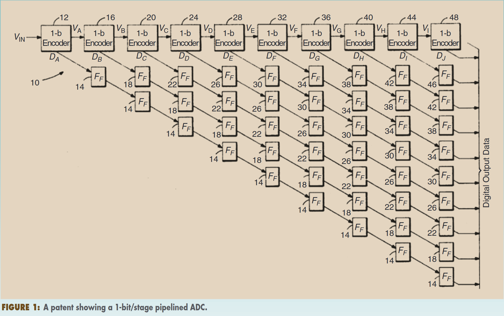

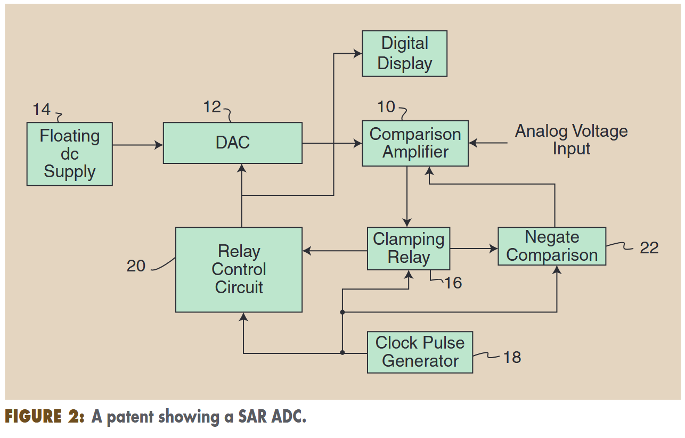

## Quantization by Binary Search

AD转换包含两个基本部分：采样和量化。后者可以看作是，找到输入对应的模拟估计值，并创建一个该值的“数字等价物”，也就是通过数字域来表征这个电压。

在pipelined和SAR的基本结构中，它们都使用二分搜索算法实现这个过程。图3(a)展示了这样一个过程，每个循环中讲电压与接近的模拟值进行比较，计算余差。二分搜索的目的就是，把余差降低到1LSB以内。图3(b)展示了上个周期的判决结果是如何影响下个周期的比较的。

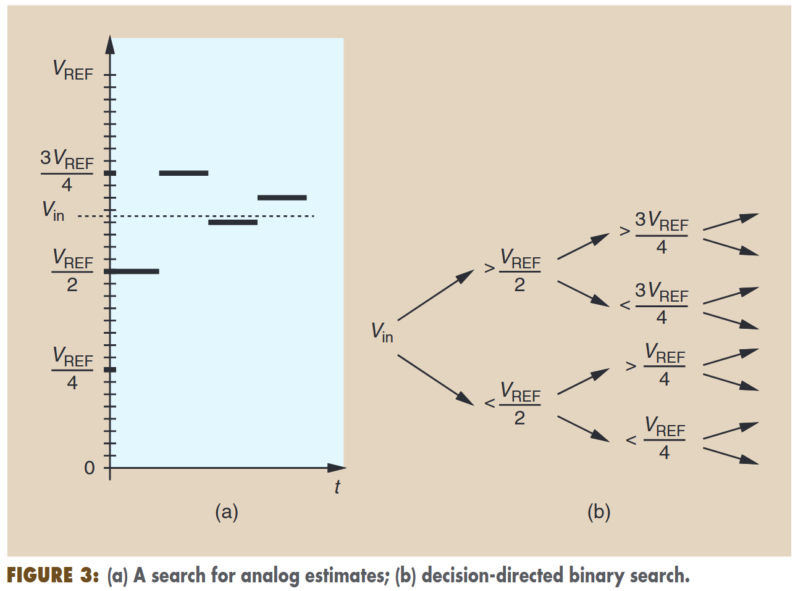

## Pipelined ADCs

### Basic Operation

为了得到基本的流水线结构，我们首先注意到，二进制搜索应该在余差为$V_{in}-V_{REF}/2$ 处开始，这个余差乘2后等于 $2V_{in}-V_{REF}$ ，极性当然不变。因此我们可以构建一个 $2V_{in}-V_{REF}$来为下个循环做准备，如果$2V_{in}-V_{REF}$能够高效紧凑地实现，就很有吸引力了。

图4中展示了一个常用的实现方法，称为“MDAC（Multiple DAC）”级。

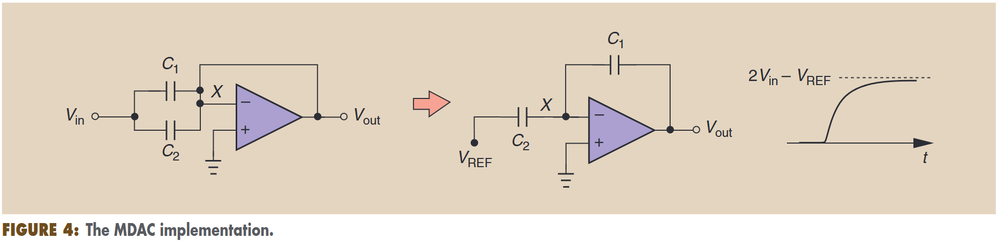

采样模式下，C1和C2（值均为C）跟踪$V_{in}$。在放大模式，C1地左端极板“翻转”到$V_{out}$上去。这时如果opamp增益足够大，电容间失配比较小，那么输出电压就会变到$2V_{in}-V_{REF}$。

>**为什么是这个电压？**
一开始，C1C2连接X点的极板，电荷量都是$-CV_{in}$。C1翻转后，根据电荷守恒，得到下式：
$$-CV_{REF}+C(-V_{out})=-2CV_{in}$$
解得，$V_{out}=2V_{in}-V_{REF}$。

然后，我们就该想想下个周期该怎么进行了。$2V_{in}-V_{REF}$ 被送入下一级MDAC，把这个信号当作新的$V_{in}$的话，下一级的输出就是 、$2(2V_{in}-V_{REF})-V_{REF}=4V_{in}-3V_{REF}$，其极性与$V_{in}-3V_{REF}/4$一致。但是根据图3，只有$V_{in}$大于$V_{REF}/2$时，我们才会将输入与$3V_{REF}/4$进行比较；如果$V_{in}$小于$V_{REF}/2$，我们就需要将输入信号与$V_{REF}/4$进行比较，也就是$4V_{in}-V_{REF}$，但这个值又无法直接递归实现，怎么办？

为克服这个困难，我们修改一下MDAC。

当$V_{in}>V_{REF}/2$时，$f(V_{in},V_{REF})=2V_{in}-V_{REF}$；当$V_{in}<V_{REF}/2$时，$f(V_{in},V_{REF})=2V_{in}$。

图5(a)展示了余差，图5(b)展示了在生成余差前，需先将$V_{in},V_{REF}/2$做个比较，根据结果将C2左极板连接到参考电压或者地。

>**解释一下**
这里的“将C2左极板连接到参考电压或者地”指的是什么？上面已经说过，如果在放大模式将C2左极板连接到$V_{REF}$，那么输出就会是$2V_{in}-V_{REF}$；但此时，如果将左极板连接到地，C2两端没有电荷，C1左极板的电荷就是$-2CV_{in}$，此时$V_{out}=2V_{in}$。

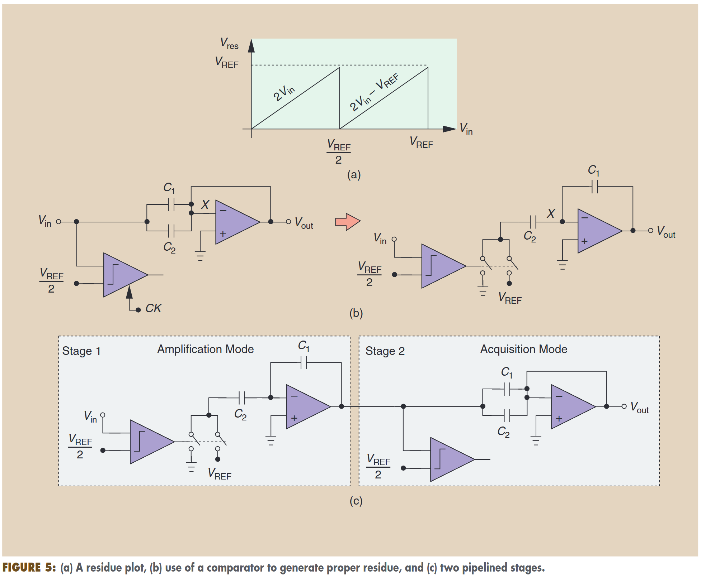

这种情形，电容和比较器同时对输入进行采样。这个电路也称为“SHA-less”前端。

上述原理很容易应用于流水线操作：当一级MDAC位于放大模式时，下一级可以位于采样模式，反之亦然（看图5(c)）。各级MDAC同时运行，意味着转换速度仅收一级MDAC的采样和放大时间影响（通常是第一级）。

这种1bit/stage架构采用流水线设计，结构紧凑，是一种高效的解决方案，尤其是对于flash拓扑达不到的分辨率而言（大约8bit）。

这个结构包括5个不精确来源：$kT/C$以及op-amp噪声，电容失配，有限op-amp增益，op-amp非线性以及比较器失调。这其中，噪声和功率耗散直接相关，电容和运放的缺陷可以在数字域中进行校准，比较器失调可以通过下述的简单修改解决。在高速设计中，还必须解决图5(b)中电容和比较器采样瞬间的失配问题。

我们可以推测，上述架构的硬件和功耗会随着分辨率提高而线性增长。对每个额外的bit，只需要在流水线末端加一级MDAC。但如今的设计对噪声有限制，要求前级（可能还有后续级）使用更大的电容和更高的运放偏置电流。换句话说，整个流水线的硬件和功耗会随着分辨率的提高而呈指数增长。

### 1.5-Bit/Stage Architecture

让我们回到误差源。可以证明的是，有限的运放增益以及电容失配会改变余差线的斜率，而比较器失配会导致判决点从$V_{REF}/2$移动。图6对这两种情况进行了展示。

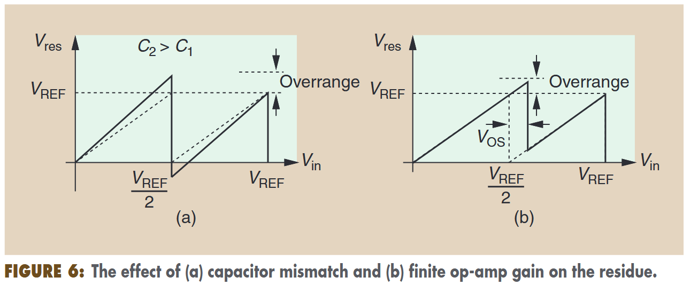

这两种情况，都会让余差“超量程”，但前者即使在“超量程”区域外，也会导致误差（如果只有失调，则只会在超量程的时候有误差）。在这一部分，我们处理后一种情况，也就是比较器失调。我们修改一个结构，让它能够容忍大的失调。

如果我们考虑全差分系统，接下来的研究就会简单许多，这种情况下输入电压变化的范围是$[-V_{REF},+V_{REF}]$。图5(a)展示的残差图被重新绘制，得到图7(a)中：

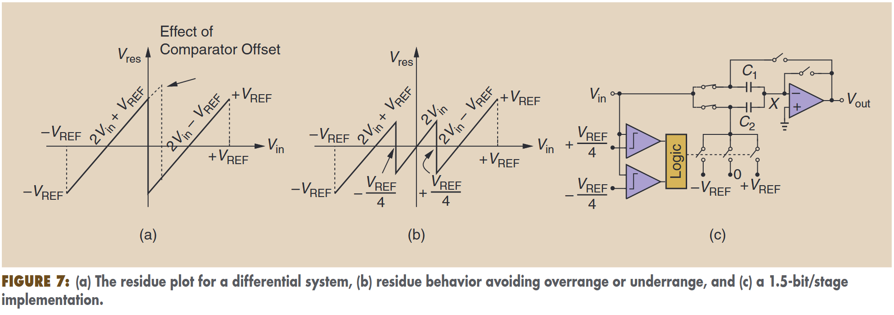

表达式为：$f(V_{in},\pm V_{REF})=2V_{in}-V_{REF},V_{in}>0;2V_{in}+V_{REF},V_{in}<0$。

注意到，现在比较器把输入电压和0电压进行比较。举个例子，如果输入是0V，但是比较器错判成了+2mV，那么判决点就不会出现在0V，而余差电压就会超过$+V_{REF}$。我们的目标是，把余差限制在$+V_{REF}$内，那么判决就需要在输入电压到0之前就进行；同理，如果输入电压从正值接近0，判决电压需要足够正，来避免$V_{res}<-V_{REF}$的情况。

这些想法让我们想到了图7(b)中的余差行为，将判决点改为$V_{in}=\pm V_{REF}/4$。当输入电压绝对值大于$V_{REF}/4$时，余差表达式还是上面的式子；当绝对值小于$V_{REF}/4$时，余差表达式为$V_{res}=2V_{in}$。

事实上，我们只要将输入放大两倍，不增减$V_{REF}$，就能避免0电压附近的误差。如图7(c)所示，该实现使用了两个比较器，称为“1.5bit/stage”结构（好复杂！！！逻辑电路一大堆）。这种拓扑可以容忍$\pm V_{REF}/4$高的比较器失调。我们可以说，每个阶段都使用了一般的“冗余”来适应失调。比较器的低功耗特性使这种拓扑结构比 1bit/stage 的拓扑结构更受青睐。

流水线中，各级的分辨率不必局限于1.5bit.在前端使用闪存级[图7(c)中超过两个比较器]尤为重要，因为其可以减轻运放需要的增益和输出摆幅。例如，具有1位冗余的4位flash次级 ADC 可将运算放大器的开环增益降低 8 倍，而功耗却可以忽略不计。

图7(b)中展示了，电容失配和op-amp有限增益带来的误差，可以通过数字校正移除。pipelined ADC的性能主要受限于其op-amp的性能，这一问题在低压纳米技术中变得更加严重，并导致向SAR架构迁移。

## SAR ADCs

### Basic Operation(for SAR)

SAR ADC是在输入冻结的时候，在多周期内进行循环。图8概念地展示了它的结构。

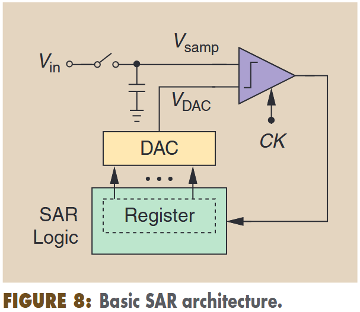

SAR 工作也可以看作是负反馈回路的收敛：比较器的高增益（在此充当砰砰减法器）迫使 VDAC 接近 Vsamp（可能经过一些 "振铃"）。

SAR结构之美源于其三个特性：高分辨率能力，不需要放大器，可以在零静态功耗运行。此外，比较器失调也只会移动静态转移曲线，而不是造成失真。SAR ADC是 "尽可能数字化 "架构的典范。

图9帮助我们理解SAR工作原理：

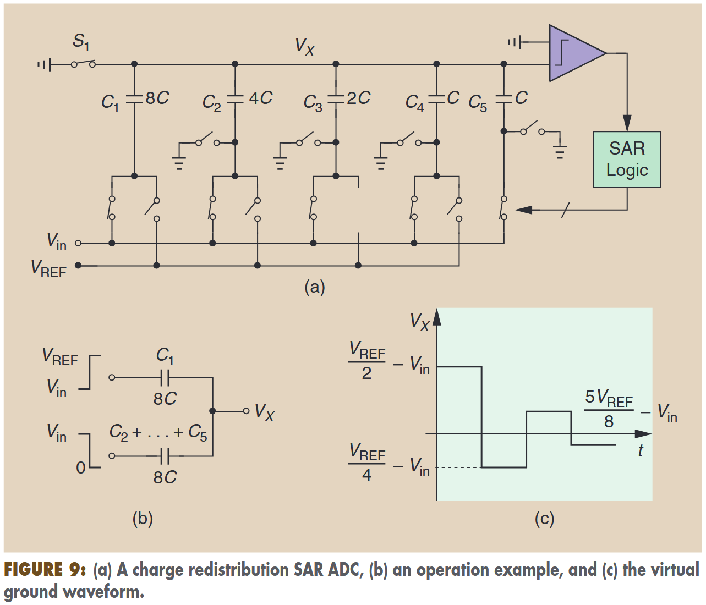

图9(c)展示了余差的变化。持续进行转换，直到余差小于1LSB。我们注意到，每个周期能够得到1bit结果。

图10中展示的“时间树状轨迹”，我们将利用它进行时域分析。

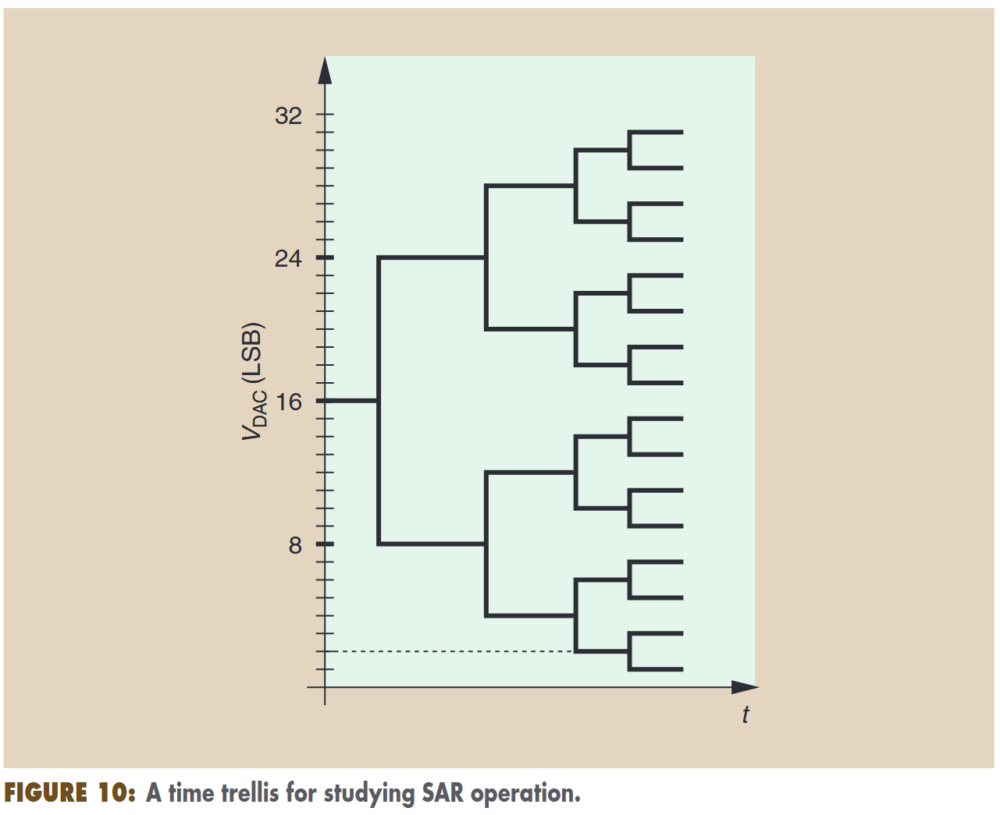

### SAR Issues

尽管SAR简单又高效，但也存在一些问题，如果想获得高性能，就需要额外的电路和架构技术。我们在这部分指出问题，在下一部分指出解决方案。

首先由于一次转换需要多周期，SAR速度慢。看图9(a)中的关键路径，需要比较器响应时间$t_{comp}$，需要逻辑电路延迟$t_{logic}$，需要DAC建立时间$t_{DAC}$，一次转换就需要大约$N(t_{comp}+t_{logic}+t_{DAC})$。对给定的CMOS节点，这三个部分的每个部分都有下限，与功率耗散关系不大，因此限制了ADC速度。

第二，SAR要求其DAC具有高精度和高分辨率。流水线每级只需要两个电容，而SAR DAC总的电容量能达到$2^{N}$，全差分则还要翻倍。大电容面积大，则高分辨率SAR的面积会很大。

第三，没有余差放大器，则噪声会限制性能。

pipelined ADC和SAR ADC有一些共同的问题，电容的失配需要数字校正，而产生参考电压的电路必须是快建立且低噪声的。

### SAR Speed Improvement

这里说了三个能够改善转换速率的技术。

第一个，也是最明显的方法，多通道交织，按比例提高转换率。

第二个方法是，每个周期解决1bit以上。例如，三个比较器可以将输入与三个模拟估计量进行比较，提供2bit信息。但怎么在连续的周期中生成模拟估计量？图11中有所展示，每个量都要用DAC生成。

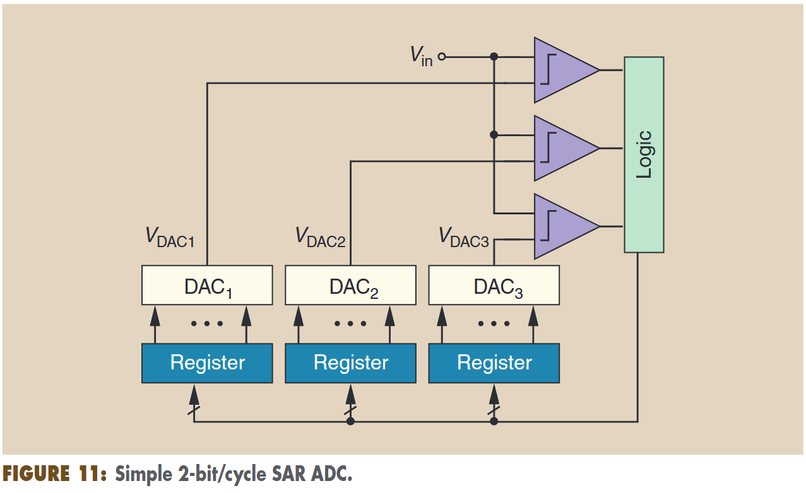

在第一个转换周期中，我们设定：$V_{DAC1}=3V_{REF}/4,V_{DAC2}=V_{REF}/2,V_{DAC3}=V_{REF}/4$。得到一次判决结果后，下个周期就再通过三个DAC电压，把新区间分成4份，以此类推。这样的话复杂度，面积和输入电容都会增长。使用电阻网络充当DAC也可以，但其对应的开关阵列就会复杂而缓慢了。最近的研究表明，每个周期的分辨率可达3位。

第三个方法与DAC速度有关，采用冗余技术，允许每个转换周期内不完全的DAC建立。为了理解这个概念，我们可以参考图12中的5bit网格图：

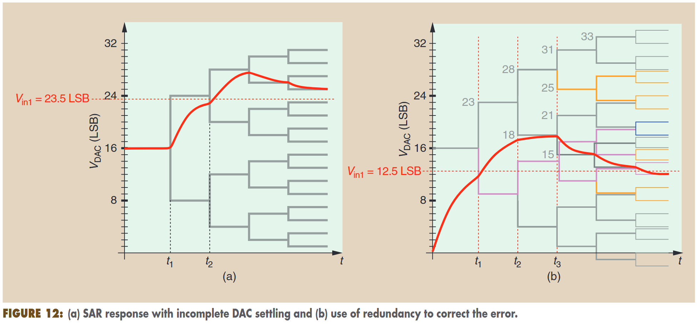

一开始，将DAC的输出打到16LSB，也就是半量程点。在$t=t_1$时刻进行判决，输入电压更大，应该将DAC输出打到24LSB。但是在下一个判决门限，也就是$t=t_2$时刻，DAC输出还没有建立到24LSB，恰好输入电压位于这个电压和24LSB之间，那么就发生了错判，下一个时刻DAC理论输出应该是28LSB。由于负反馈，这时DAC输出应该再减小，但最终结果25LSB还是与23LSB有误差。

这是因为，这个设计中没有包含冗余，所以才导致了误差的出现。

让我们开动脑筋，如何增加冗余，才能够适应DAC的不完全建立？我们观察到两点：第一，$t=t_2$时刻的判决是错误的，并不可逆地设置了寄存器中的一位，环路没有能力重置这一位，导致DAC输出中的错误始终存在；第二，$t=t_2$后的任何修正都需要额外的时钟周期。因此，“冗余”既需要为DAC提供足够的超量程补偿，也需要额外的时钟周期。由于图12(a)中错误地为DAC输出增加了4LSB，因此后续周期必须提供至少4LSB的修正，加上24LSB与$V_{in}$的原始误差。

图12(b)中的树状结构，是SAR冗余的一个例子，这里简单起见，我们认为DAC输出中，0到16LSB的变化是缓慢的。与二进制搜索相比，这里的栅格跳跃更小，但包含的转换周期也更多。如果$V_{in}=12.5LSB$，DAC的输出没有达到16LSB的标称值，那么在$t=t_2$时刻，会产生一个23LSB-16LSB=7LSB的误差。有高增益的环路可以通过降低$V_{DAC}$来抵消这一效果。能力的代价是额外的周期。非二进制增量无需更改DAC设计，可通过更改寄存器后的查找表来实现。

### DAC Complexity Reduction

通过不同的电路技术，可以降低CDAC中电容的数目。常用的方法设计“桥接”电容，以减少DAC一个部分对输出的贡献，从而产生更精细的步进。图13(a)展示了一个8bit系统，想法是通过$C_B$来减弱DAC输出摆幅的影响。

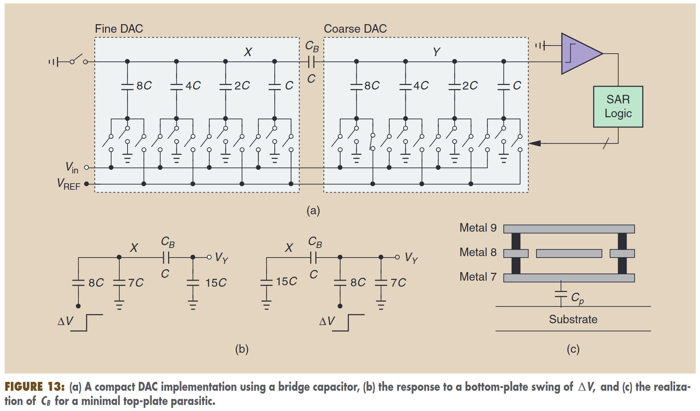

例如，图13(b)中展示的，在下极板有$\Delta V$的变化，8C的电容在精细DAC中产生的电压是$V_Y = (8/255)\Delta V$，而粗糙DAC中产生的电压是$V_Y = 16\times (8/255)\Delta V$。因此，该阵列只需要31个单位电容，就能达到8bit的分辨率。

尽管如此，桥接电容也会受到基板寄生电容的影响，在X和Y之间引入接地电容，导致DAC输出错误。为了解决这个问题，我们构建了图13(c)所示的电容器。其中一块板由金属8制成，并由金属-7和金属-8层及通孔笼罩。这种几何形状可确保从金属 8 到地之间的电场线几乎可以忽略不计，因此与该终端相关的寄生极小。电容器的另一端确实对地寄生了Cp，但如果像图13(a)中那样连接到节点 Y，它只会产生 DAC 增益误差，这在 SAR 环境中是可以容忍的。
