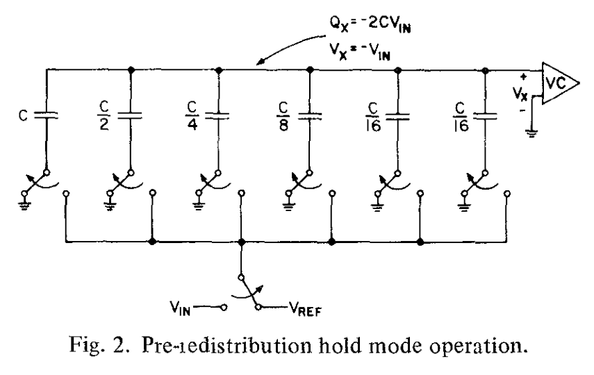
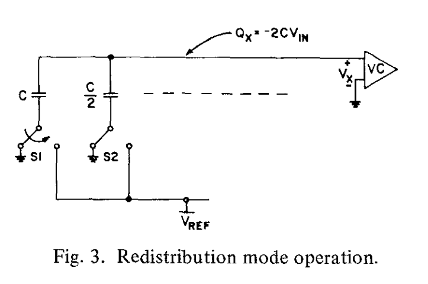
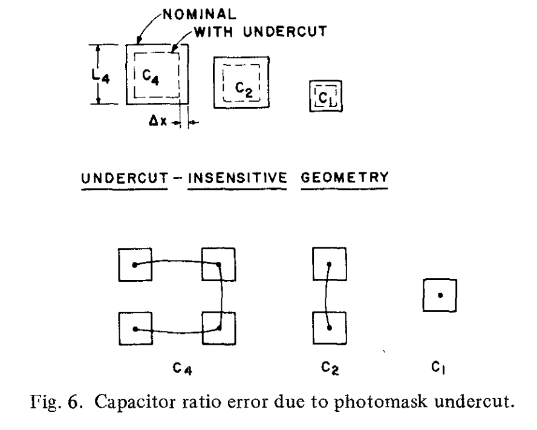
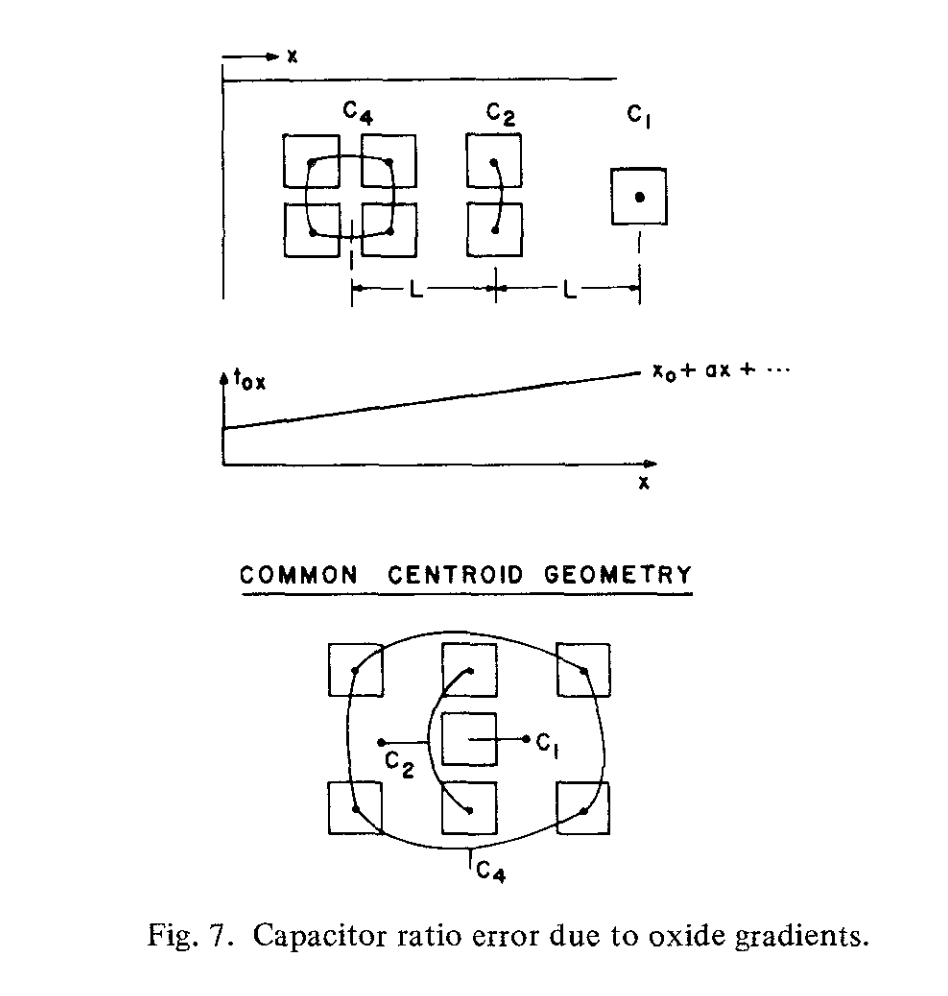
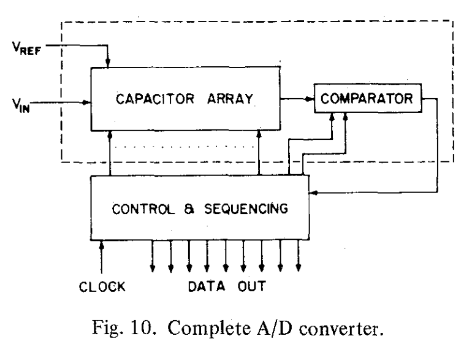
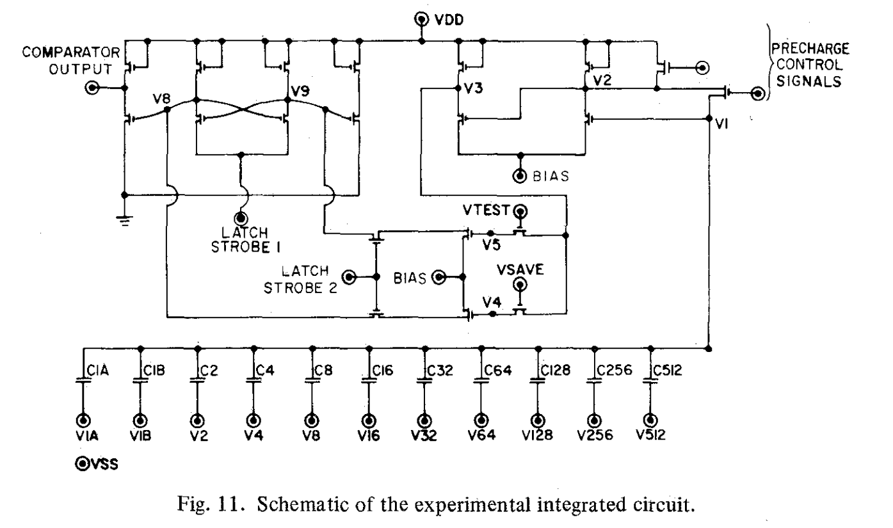
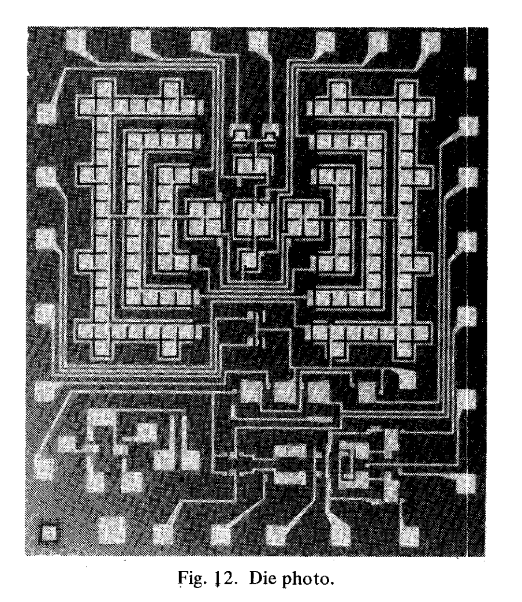
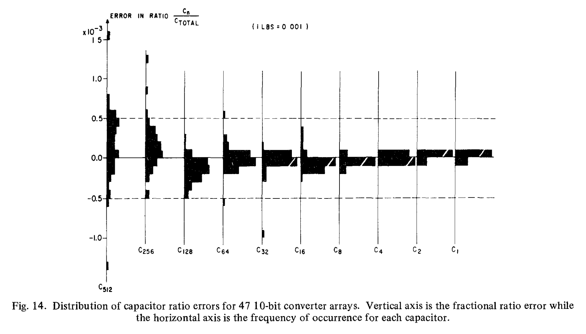
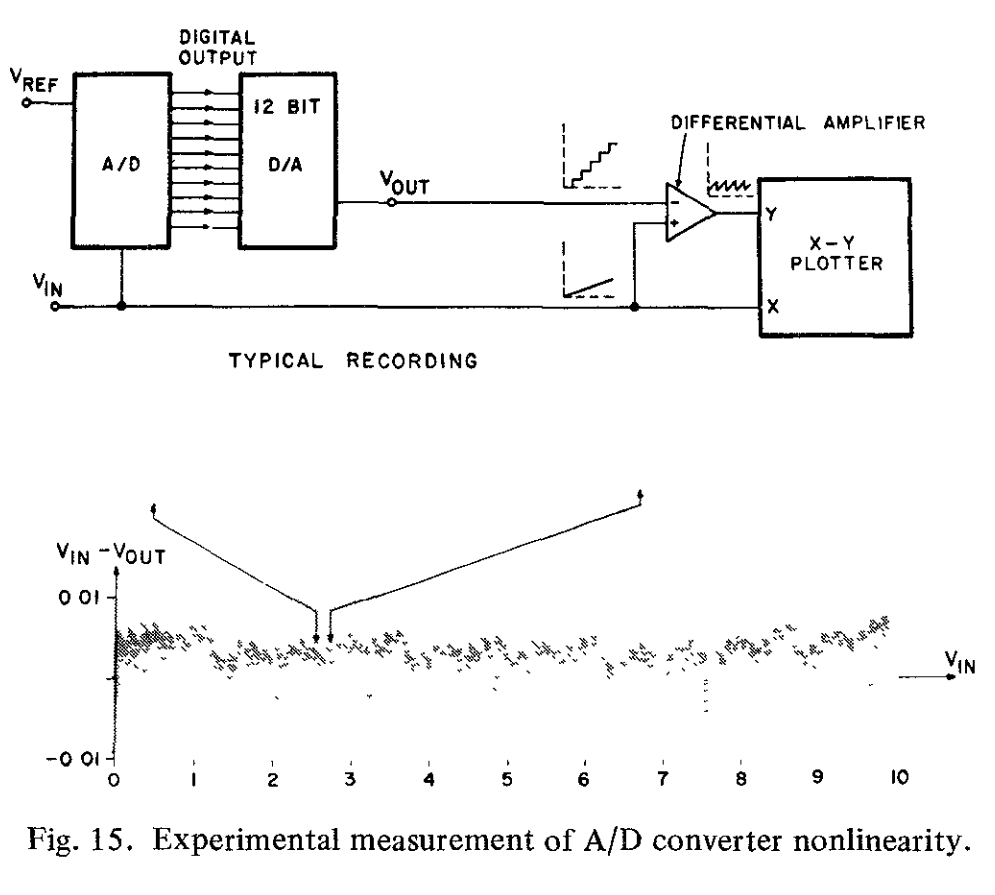
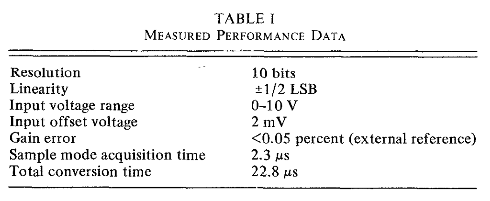

# 全MOS电荷重分配AD转换技术-第一部分

## 摘要

这两篇文章描述了两种使用标准单通道MOS实现AD转换的不同技术。第一篇文章中，讨论了使用二进制加权电容阵列来实现高速逐次逼近式转换。这项技术提供了内在的采样保持功能，能够单单通过一个正的参考来接收两种极性的输入。对限制该项技术的精度和转换速率的因素进行了分析研究。呈现了单片原型机（monolithic prototype）的实验结果；实现了10bits分辨率，转换时间为23us.完整单片版本的预计系统晶粒尺寸（die size）是8000mil2。

第二篇文章描述了一个两电容的逐次逼近技术，与第一篇相比较，需要相对小的晶粒区域，在存在电容比误差的情况下，它本质上是单调的，并且工作在更低的转换速率。对限制该项技术的精度和转换速率的因素进行了分析研究。呈现了单片原型机的实验结果；实现了8bits转换率，AD转换时间是10us.作为 D/A 转换器使用时，反应时间为 13.5 秒。据估计，包括逻辑电路在内的完全单片式芯片的总晶粒尺寸为 5000 mil2。

## Ⅰ.引言

大部分AD转换的传统技术需要高性能模拟电路（例如运算放大器）和用于计数、排序和数字存储的数字电路。这往往会产生混合电路，由一个或者多个双极模拟芯片组成，以及一个MOS芯片，来经济地执行数字功能。这篇文章描述了一个新的，全MOS技术，通过一个单一芯片实现，以23us的转换时间实现了10bit转换。它包含了一个内在的采样保持功能，能够接受单极性或者双极性输入，通过标准的N通道金属栅极技术实现。

为了使用MOS技术实现快速地逐次逼近式AD转换，传统的电压驱动R-2R技术是相当复杂的，因为标准单通道技术不能实现恰当的片电阻的扩散电阻。还需要复杂的薄膜工艺（thin-film process）。此外，这些方法需要在很大的数值范围内仔细控制 MOS 开关的 "导通 "电阻比。

相比于作为电流开关使用，MOS器件用作电荷开关时，本身的偏移电压为零。作为放大器有很高的输入阻抗。此外，采用金属栅极技术制造电容器也很容易。因此，人们会使用电容器而不是电阻器来作为精密元件，使用电荷而不是电流作为工作介质（working medium）。这项技术，称为电荷再分配，很多年来被使用在AD转换器的离散部分中。但是，这些转换器需要高性能运算放大器，在单通道MOS技术中是很难实现的。

这篇文章描述了一个利用加权电容器上的电荷再分配技术的新型AD转换技术，另一篇论文[引用]描述了一个使用两个相同的电容器的电荷再分配概念的另一个应用。在这篇论文的Ⅱ部分中，描述了二进制加权电容器阵列和它的运行。在Ⅲ和Ⅳ部分中，分析了速度和分辨率的限制。原型系统中的实验结果在Ⅴ部分中展示。

## Ⅱ.使用二进制加权电容的电荷再分配AD转换技术

在图1中，通过转换器的5bit概念版本描述了这项新的转换技术。

它由一个比较器，一个二进制加权电容阵以及一个LSB对应的额外的电容器组成，以及将极板连接到指定的电压的开关。转换是通过一连串的三个操作完成的。

第一，“采样模式”，上极板连接到地，底部的极板连接到输入电压。这使得上极板存储了电荷，与输入电压成正比（be proportional to）。在图2所示的“保持模式”中，连接到地的顶部开关打开（open，这里指的应该是断开），然后底部的极板连接到地。因为顶板上的电荷是守恒的（charge on the top plate is conserved），顶板的电势（potential）变成$-V_{in}$。

图3中展示的“再分配模式”首先测试MSB的值，也即最高位。这是通过将最大电容器的底部升高到参考电压$V_{ref}$来实现的。现在的等效电路实际上是，两个相等电容之间的分压器。这个操作的结果是，电压$V_X$之前等于$-V_{in}$，现在增加了参考电压的1/2，也就是：

$$V_x = -V_{in}+\frac{V_{ref}}{2}$$

>**$V_x$表达式是怎么得到的？**
上极板的电荷守恒。对于C，$\Delta Q_1 = C\Delta U = C[V_{in}-(V_{REF}-V_P)]$
而对于其他的电容，总的容值也为C，则$\Delta Q_2 = C[V_{in}-(-V_P)]=C(V_{in}+V_P)$
电荷守恒，则$\Delta Q_1 + \Delta Q_2 = 0$，即得：$V_x = -V_{in}+\frac{V_{ref}}{2}$
**我们能否得到更一般的式子？**
答案是肯定的。观察图2，这是一个5bit的ADC，有六个电容，分别是$2^0 - 2^{-4}$，以及一个额外的$2^{-4}$的最小电容。
将接到$V_{ref}$的电容器和接到地的电容器分开来看，它们的容值分别为$C_1,C_2$其中$C_1+C_2 = 2C$。
根据上面列出的电荷守恒式子，$2C(V_{in}+V_P)=C_1V_{ref}$，整理得：$V_P = -V_{in}+\frac{C_1}{2C}V_{ref}$。这样就得到了统一的式子。

通过检测$V_x$的符号（seneing the sign of V_x），如果其符号为正，输出为逻辑“1”，如果输出为负，输出为逻辑“0”.也就是如果$V_{in} > \frac{V_{ref}}{2}$，输出为1，否则输出为0。通过这个过程确定了输出码的最高位。

如果MSB输出是0的话，开关S1会重新连接到地。类似的方式，通过将下一个最大电容的下极板连接到$V_{ref}$，检查$V_X$的极性，来确定次高位输出的值。在这时，电容阵的分压特性会将$V_{ref}/4$加入到$V_x$中：

$$V_x = -V_{in}+b_4\frac{V_{ref}}{2}+\frac{V_{ref}}{4}$$

转换以这种方式进行，直到所有位都被确定。数字输出01001的最终配置在图4中展示。

注意到所有对应“0”的电容都完全放电了。原来上极板上的所有电荷以二进制的形式重新分配，现在只存在（reside）于“1”对应的电容器上。**为什么？mark一下这里。** N位分辨率的转换需要N次电荷再分配。相较于之前的再分配技术，下极板开关的电容不会影响转换的准确度。这个事实是显而易见的，因为开关电容要么对地放电，要么从$V_{ref}$充电，但绝不会从上极板吸收电荷。因此，开关器件可以相当大，允许快速重新分配**这里的很大是什么意思？**。另一方面，阵列的上极板连接到所有电容器，连接到一个开关和比较器，导致了上极板和地之间的大寄生电容（parasitic capacitance）。然而，转换过程的性质，决定了$V_X$会向其初始值0收敛。因此，在最终的配置中，寄生元件上的电荷会与它在采样模式时候一致。因此，这个寄生元件贡献的误差电荷非常接近0.对于一个10bit转换器，上极板的寄生电容会是最小电容的100倍，也只会导致0.1 bit的失调误差。这等同于说，最小的电容器可能比寄生电容小得多，因此最大的电容可能会按比例减小。此外，$V_X$的初始值不一定是0，也可以是比较器的阈值电压（应该是给比较器留一定的裕度？）。可以在采样模式下存储偏移来消除比较器的偏移。因此，线性度主要取决于阵列中电容器的比率精度。

只要对阵列开关方案稍作改动，就能在仍然只使用单个正基准源的时候对双极性电压进行编码。这是通过在采样模式下将最大电容连接到$V_{ref}$实现的，导致存储电荷：

$$Q_x = -C_{TOT}(\frac{V_{in}}{2}+\frac{V_{ref}}{2})$$

然后，依次测试每一位，除了最大的电容从$V_{ref}$转换到地，而其他所有电容都是从地转换到$V_{ref}$参考电压。同之前一样，如果$V_x$在测试后为负，那么对应bit的值是1.$V_x$的表达式再次向0收敛：

$$V_x = -\frac{V_{in}}{2}+V_{ref}(-\frac{b_{10}}{2^1}+\frac{b_9}{2^2}+\cdots + \frac{b_1}{2^{10}})\approx 0.$$

>**全过程说明：**
采样模式下，上极板都连接到地，大电容的下极板连接到Vref，其他电容的下极板连接到Vin；保持模式，所有电容的上极板与地断开，大电容的下极板仍然与Vref相连，其他电容的下极板切换到地；测试时，如果一开始的Vx大于0，说明输入为负，把大电容的下极板切换到地，将负输入补偿到正，而如果输出为负，大电容的下极板不用动，开始其他电容开关的动作即可，以此类推。

对一个10V的参考电压，当$0\leq V_{in} \leq 10V$时，$b_{10}$ 为0；而当 $-10V\leq V_{in}< 0$ 时$b_{10}$为1.因此，$b_{10}$是符号位，其功能是对$V_x$进行电平移动，来实现负输入。这样，就实现了一个输入范围为$\pm10V$的10bit转换器，负数用“1”的补码表示。、

>**关于更改后$V_X$的说明：**
首先，在采样模式，上极板电荷量为：$Q = -C(V_{ref}+V_{in})$。
在进入保持模式后，所有的上极板与地断开；除了大电容以外，所有电容的下极板连接到地，大电容的下极板仍然连接到$V_{ref}$。
根据电荷守恒，此时：$-C(V_{ref}-V_{x})+CV_{x}=-C(V_{ref}+V_{in})$，得：$V_x = -\frac{V_{in}}{2}$。
当大电容从$V_{ref}$切换到地时，同样根据电荷守恒式：$CV_x+CV_x = -C(V_{ref}+V_{in})$则$V_x = -\frac{V_{ref}+V_{in}}{2}$
一般地说，如果将大电容切换到地，会减小$V_x$；而将小电容切换到$V_{ref}$，会增大$V_x$的值。按照$V_x = -\frac{V_{in}}{2}+V_{ref}(-\frac{b_{10}}{2^1}+\frac{b_9}{2^2}+\cdots + \frac{b_1}{2^{10}})$的样子不断变化。
**注意！**：当$V_x=-\frac{V_{in}}{2}$时，就要进行第一次判别，判断正负号，决定$b_{10}$的取值。然后再动作$b_9$对应的开关，以此类推。

## Ⅲ.限制精准度的因素

虽然单片电路技术对许多模拟电路功能的成本产生了巨大影响，但它对A/D和D/A转换器的影响没有那么大。这是因为一个完整转换器的复杂程度，同时更重要的是，因为部件匹配的问题。由于实际使用值得扩散电阻与电容器的长宽比的差异，在芯片总面积相同的情况下，电容器的匹配精度更高。电容器几何形状的灵活性让它们能做成方形甚至圆形，以优化匹配精度，相关论文（companion paper）中对此进行了进一步讨论。

在这项技术中，阵列中电容的二进制比值的失配（mismatch）会导致非线性。它不会导致增益误差，因为传递函数曲线，$V_{out}-V_{in}$曲线，的端点，与电电容匹配无关。这是因为无论是零输入还是满量程输入，电容器之间都不会出现净电荷再分配，因为所有电容器都分别处于完全放电或完全充电状态。同样的原因，电容失配也不会引起失调误差，因为除非最终构型中存在电荷再分配，否则失配现象不会显现（manifested）。**（为什么？还是不理解）**

首先考虑理想情况，即图5所示的，一般N位转换器，所有的电容器都有精准的二进制权值。

在这种情况下，数字输出$x$与$V_{in}$的关系图是一个规则的阶梯形，每一个转换点都出现在22指定$V_T$的$V_{in}$的精准值处。另一方面，将一个电容从它的理想值改变一个小的量$\Delta C_N$，会使所有转换点都发生一定程度的移动，但会有一个最坏情况的转换点。比值$\Delta V_T/V_R$是最坏情况的偏差比例。这也是非线性的度量。该偏差与电容变化比例值$\Delta C_N/C_N$的比能够表示线性度对单个电容器值的灵敏度（$\frac{\Delta V_T}{V_R}/\frac{\Delta C_N}{C_N}$）。图5中展示的，敏感度的图，说明线性度对大电容上的比例变化很敏感，但与较小电容器上的相似比例变化关系不大。因此，较小的电容有很大的容许公差。需要指出的是，实际上所有电容器都会同时出现偏差，从而导致比例误差，因此必须始终考虑这些偏差的最坏组合。因此，优化阵列中的比例精度是首要考虑因素。

造成电容比例误差的原因有几个，其中一个是定义电容器的掩膜的欠切（undercutting）。考虑图6中展示的两个电容器$C_4,C_2$，它们名义上（nominally）的关系是：$C_4=2C_2$。在光掩膜工艺的蚀刻阶段，会出现一种控制不佳的横向蚀刻，称为欠切（undercut）。

(PS：结合图文)

$\Delta x$是欠切长度，而$L_4$是$C_4$的边长，图6中均已展示。然后在$C_4,C_2$之间产生一个比例误差，与欠切长度成正比：

$$C_4 = C_2(1+\epsilon),\epsilon \simeq 4\frac{\Delta x}{L_4}$$

>简单推导：
$\frac{(L+2\Delta x)^2-L^2}{L^2}=\frac{4(L+\Delta x)\Delta x}{L^2}\approx 4\frac{\Delta x}{L}$

这个问题可以通过周长和面积成比例的几何图形来避免（circumvent）。如图6所示，可以将相同尺寸的板子并联来实现。这样电容比例就不会被欠切影响了。

薄电容氧化物中的长程梯度（gradient）也会导致比例误差。这些梯度产生于不均匀的氧化物生长条件。如果将氧化层厚度的变化近似为一阶梯度，如图7所示，那么得到比率误差与氧化层厚度的分数变化成正比：

$$C_2 = 2C_1(1+\epsilon L)$$

$$C_4= 4C_1(1+2\epsilon L);\epsilon = \frac{a}{x_0}$$

实验表明，因子$\epsilon$的值观察到是10-100ppm/mil（ppm：百万分之一，Parts per million）。通过改进氧化生长技术，以及采用共同的中心点几何形状，可以最大限度地减少由此产生的误差。在图7中，电容器元件的位置围绕着一个共同的中心点对称分布，解决问题。这样，尽管存在一阶梯度，电容比仍能保持不变。尽管欠切和氧化梯度误差可以最小化，随机的边缘变化也会存在，并导致较小的比例误差。

小信号电容和直流端电压的任何明显变化都会限制精度，因为会导致非线性。对于重掺杂N+背板上的MOS电容器，观察到的电压系数小于24ppm/V。这在10bit转换器水平是微不足道的。

介质吸收是一种电容器在快速放电后出现残余电压的现象。不过，MOS电容器会出现松弛现象，这对10bit转换器并不重要。

电压比较过程是A/D转换的基础。比较器的偏移电压通常表现为数字转换中的失调误差。由于MOS差分放大器的栅源电压失配较大，必须将全MOS比较器的偏移电压作为误差源进行消除。这既可以通过数字方式完成，也可以通过偏移消除技术完成。在这个电路中，偏移量被存储起来，随后通过图8中展示的一系列事件减去。

在采样模式下，$V_{in}$仍与底板相连，但开关S1也处于ON状态，并将阵列顶板预充电至A1级的阈值电压。随后S1关闭，但由于A2与A1完全相同，其输入端也处于阈值电压。由于S2在“向上”位置处于ON状态，A2的输出保存在A3的一个输入端对应的存储节点中。在随后的（subsequent）再分配模式中，S1始终保持关断，但在每次再分配后，S2会在“向下”位置打开，将A2的输出加载到A3的另一个存储节点输入端。这就在两个存储节点上实现了开关馈通的一阶消除。由于A3是差分放大器，A1和A2的偏移以及S1的馈通均已消除。因此，A3的偏移电压是比较器中唯一重要的偏移电压。这一偏移通过增益级A1和A2反折回来，产生有效的偏移误差：

$$V_{OS_{effective}}=\frac{V_{{OS_{A3}}}}{G_{A1}\cdot G_{A2}}$$

迄今为止（thus far）所描述的转换技术会产生上面图5所示的的转移特性，第一个转移点距原点有1LSB远。事实上，为了获得最小的量化误差，第一个转移点应该距离原点1/2 LSB远。在采样模式后，将最小电容器的下极板接到$V_{ref}/2$而不是接地，从而消除这种偏移。

二氧化硅介电电容器的一大优点，是它非常低的温度系数，大约20ppm/℃，相比之下扩散电阻大约2000ppm/℃，而薄膜电阻和植入电阻大约几百ppm/℃。因此，与电阻的比率相比，电容器的比率对温度梯度的敏感更低。由于元件失配对线性度的误差往往大于对增益和失调的影响，因此这项技术与R-2R方法相比，非线性的温度系数更低。

## Ⅳ.影响转换速率的因素

与其他许多转换技术相比，这个电路中使用的逐次逼近方法能够进行快速转换。转换需要两个不同的操作。第一个是采样模式期间电容阵列充电到输入电压，第二个是逐次逼近转换过程中电容阵上电荷的再分配。图9中展示了采样模式期间的等效电路：

阵列总电容$C_t$通过源电阻$R_S$和上极板接地开关的等效ON电阻$R_{ON_G}$，以及二进制比例开关的等效导通电阻。因此时间常数是：

$$\tau_1 = [R_S + \frac{R_{ON_1}}{2}+R_{ON_G}]C_T$$

最大传输速率取决于一次采样模式预充电和随后十次再分配循环所需的时间，以及每次再分配后进行一次比较的时间。在稍后讨论的实验电路中，每个延迟都会对总的转换时间造成影响，但是，考虑一下这种技术在转换率方面的基本限制是很有启发性的。

假设信号源电阻很小，那么采集时间$\tau_1$取决于$R_{ON_1}$和$R_{ON_G}$的值。与$R_{ON_G}$相比，前者可以做的很小，因为底板开关的栅源和栅漏电容不会导致转换误差。但是，接地开关的栅漏电容，会影响转换的准确度。在稍后描述的实现过程中，这一误差将被消除（cancelled），但暂时（for the time being）假定没有这么做。在这种极限情况下，预充电器件的时间常数是：

$$\tau_! = R_{ON_G}C_T = \frac{C_T}{\mu \frac{w}{L_c}C_0 (V_{GS}(ON)-V_T)}$$

假设接地开关的栅极驱动信号最佳，那么错误电压就是：

$$V_E = \frac{C_{GS}}{C_T}(V_{GS}(ON)-V_T)$$

>这里是电荷注入！Razavi 13章开关电容相关内容有讲。
反型层的电荷为：$WLC_{OX}(V_{DD}-V_{in}-V_{TH})$，在开关断开后会通过源端和漏端流出。对于这里，简单认为流到电容阵上的电荷为：$C_{GS}[V_{GS}(ON)-V_T]$（下面有讲）。电荷量除以$C_T$就是造成的电压的误差。

因此：

$$V_E \tau_1 = \frac{C_{GS}}{\mu \frac{w}{L_C}C_0} \simeq \frac{L_C^2}{\mu}$$

在这里交叠电容被忽略了，简单起见转移到$C_T$上的误差电荷是简单的沟道反型层电荷，用量$C_{GS}[V_{GS}(ON)-V_T]$来表示。这一结果意味着，例如，对0.1%的误差，10u的沟道长度和N沟道器件为例，所需的最小采集时间约为3us。

事实上，这个误差源并不是对精度的根本限制，因为它只是一个失调误差，可以通过模拟或数字技术来消除。然而，这些技术需要相当长的时间对失调电压进行采样和处理，因此这个误差确实对转换速率带来的实际的限制。

再分配时间$\tau_2$取决于底板开关上$R_{ON}$的值，此值以芯片面积为代价可以做得任意（arbitrarily）小。对很大的器件而言，再分配时间会接近开关本身需要的改变自身漏极和衬底之间电容的时间。

每次再分配后，电压比较器需要一个时间间隔来恢复到正确的状态。随着分辨率提高，最小过驱动电压越小，需要的时间间隔就越长。比较器延迟是影响转换速度的一个基本限制因素。

## Ⅴ.电路描述和实验结果

图10展示了使用本文中技术的完整A/D转换器。系统框图由一个电容器阵列、比较器和控制排序逻辑部分组成。通过使用标准N沟道MOS技术，仅以单片形式制造电路的关键部分--阵列和比较器，对这一技术的可行性（feasibility）进行了研究。尽管控制排序逻辑部分由TTL门组成，在MOS技术中该电路的单片实现也是简单的。

图11展示了集成电路实验原理图。在采样阶段，通过预充电控制信号实现偏移消除。预充电完成后，在传输门的作用下，$V_1$的初始值被保存在存储节点$V_4$中。每次再分配后，$V_1$的放大值被传送到$V_5$节点中，为随后的bit值测试做准备。由于两个锁存器的选通信号初始值都是高电平，锁存器上的差分信号由下面的式子给出：

$$(V_8 - V_9)=(V_4 - V_5)\cdot G_{A3}$$

其中$G_{A3}$是我们之前讨论过的放大器的增益。从比较器输入到锁存器输入的总信号增益约为200，因此$V_1$上10mV的变化会导致锁存器上产生2V的差分信号。当锁存选通信号变为低电平时，交叉耦合对就会再生，从而实现比较器的全增益。然后，锁存器的最终状态被缓冲到芯片外。

图12中的芯片照片展示了比较器上方总共240pF的电容阵列。阵列的最左端和最右端并联在一起，形成最大的电容器。后面的两段组成次大电容器，以此类推，因此共同的中心点在阵列的中央。注意到较大的电容器由3x3小方块组成，降低对欠切的敏感度。电容阵列的尺寸是75x58mils，包括数字控制部分在内的芯片估计尺寸是90x90mils.

>下面是一段MOS工艺相关的文字，不想看了......

这一方法可行性的核心问题是，使用传统的光掩膜技术可以保持的电容器比率的精确度。在阵列比率精度这方面，收集了大量数据，图14中展示了3个晶圆的不同典型结果。这是每个单独电容器与阵列总电容之比的测量误差分布。

横轴代表出现频率。假定电容比误差是影响成品率的唯一因素。那么根据这些数据，在47个功能阵列样本中，8/9/10位分辨率的能产生$\pm 1/2$LSB的比率分别为98%/94%/45%。

通过将带有外部逻辑的实验芯片作为一个完整的 A/D 转换器运行，进一步研究了该技术的可行性。使用图 15 所示的实验程序对设备样本的线性度和失调进行了评估。A/D的输出连接到了12bit DAC。$V_{in}$是一个长周期的斜坡信号，那么D/A的输出是一个台阶形状的信号。这些信号之间的差值表示总转换误差，并与绘图仪的Y轴相连。图15也展示了输出从0到满量程的记录。由于10mV标记对应1/2LSB误差，看得出误差似乎小于1/2LSB.在实际验证结果时，使用了可对所有 1024 个状态进行视觉分辨率的扩展记录。

表一中展示了测试结果的概要。采样模式采集时间是5V阶跃输入时精确转换需要的最小预充电时间。总转换时间对应44kHz的采样频率。

## Ⅵ.总结

本文展示了一项新的全MOS AD转换技术，加上外部参考后可以在单独芯片上实现标准处理的AD转换。实验数据表明，使用标准N沟道MOS技术，可以以高产量和低成本实现8bit分辨率，而10bit分辨率产量略低。作者相信，如果对光刻处理进行更细致的控制，10bit分辨率也可以达到高产量，甚至更高的分辨率也能达到客观的产量。
