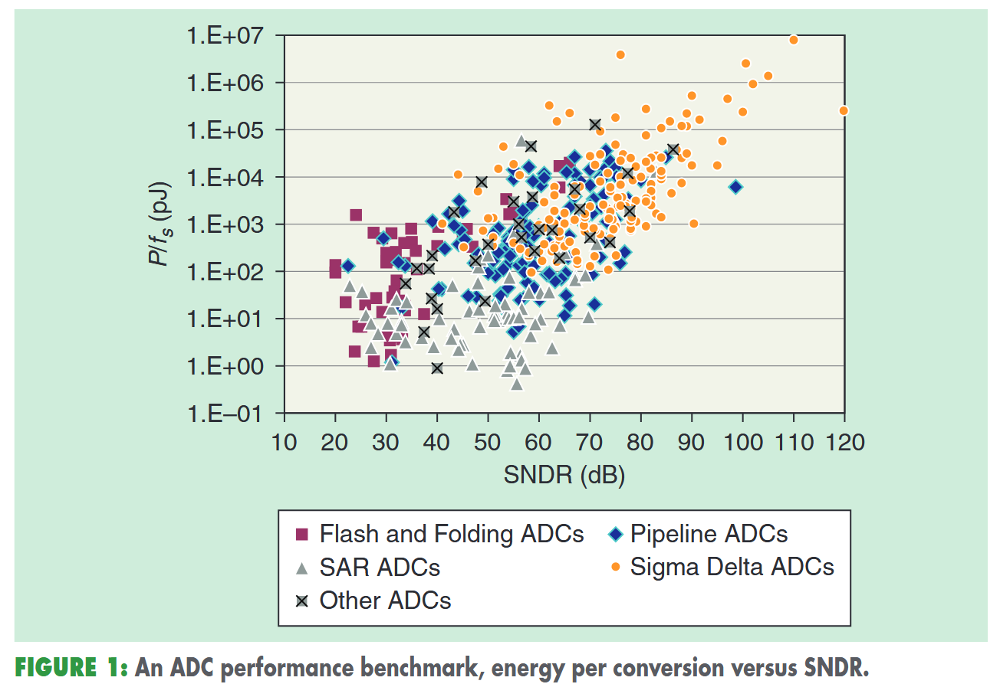
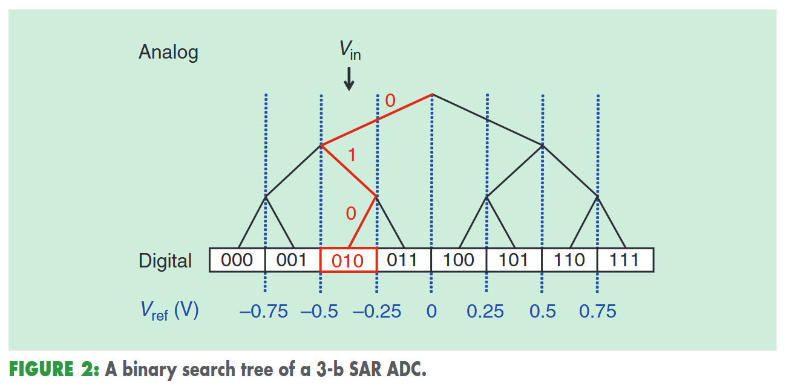
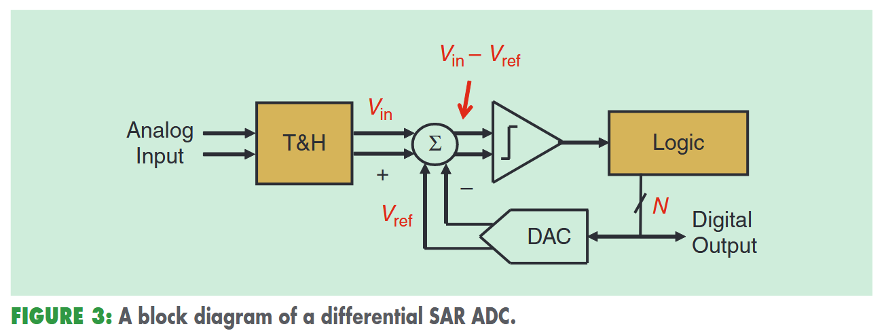
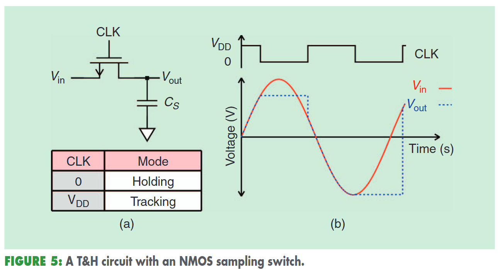
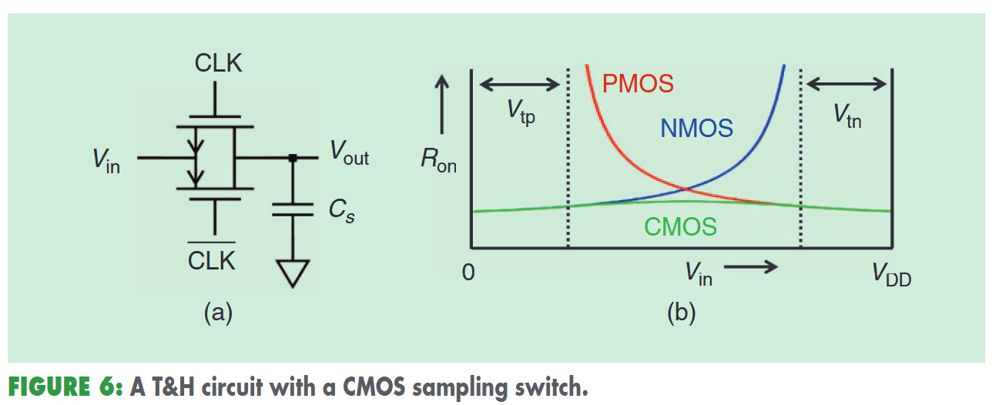
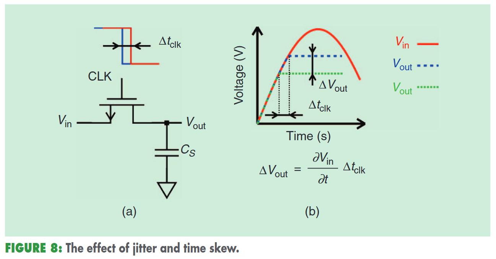
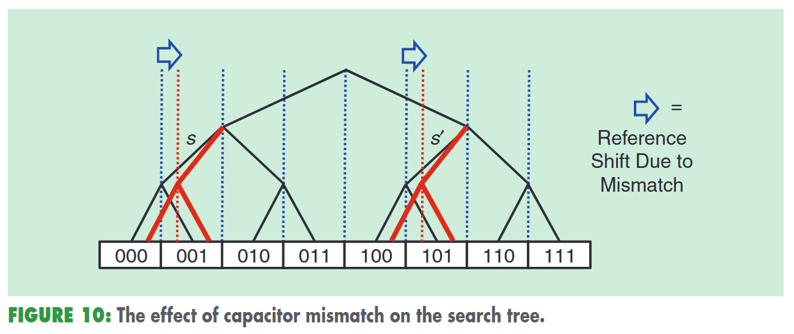
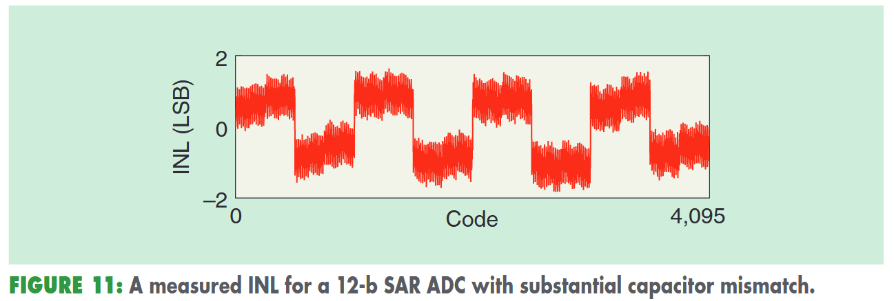
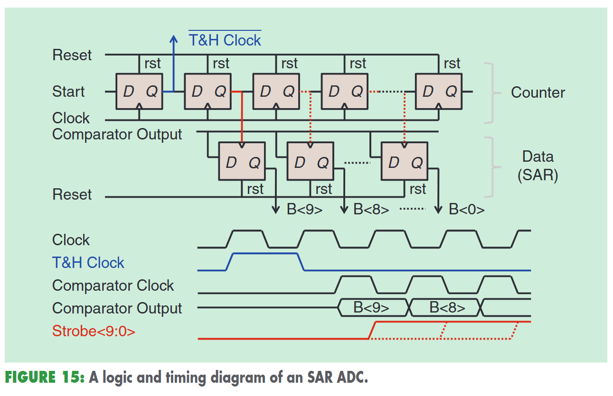

# 改善了功率和转换速度的SAR ADC

前言：看完第一篇paper之后发现逐字翻译效率太低，而且容易抓不住重点。不如每段总结一下，然后做个导图。

## Introduction

SAR ADC出来很久了，由于其工艺扩展和结构创新，在功率效率和转换速度上有了新的进展。图1展示了一组数据转换器的单位转换能量（功率除以采样率，$P/f_s$）以及精度，单位是SFDR。

由图可见，中等精度时（40-70dB）SAR ADC非常省电。电路简单是一个原因。

本文将讨论SAR ADC的基本设计问题，并简要介绍最先进的设计和未来趋势。

## Basic Operation

SAR ADC使用了二分查找算法，通过N次查找，找到最适合模拟输入的码字。图2展示了一个3bit ADC的例子。

看图，经过二分查找最后给出的码字是010。

看得出来，二分查找算法需要3个部分。DAC，产生用来参考的电压；逻辑电路，计时并存储；采样保持电路，在进行比较之前，对输入的电压值进行采样保持。

图3展示了一个N-bit SAR ADC的框图。

上面说过，我们生成码字对应的参考电压和输入电压进行比较。但是实际上是将$V_{in}$与$V_{ref}$作差，再根据结果的符号判断。而采样保持电路不过是一系列开关，DAC也不过是开关电容网络。

图4展示了一个简化的SAR ADC时序图。需要注意的是，采样占一个周期，而后面还需要N个周期进行逻辑判断，因此$f_{clk}\geq (N+1)f_s$是需要的。

## T&H

T&H（Track and Hold）用来对信号进行采样。图5展示了一个采样开关和电容构成的T&H电路。

时间电路中是做两个组成差分电路。这里的电容通常可以直接使用DAC的电容。如图5所示，时钟为高时，$V_{out}$ 能够跟随输入；而时钟变低后，锁住输入，也就是采样了。对于只使用N管的开关而言，主要的限制是，只有在$V_{in}$小于$Vdd-V_{th}$时才能导通，不能接受轨到轨输入信号。

图6展示了一个潜在的简单解决方案，使用CMOS：

把一个NMOS和PMOS并联在一起，能够实现轨到轨导通。但是如果不满足$Vdd \gg V_{tp}+V_{tn}$时，中量程信号可能无法导通。对先进CMOS节点这可能无法满足。

为了克服这一缺点，我们可以把图5中的栅极电压太高一个固定的电平。但是抬高的电平可能会超过MOS的安全电压。替代方法是bootstrapping，将栅极抬到输入相关的电压$Vdd+V_{in}$上，确保NMOS管的$V_{gs}$是常量，不仅能保证安全操作，也能使得过驱动电压独立，进而增强线性。

对T&H电路，导通电阻是关键的缺陷。采样瞬间（CLK由高变低），电荷注入，采样噪声，抖动/时间偏移都会引入。在保持模式下，漏电和电容耦合也会恶化采样值。

$$R_{on}=\frac{1}{\mu_n C_{ox}W/L(V_{CLK}-V_{in}-V_{th})} \tag{1}$$

式(1)给出了导通电阻的表达式，图6也给出了NMOS/PMOS/CMOS的导通电阻。增大宽长比、增大时钟电压或者使用低阈值晶体管都能减小开启电阻。电阻有两个影响，一个是组成RC滤波器，影响系统带宽；二是信号接近RC滤波器带宽时带来较大失真。

另一种失真是电荷注入（charge injection）。沟道中的带你和跑出来，假设输入输出节点分到的电荷一样，那么造成的电压误差：

$$\Delta V_{out}=\frac{Q_{ch}}{2C_s}=\frac{C_{ox}WL(V_{CLK}-V_{in}-V_{th})}{2C_s} \tag{2}$$

会导致增益和失调误差，差分T&H中能得到抵消。这个失真与输入信号有关，但与频率无关。解决方案有：增大WL面积；使用dummy；使用底板采样。

图7展示了使用NMOS开关进行差分T&H的仿真线性度：

10MS/s，电容1pF。SFDR的含义是：信号的均方根值与第一奈奎斯特区域中最高的杂散频谱分量的均方根值的比值。低频时，线性度主要由电荷注入影响，大致保持恒定；高频时导通电阻开始有更大影响。同时横向对比，更宽的开关（蓝色线）在低频时线性度更低，因为电荷注入现象更显著。但同时，更大的W会改善高频时线性度。因此，宽长比$W/L$是低频与高频之间的折中。

采样时，第二个缺陷是采样噪声。以及热噪声$kT/C$。使用差分拓扑就会有两倍的噪声。解决方案是选择恰当的$C$值。增加供电电压或者轨到轨也是一个方案。

第三个问题是：时钟时序的变化。当采样时钟偏移一个量$\Delta t_{clk}$是，输出电压会有一个误差$\Delta V_{out}$，这个值与偏移时间和信号的导数有关。图8有所展示：

这个误差对高频输入的ADC很关键。$\Delta t_{clk}$ 是随机时，也叫*jitter抖动*，会对输入引入噪声；$\Delta t_{clk}$是固定时，叫做*timw skew时间偏移*。在时间交织结构中组合多个SAR时，每个子ADC中的时间偏移会导致整体的失真。

保持模式下T&H也可能有缺陷。理想情况输出节点应该和输入完全隔离开。但实际上晶体管会泄露，源漏之间会有电阻回路，以及耦合电容。输出电压在这种情况下会被输入干扰。在按比例放大技术中，这两个问题都会变得更加严重，因为泄漏会增加，电容耦合也会因尺寸缩小而增加。减小宽长比能够减小泄露和耦合电容，使用高阈值器件也能减少泄露，合适的layout能减小耦合电容。

总而言之，T&H会遇到很多问题，有时解决方案会互相矛盾。因此，拓扑结构和管子尺寸设计将是平衡各种问题的折中。

## DAC

图9展示了一个3bit差分拓扑的DAC，包含DAC。

这个结构可以处理差分信号。开关动作前先进行正负号的判断，这是1bit；将正输入端的电容器接到$V_{ref}$相当于下调$(V_p-V_n)$的判决门限，相反则是上调判决门限。这样我们能够得到4bit的结果，白嫖一位。

对DAC，噪声、速度和失配是最重要的。采样保持电路和参考电压都会引入噪声，而非速度主要取决于RC网络，而失配往往是最大的问题，限制了能达到的线性度。失配能导致二进制搜索时候的搜索树出现问题，图10是一个例子。

图11展示了INL：

因此电容真的选择是一个折衷，大则噪声低且失配低，小则功耗、芯片面积小且速度快。

失配限制了SAR的线性度，一个解决方案是使用**校正**。另一个解决方案是使用**过采样**。

## Comparator

图13展示了一个在上升沿激活的比较器，只在时钟转换时耗能。

preamplifier提供增益，并将后面部分和DAC隔离开。latch stage进行判决。图14展示了工作时序：

时钟为低时，两个P管将AN/AP预充电到Vdd。当时钟变高后，尾电流导通，AP/AN开始向GND减少。如果$V_{in+}$更大一点，那么AN放电更快，这时候能得到锁存器输出。时钟拉低后比较器恢复为初始状态。

噪声和运行速度是最大缺陷，甚至导致亚稳态。比较器输入是模拟的，输出是数字的，那么需要用BER误码率建模。输出为“1”的概率为：

$$P_1 = \frac{1}{2}[1+erf(\frac{V_{in}}{\sqrt{2P_{n,cmp}}})]$$

这里应该是跟通信原理中“双峰判决”一样的地方。当差分输入电压很小时，受噪声干扰较大。

噪声功率和前级的预放大器负载电容成反比（kT/C），而功耗和电容成正比。这又是一个折衷。

比较器另一个关键点是延迟$\tau_{cmp}$。看图14，时钟上升沿和输出D有效的时间之间是由延迟的。如果输入很接近0，那么延迟会很长，导致亚稳态。因此，比较器的速度应在输入幅度较小的情况下进行验证，以限制因不稳定性而产生位错误的几率。

## Logic

图15展示了一个SAR逻辑电路内核的例子：

往往需要两组触发器（filp-flops）。一组用来激活SAR的运行，包括采样、控制比较器、保存结果、控制DAC等等。另一组实现数据寄存器。一般标准单元库就足够满足要求了，但需要低功耗或者高速运行时，还需要定制的逻辑部分。

## System-Level Tradeoffs

考虑噪声、线性度、速度、功耗以及芯片面积，还需要进行整体的折衷。

**噪声**：采样噪声、DAC噪声、比较器噪声和量化噪声。低分辨率主要是量化噪声，因为其他几项的热噪声要求很容易满足；高分辨率主要是热噪声，此时量化噪声相对容易减小。

**线性度**：失调和增益不会带来失真。但是，时间交织情况或者是绝对精度的ADC，需要进行校正。SAR的失真主要是采样保持和DAC非线性带来的。

**速度**：DAC、比较器和逻辑单元延迟加在一起应该始终比一个周期小。当工作时钟和采样时钟的比例确定时，也可以进行异步实现。这时候采样时钟是外部提供的，而工作时钟不是，而是内部生成。这样当比较器接近亚稳态，对应时钟可以长一点，用其他时间来弥补。这样既能更好地处理亚稳态，也能减少外部时钟的需求。

**功耗**：数字逻辑复杂度和N成正比，功耗亦如此。而模拟部分主要受噪声影响，信噪比每提高6dB，模拟部分功率就增加4倍，因此模拟部分功耗随N的增加指数上升。因此低分辨率SAR主要是数字部分功耗大，高分辨率是模拟部分占主导。

观察SAR ADC版图时，最大部分往往是DAC，因为有大量元件在里面。因此，最好尽量减少元件数量或者减小每个元件面积。

## State-of-the-Art SAR ADCs and Future Trends

此类ADC应用广泛。从最先进的来看，最快能达到90G速率，最高能达到101dB SNDR，最低功耗能做到1nW。

近年来的趋势是把SAR和其他结构ADC杂交，利用SAR的功耗效率，同时取长补短。

## Conclusion

现在的SAR会用相对简单的硬件，但在此基础上应用大量算法和电路层面的创新，来提高能效、速度和精度。鉴于近年来的飞速进步，不久的将来基于SAR的方法或许能达到前所未有的性能。
