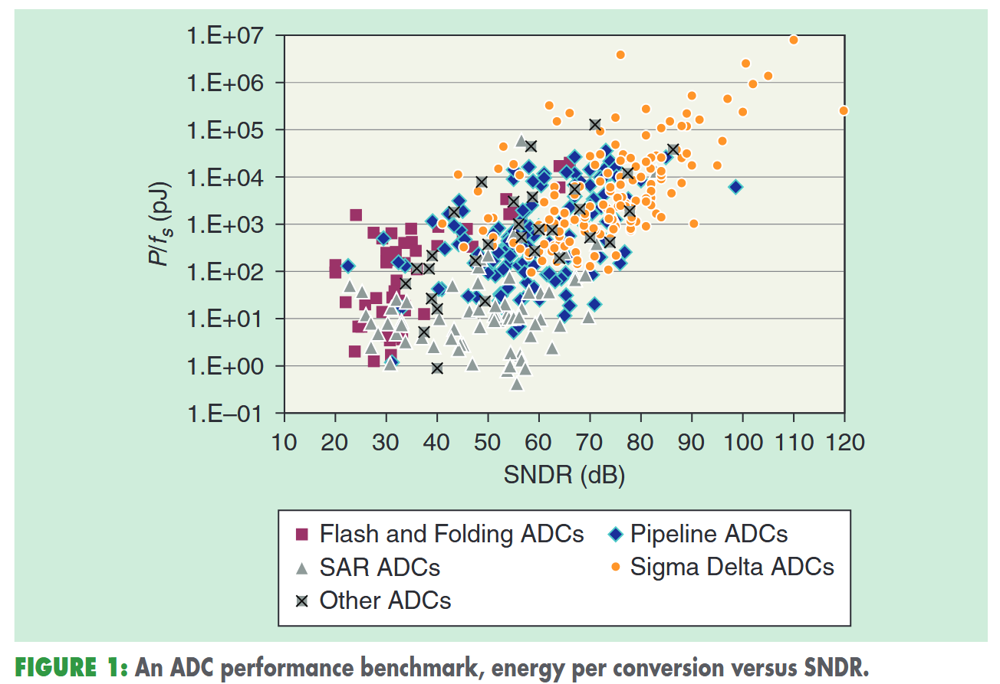
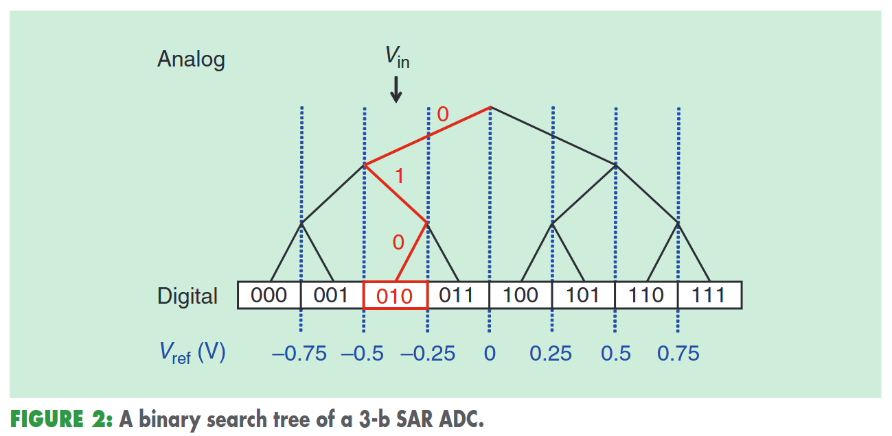
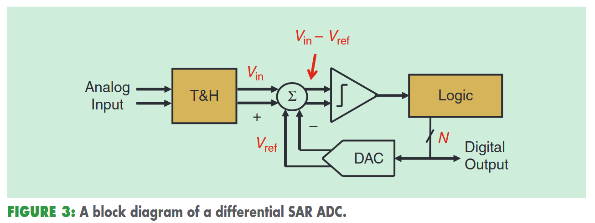
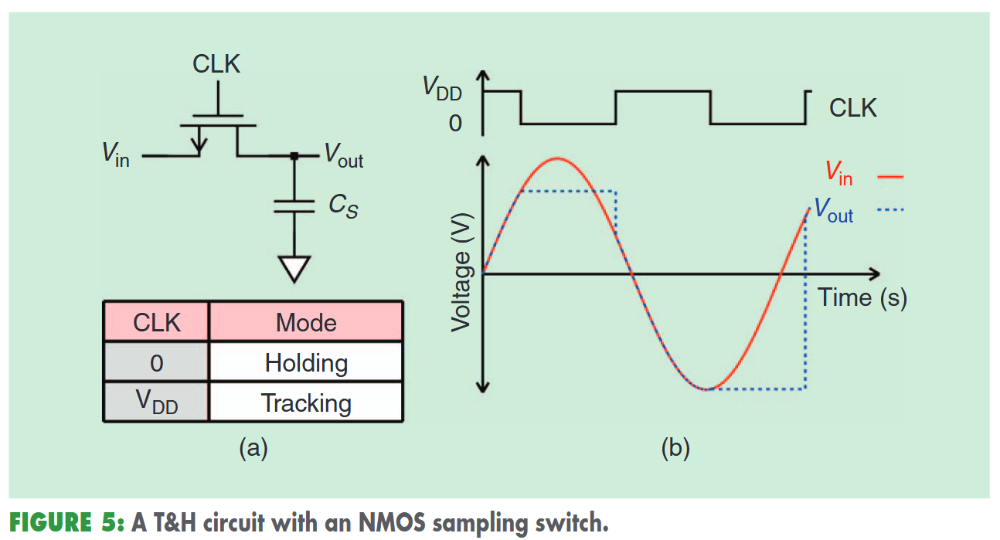
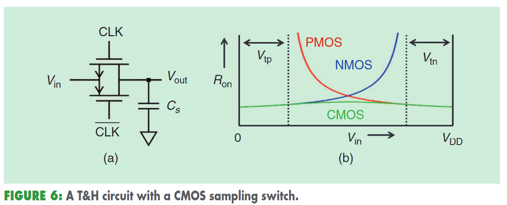
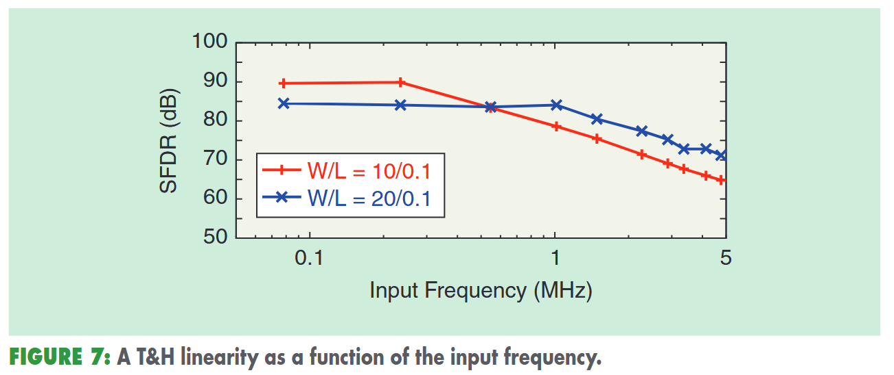
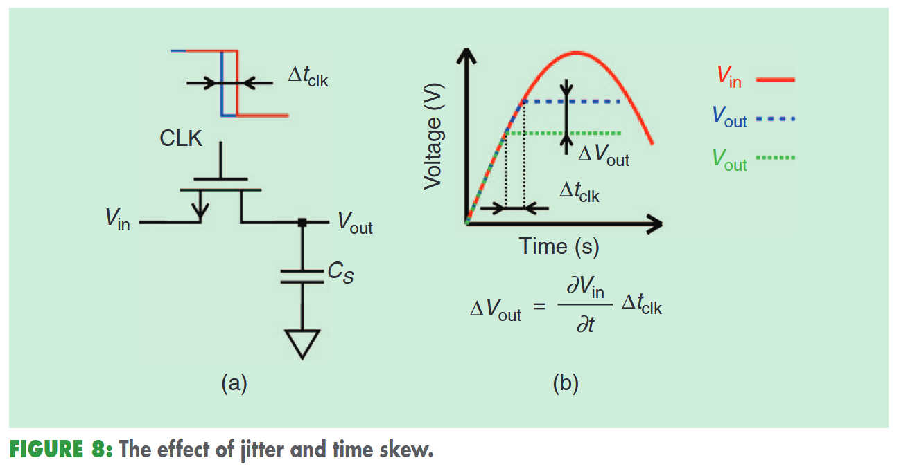

# 改善了功率和转换速度的SAR ADC

前言：看完第一篇paper之后发现逐字翻译效率太低，而且容易抓不住重点。不如每段总结一下，然后做个导图。

## Introduction

SAR ADC出来很久了，由于其工艺扩展和结构创新，在功率效率和转换速度上有了新的进展。图1展示了一组数据转换器的单位转换能量（功率除以采样率，$P/f_s$）以及精度，单位是SFDR。

由图可见，中等精度时（40-70dB）SAR ADC非常省电。电路简单是一个原因。

本文将讨论SAR ADC的基本设计问题，并简要介绍最先进的设计和未来趋势。

## Basic Operation

SAR ADC使用了二分查找算法，通过N次查找，找到最适合模拟输入的码字。图2展示了一个3bit ADC的例子。

看图，经过二分查找最后给出的码字是010。

看得出来，二分查找算法需要3个部分。DAC，产生用来参考的电压；逻辑电路，计时并存储；采样保持电路，在进行比较之前，对输入的电压值进行采样保持。

图3展示了一个N-bit SAR ADC的框图。

上面说过，我们生成码字对应的参考电压和输入电压进行比较。但是实际上是将$V_{in}$与$V_{ref}$作差，再根据结果的符号判断。而采样保持电路不过是一系列开关，DAC也不过是开关电容网络。

图4展示了一个简化的SAR ADC时序图。需要注意的是，采样占一个周期，而后面还需要N个周期进行逻辑判断，因此$f_{clk}\geq (N+1)f_s$是需要的。

## T&H

T&H（Track and Hold）用来对信号进行采样。图5展示了一个采样开关和电容构成的T&H电路。

时间电路中是做两个组成差分电路。这里的电容通常可以直接使用DAC的电容。如图5所示，时钟为高时，$V_{out}$ 能够跟随输入；而时钟变低后，锁住输入，也就是采样了。对于只使用N管的开关而言，主要的限制是，只有在$V_{in}$小于$Vdd-V_{th}$时才能导通，不能接受轨到轨输入信号。

图6展示了一个潜在的简单解决方案，使用CMOS：

把一个NMOS和PMOS并联在一起，能够实现轨到轨导通。但是如果不满足$Vdd \gg V_{tp}+V_{tn}$时，中量程信号可能无法导通。对先进CMOS节点这可能无法满足。

为了克服这一缺点，我们可以把图5中的栅极电压太高一个固定的电平。但是抬高的电平可能会超过MOS的安全电压。替代方法是bootstrapping，将栅极抬到输入相关的电压$Vdd+V_{in}$上，确保NMOS管的$V_{gs}$是常量，不仅能保证安全操作，也能使得过驱动电压独立，进而增强线性。

对T&H电路，导通电阻是关键的缺陷。采样瞬间（CLK由高变低），电荷注入，采样噪声，抖动/时间偏移都会引入。在保持模式下，漏电和电容耦合也会恶化采样值。

$$R_{on}=\frac{1}{\mu_n C_{ox}W/L(V_{CLK}-V_{in}-V_{th})} \tag{1}$$

式(1)给出了导通电阻的表达式，图6也给出了NMOS/PMOS/CMOS的导通电阻。增大宽长比、增大时钟电压或者使用低阈值晶体管都能减小开启电阻。电阻有两个影响，一个是组成RC滤波器，影响系统带宽；二是信号接近RC滤波器带宽时带来较大失真。

另一种失真是电荷注入（charge injection）。沟道中的带你和跑出来，假设输入输出节点分到的电荷一样，那么造成的电压误差：

$$\Delta V_{out}=\frac{Q_{ch}}{2C_s}=\frac{C_{ox}WL(V_{CLK}-V_{in}-V_{th})}{2C_s} \tag{2}$$

会导致增益和失调误差，差分T&H中能得到抵消。这个失真与输入信号有关，但与频率无关。解决方案有：增大WL面积；使用dummy；使用底板采样。

图7展示了使用NMOS开关进行差分T&H的仿真线性度：

10MS/s，电容1pF。SFDR的含义是：信号的均方根值与第一奈奎斯特区域中最高的杂散频谱分量的均方根值的比值。低频时，线性度主要由电荷注入影响，大致保持恒定；高频时导通电阻开始有更大影响。同时横向对比，更宽的开关（蓝色线）在低频时线性度更低，因为电荷注入现象更显著。但同时，更大的W会改善高频时线性度。因此，宽长比$W/L$是低频与高频之间的折中。

采样时，第二个缺陷是采样噪声。以及热噪声$kT/C$。使用差分拓扑就会有两倍的噪声。解决方案是选择恰当的$C$值。增加供电电压或者轨到轨也是一个方案。

第三个问题是：时钟时序的变化。当采样时钟偏移一个量$\Delta t_{clk}$是，输出电压会有一个误差$\Delta V_{out}$，这个值与偏移时间和信号的导数有关。图8有所展示：

这个误差对高频输入的ADC很关键。$\Delta t_{clk}$ 是随机时，也叫*jitter抖动*，会对输入引入噪声；$\Delta t_{clk}$是固定时，叫做*timw skew时间偏移*。在时间交织结构中组合多个SAR时，每个子ADC中的时间偏移会导致整体的失真。

保持模式下T&H也可能有缺陷。理想情况输出节点应该和输入完全隔离开。但实际上晶体管会泄露，源漏之间会有电阻回路，以及耦合电容。输出电压在这种情况下会被输入干扰。在按比例放大技术中，这两个问题都会变得更加严重，因为泄漏会增加，电容耦合也会因尺寸缩小而增加。减小宽长比能够减小泄露和耦合电容，使用高阈值器件也能减少泄露，合适的layout能减小耦合电容。

总而言之，T&H会遇到很多问题，有时解决方案会互相矛盾。因此，拓扑结构和管子尺寸设计将是平衡各种问题的折中。
