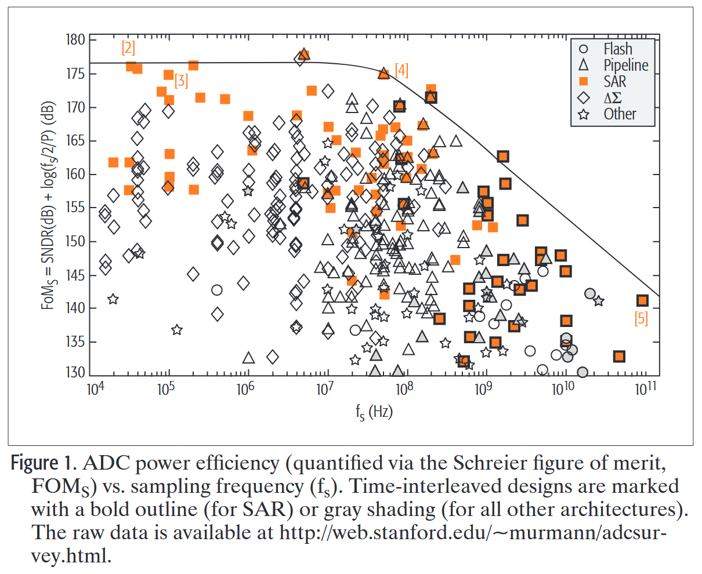
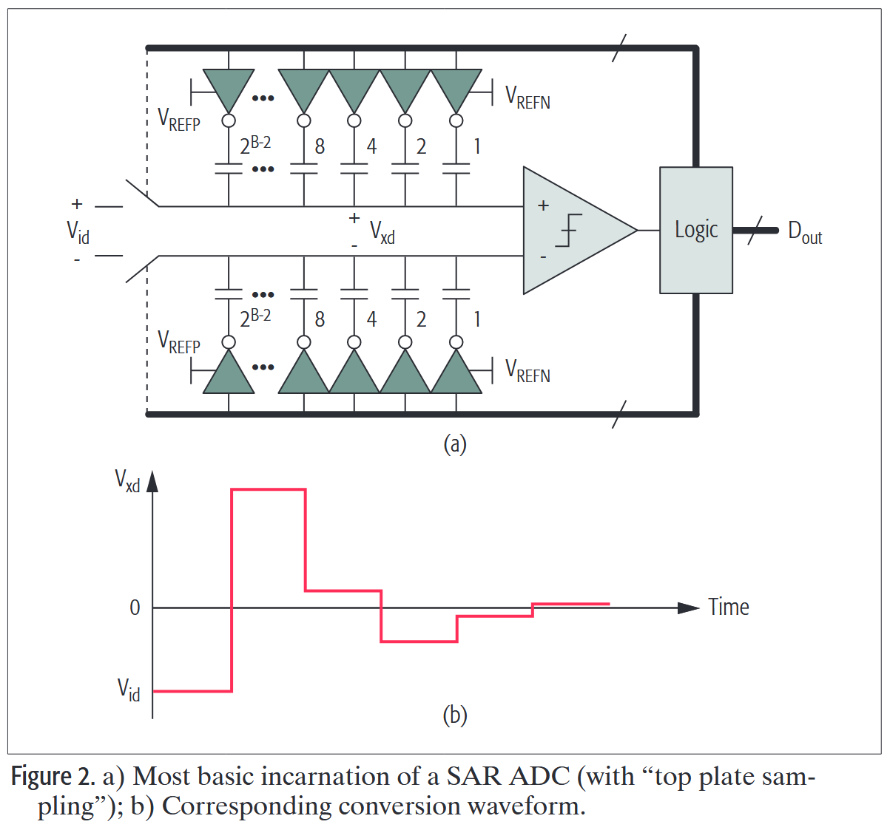
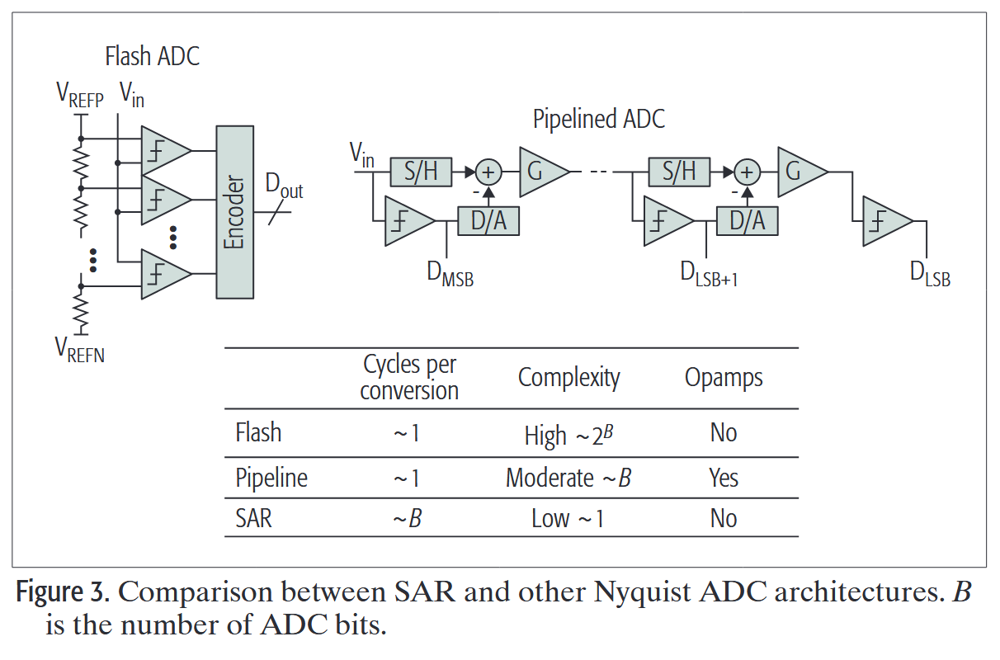
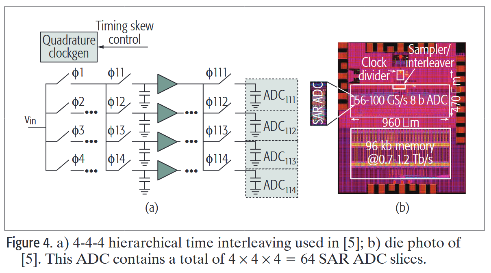
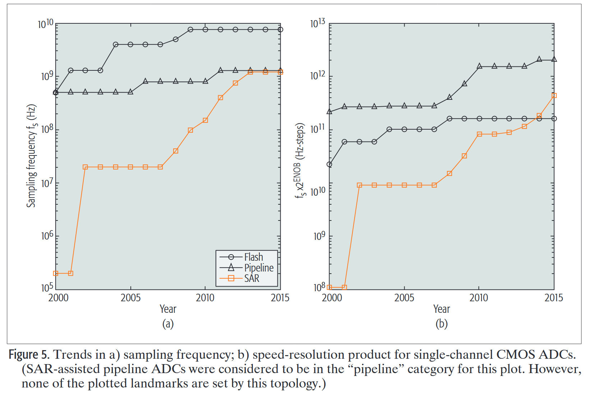
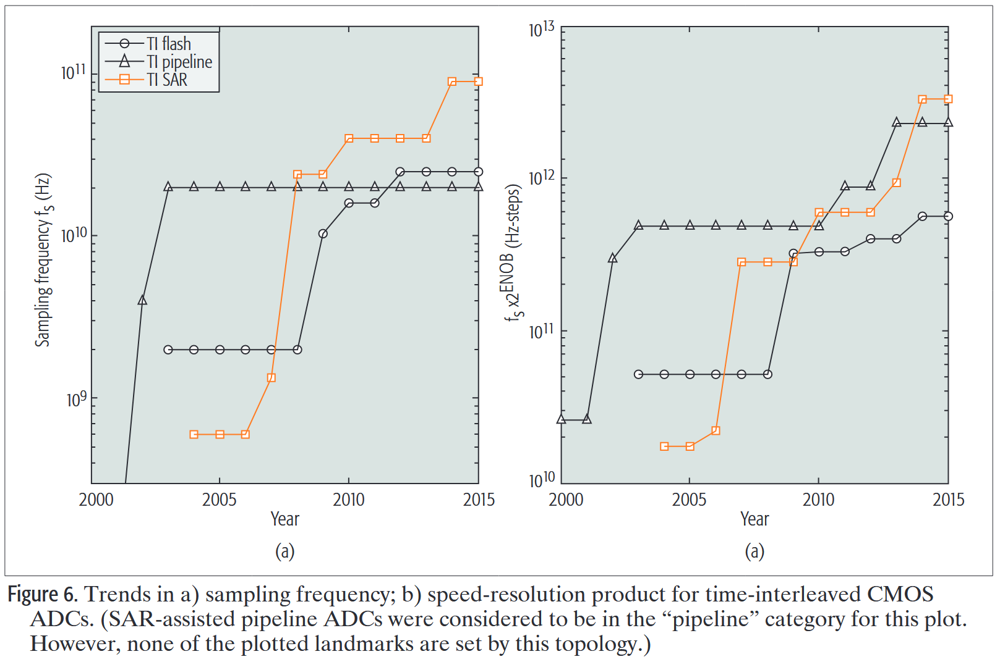

# 逐次逼近寄存器 ADC：从超低功耗到超高速应用的多功能构建模块

## Abstract

现代 SAR ADC 依靠 MOS 开关和锁存器发展壮大，技术进步时能得到很大改进。本文比较了SAR和其他拓扑的优势和局限性，以及相关的性能上限。同时会讨论超低功耗和超高速（时间交织）情形下的注意事项。

## Introduction

SAR起源于二十世纪五十年代，在二十世纪七十年代登场。到了2000年，有许多其他拓扑的ADC可满足高端音频需求和视频等高速输出需求。但CMOS技术进入100nm后，SAR拓扑开始反弹。从图1中，我们可以看到，SAR为基础的结构在10k到10GHz范围有很好的性能。

本文解释了SAR-based结构在低带宽IoE应用以及高速通信平台大放光彩的原因，也强调了其缺点。

## THE BASICS

图2(a)展示了SAR的概念模型：开关，电容，比较器和逻辑电路。图2(b)展示了运行过程。

其实解释为什么SAR在低速传感器应用中很流行。因为可以完全动态运行，不需要静态电流。

上面说的有点，随着CMOS技术进步只会越来越突出。

然而，随着对高速需求的增长，SAR-based ADC没那么有吸引力了。图3将SAR和其他两种结构进行了对比：

与另外两种结构相比，SAR依次需要多个周期。但为什么SAR还会有吸引力呢？

这是因为大部分超高速ADC使用时间交织结构。使用正交时钟，像循环赛一样。图4展示了一个，64个SAR并行的时间交织ADC。

但其他高速ADC，比如flash，也可以时间交织，为什么选择SAR呢？回答这个问题并非易事。图3中可以看出，flash的复杂度随着位数指数增长，因此flash结构被限制在6bit左右。

那么pipeline呢？其需要大量DAC，S/H，累加节点和放大器，运放多，速度慢；不会随着技术进步获益。因此尽管只需要一个时钟周期，该时钟周期比SAR的子周期更长。

## PERFORMANCE TEAJECTORIES

为简洁起见，我们在此重点讨论速度性能，下一节再讨论低速、低功耗领域。

图5展示了单通道ADC速度发展，以及速度和有效电平数乘积。

SAR起初慢得多，但现在赶上了。注意到flash停滞不前了五年以上。将单组分速度提升到某个临界值后，回报率就会递减。此时进行时间交织更有效。

图5(b)是转换速度和有效量化电平数的乘积。注意到SAR现在超过了flash，因为flash停止在速度上改进，分辨率也已经达到上限。另一方面，在这个乘积上，SAR仍然落后pipeline。一个解决方案是使用SAR和pipeline混合，但没有达到，反而实现了低功耗。目前，在无线基站这个需求高速和高动态范围的领域，传统pipeline仍然主宰。

图6展示了使用时间交织后的性能。

图6(a)中能看到，TI pipeline停滞了十年以上。对TI SAR，2008年实现了飞跃。有趣的是，考虑到乘积，TI SAR竟然登顶。这是超高速实现的。

有趣的是，对于TI ADC的速度-分辨率乘积，竟然只比单通道大一点。这是因为高速会牺牲分辨率。同时，通道间因素也会影响ENOB，这应该是时间交织的关键。

## LOOKING AHEAD

在本节中，我们将讨论未来的关键设计方面，以及可能最终影响和限制未来进展的一些障碍。

首先考虑超低功耗场景。对一个1.1nW的ADC。其FoM大约是175dB。而ADC的转换效率在FoMS=186dB附近有一个界限，这让我们达到0.1nW的水平。但有时候泄露电流就已经0.15nW了，因此减少泄露是很重要的。

不妨从另一个角度考虑，对1kHz/1nW的ADC，每次采样的功耗是1pJ.在现代28nm一下的工艺中，这个能量大致能够翻转1000次逻辑门。因此减小数据量是关键。

对高速TI SAR而言，情况没有那么暗淡了，还是有很多悬而未决的问题等待解决。第一个就是图4中展示了信号分配网络。在时间交织系统中，buffer会成为速度瓶颈以及耗电大户。

另一个基本问题是解决SAR中的亚稳态。比较器进行判决时，如果输入信号较小，判决时间可能被加长，解决不了。第一个解决方案是使用异步时序，给那些“hard”的判决分配更多时间。尽管如此，对很多没有FEC的系统而言，还是无法满足亚稳态需求。

还有一个有待进一步调研的领域是转换器前端的时钟生成。

最后也是最重要的一点是热噪声。不久之前ADC设计者认为热噪声在6ENOB左右的高速ADC中算不上问题，但使用大规模晶体管进行设计时，情况就不是这样了。最要的热噪声来自比较器，这需要创新的电路来解决。

将上述挑战视为推动创新的机遇，可以预见的是，TI SAR未来将会打破100G的壁垒。

## CONCLUSIONS

大约十年前，SAR结构还被认为只适合低速ADC涉及。单通道1G，SAR已经成为了在时间交织结构中超过10G情况下有吸引力的模块。

但SAR还是无法取代所有其他拓扑的。目前来看传统pipeline拓扑在高速高精度领域还是更胜一筹。因此，结合流水线和 SAR 转换最佳特性的混合架构正得到积极研究。

在我们设计下一代SAR-based ADC时，很明显大部分挑战和基于都在告诉设计，包括基本问题，比如亚稳态和热噪声缓解。在低速和超低功耗方面，SAR几乎已经达到了最优性能，下一步的提升可能更围绕优化转换器周围的系统。
