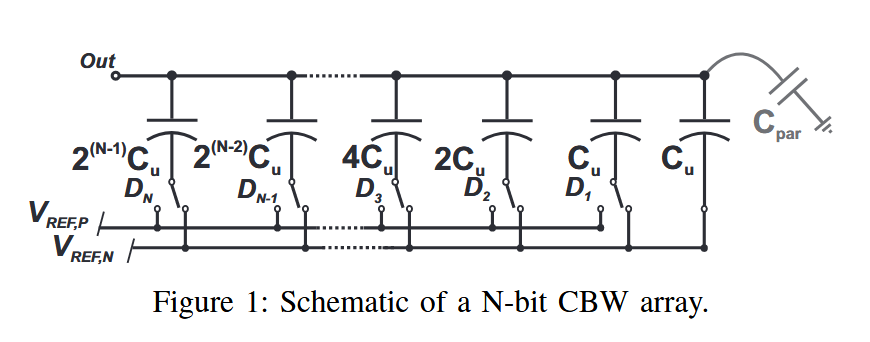

# A Modeling Environment for the Simulation and Design of Charge Redistribution DACs Used in SAR ADCs

## Abstract

SAR ADC的最优设计，需要对非线性，以及寄生电容对电荷再分配DAC的影响，的精确估计。这篇文章展示了一个matlab为基础的数字工具。这个工具考虑了电容失配以及寄生电容的影响，计算了INL与DNL。静态非线性对SNDR，ENOB的影响也进行了考虑。

## Introduction

在中等分辨率和转换速度情况下，SAR通常被看作最好的选择。这些转换器的性能由静态性能（INL/DNL）以及动态性能（SNDR，ENOB）呈现。**这些参数主要取决于电容阵的质量！** CDAC会被失配和寄生电容影响性能，这是影响ADC整体性能的主要因素。失配容易考虑，而寄生电容则需要考虑阵列结构。

但失配和寄生电容和性能的精确关系始终缺失。往往需要进行长时间的仿真，而且需要大量时间进行数据后处理。

这篇展示了一个matlab为基础的数字工具，包含三种拓扑，经典二进制加权（Classic Binary Weighted），拆分二进制加权（Split Binary Weighted）以及衰减电容阵的二进制加权（Binary Weighted with Attenution），单端以及全差分都包含，同时允许开关方案的选择。

## Converter Topologies

在一般的N-bit CDAC中，如图1所示，每一位数字码都与，产生对应输出电压的，底部开关的特地配置相关联。

在通过反馈路径的DAC实现的等效SAR ADC中，该电压标志着两个相邻相邻码字之间的转换电平。我们可以得出，转换精度取决于每个电容组的实际大小。由于失配和寄生现象，每一部分的电容都与标称值不同，可以表示为：

$$C_i = 2^{i-1}C_u + C_{par,i} + \sum_1^{2^{i-1}}\delta_j,i=1,...,N$$

表达式中第二项是第i个电容对应的寄生电容，求和项中的每一项是影响单位电容失配的等效电容。

寄生电容的影响可以看作是确定性的，取决于布局不精准，电容的几何形状以及接线。相比之下，电容失配可以建模为单位电容值的高斯分布，均值为标称电容$C_u$，而标准差等于：

$$\sigma_C = \frac{C_u k_c}{\sqrt{2A}}=k_c \cdot \sqrt{\frac{c_{spec}\cdot C_u}{2}}$$

这其中$k_c,C_u,A,c_{spec}$分别是Pelgrom失配系数，单位电容，面积以及 *？比电容* 。出现寄生或者失配时，DAC输出就会与理想值不同，间距不相等，导致ADC输入输出曲线出现非线性。阵列中另一个重要的寄生是连接阵列顶板节点和固定电压节点的杂散电容，如图1中的寄生。这种寄生电容会导致增益误差，在某些ADC拓扑中也会影响线性度。

### 传统二进制加权阵列（CBW）

no
