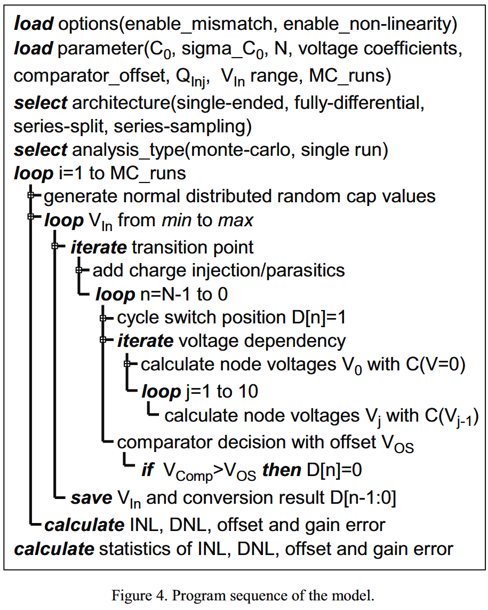
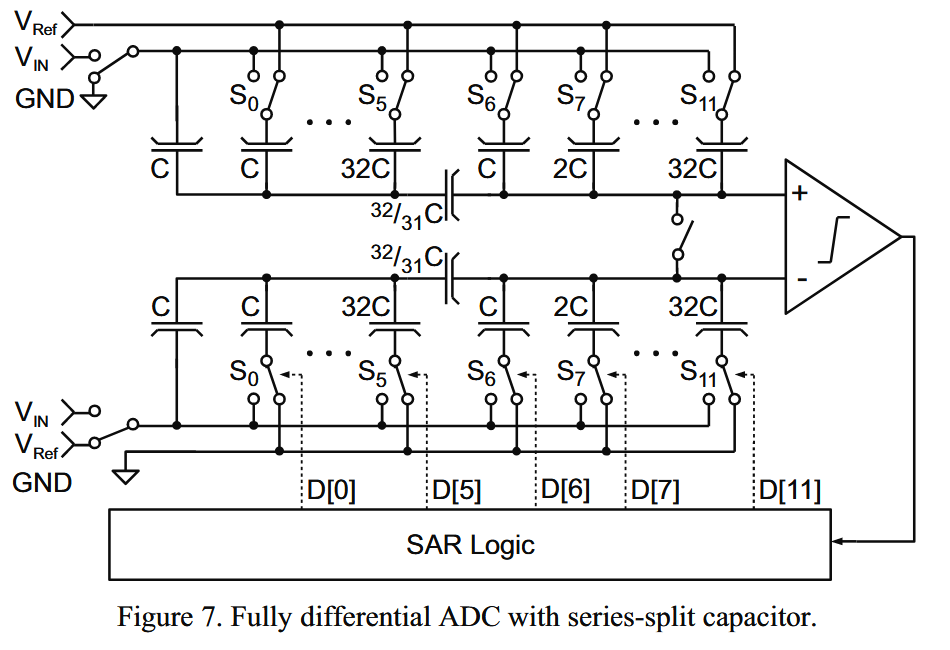

# Modelling of capacitor mismatch and non-linearity effects ini charge redistribution SAR ADCs

## Ⅰ.Introduction

SAR ADC能提供12-16bit高分辨率，以及5M中等速率的转换速度。CR电荷再分配技术被广泛使用。

众所周知，CR SAR的可达分辨率主要由电容失配限制，而失配取决于面积和工艺参数。增大电容能减小失配，但电容面积会增大，采样电容会增大。确定CR SAR的尺寸，也许是面积-分辨率之间的折中。与flash ADC不同的是，没有已有的分析失配和电容尺寸的关系的方法。通常使用简单的、经验的方法。对12bit以上的ADC，精确的估计是必要的，因为过度限制肯定会限制整体性能。

*下面这一段问题很多*。这一段应该都是讲，即使使用了很多技术来精简仿真，仍然需要跑很多次蒙特卡洛！

总之，我们新的方法结合了蒙特卡洛分析和分析模型，能对整个转移曲线进行分析。除了失配以外，这方法还考虑了电荷注入和电容非线性。

## Ⅱ.Model of SAR ADC

SAR的基本模型我们看过很多次了，直接跳到电容失配部分吧！

假设电容是正态分布，我们可以认为：

$$\sigma(\frac{\Delta C}{c})=\frac{A_C}{\sqrt{WL}}$$

而对于单个电容，这个值要乘上$\sqrt{2}$。

在每个开关状态，我们都要保证$\Delta V_{TP}<\frac{1}{2}LSB=\frac{V_{ref}}{2^{N+1}}$

考虑多个独立的随机变量的和，其方差为：$\sigma(\sum C_i)=\sqrt{n}\cdot \sigma(C_0)$

最坏的情况，就是认为标准差直接变成n倍，这种情况下，这些电容之间的相关系数都看成1.

根据这些随机变量，同时根据$V_{TP}$的表达式，利用数值解法，我们能够计算出$V_{TP}$的标准差。我们可以认为：$\Delta V_{TP}<3\sigma(V_{TP})$。这样分析只对传统的全二进制ADC有效，如果是桥接电容的ADC不能直接套这个方法。

## Ⅲ.System Model Implementation

为计算整个转移曲线的误差，我们以电路的分析模型为基础，提出了蒙特卡洛分析法。不需要电路模拟器，只需要MATLAB实现模型和testbench。几分钟内就能实现完成的千次计算。

算法流程如下：

这里确定D[n]=1后，进行的迭代应该是电容非线性导致的。根据电压确定电容，再迭代确定新的电压，迭代多次应该就会收敛。

当然我们的模型也考虑了电荷注入和比较器失调。对于电荷注入，写CDAC的表达式时，把那一部分电荷考虑在内即可。而比较器失调直接写进CDAC输出即可。对于寄生电容，也是写进CDAC的表达式。

## Ⅳ.Calculation and Measurement Results

我们的方法可以快速简易地比较不同结构的匹配要求。

## Ⅴ.Limitation of The Model

匹配分析假定相同的器件，没有系统变化。这对传统全二进制ADC是可以实现的，因为电容只由单位电容实现。但使用分数电容的桥接电容CDAC就不行了。不规则的尺寸和版图结构会导致误差。下图展示了一个全差分的串联分离电容结构CDAC。

为了避免系统误差和边际效应的影响，共同中心的布局以及周围一圈dummy电容是很必要的。

非单位电容的失配很难预测，因为缺乏分析性的定义。尽管我们的模型中没包含这方面的预测，但手动来包含寄生电容，为分析这个影响提供了可能。

## Ⅵ.Conclusion

我们给出了一个基于分析解法的蒙特卡洛分析的系统模型。这个模型包含了器件失配、电容非线性，以及电荷注入和寄生电容等其他影响。我们也展示了，最坏情况的分析不能满足高分辨率ADC，会带来过约束的设计。与电路仿真相比，我们的方法足够的快。
