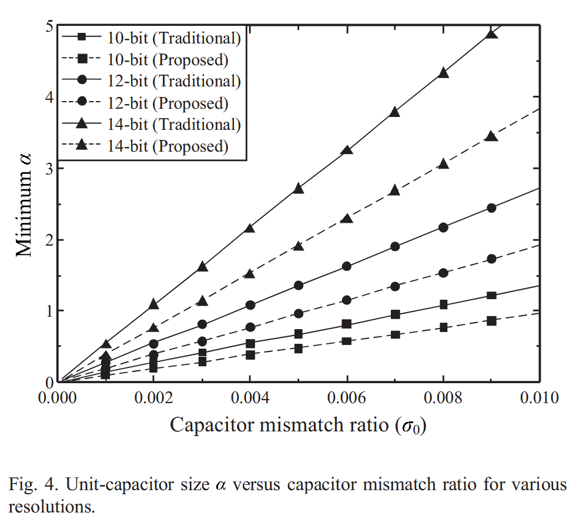
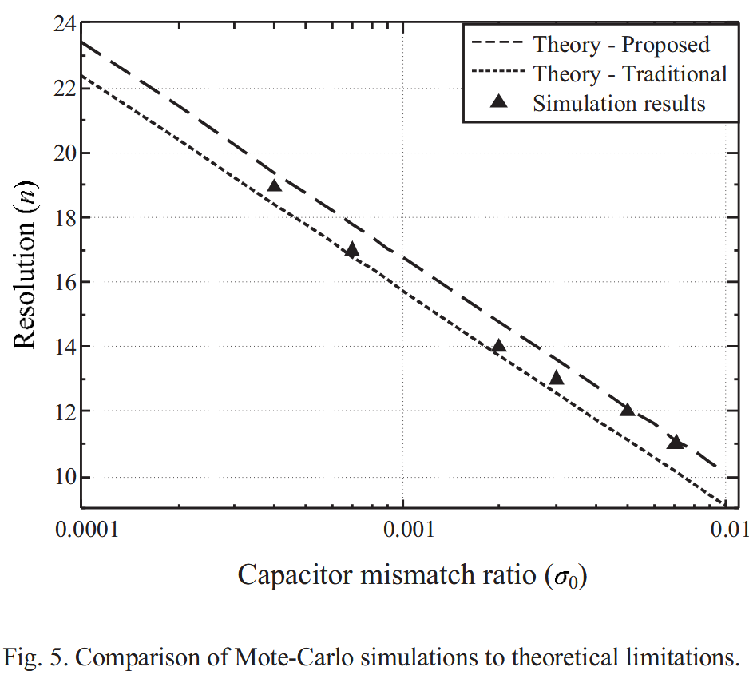

# Statistical modeling of capacitor mismatch effects for successive approximation register ADCs

## Abstract

这篇paper展示了一个在SAR ADC中，对电容失配的影响进行高效建模的方法。电容失配对精度影响很大的！不得不搞清楚它对分辨率的限制了。我们使用传统方法以及提出的新方法，仔细地推导出了分辨率与电容失配比的具体关系。与数值方法不同，我们给出了闭式表达式。我们又做了大量蒙特卡洛仿真来验证提出的关系式，结果能够支持我们的分析。

## Ⅰ.Introduction

CR SAR ADC的可达分辨率主要受到单位电容失配的限制。但电容大小是一个需要折中的问题，大则徒增面积开销，小则失配严重。

这篇文章中，我们推导出最大可达分辨率与失配比率的闭式解。

## Ⅱ.Structure of SAR ADC

这里就不讲了吧，前面看的几篇已经说的比较明白了。

## Ⅲ.Statistical Analysis

### Mismatch Modeling

我们假设失配比可以建模为：$\Delta C/C_u = 1/\alpha \times \Delta C/C_0 \sim N(0,\sigma_0^2/\alpha^2)$.其中C0是最小电容，Cu是单位电容。

一个使用的方法是，像下图这样实现大电容。注意要在实际使用的电容周围环绕一圈dummy电容，减轻边上的电容造成的误差。

对一个单位电容（实际有误差），我们可以建模为：

$$C_1 = C_u + C_u \times \Delta C/C_u \sim N(C_u,\sigma_0^2C_u^2/\alpha^2)$$

把K个电容连接在一起得到的大电容，我们可以建模为：

$$C_K \sim N(KC_u,K\sigma_0^2C_u^2/\alpha^2)$$

如果把失配设定为最大值，对一个单位电容而言，$e_{1max}=3\sigma_0/\alpha$，99.7%的电容的失配比小于e1max。对于Ck这个值是$\sqrt{K}e_{1max}$。

### Traditional Analysis

先写出来CDAC的输出表达式吧~

$$V_{out}=-V_{in}+\frac{C_H}{C_H+C_L}V_{ref}=-V_{in}+\frac{HC_u+\Delta H}{2^n C_u + \Delta H + \Delta L}V_{ref}$$

这里CH是连接到参考电压的电容，CL是连接到地的电容，对应的$\Delta$是电容失配导致的。为确保满足需要的分辨率，我们需要实际转换点和理想转换点之间的误差不能大于0.5LSB。也就是下面这个式子：

$$-\frac{1}{2^{n+1}}<\frac{HC_u+\Delta H}{2^n C_u + \Delta H + \Delta L}-\frac{H}{2^n}<\frac{1}{2^{n+1}}$$

传统分析方法中，考虑极端情况，假设连接到参考电压的电容都是正失配，而连接到地的电容都是负失配。这时候：

$$\frac{H+\sqrt{H}e_{1max}}{2^n+ \sqrt{H}e_{1max}  -\sqrt{2^n - H}e_{1max}}-\frac{H}{2^n}<\frac{1}{2^{n+1}}$$

得到：

$$e_{1max}<\frac{2^n}{2^{n+1}\sqrt{H}-(2H+1)(\sqrt{H}-\sqrt{2^n-H})}$$

上式右边在$H=2^{n-1}$时最小。带入就能得到$e_{1max}$的最大值，也就能求出$C_u$的最小值。

解得：$\alpha > 6 \cdot \sigma_0 \cdot \sqrt{2^{n-1}}$。

如果alpha的值小于1，直接把最小电容当作单位电容使用即可。

变形上面的式子可得：

$$n_{max}=log_2(\frac{\alpha^2}{18\sigma_0^2})$$

这样就推出来了失配、分辨率和电容的闭式关系。知道失配参数、最小电容就能求最大可达分辨率，知道需要的分辨率也能推最小电容。但上面的式子，没有考虑CDAC输出中分子分母两个随机变量之间的相关，不能给出准确的关系。

### Proposed Advanced Analysis

我们改变一下CDAC的形式：

$$V_{out}=-V_{in}+\frac{C_H}{C_H+C_L}V_{ref}=-V_{in}+\frac{C_H/C_U}{C_T/C_U}V_{ref}=-V_{in}+\frac{C_X}{C_Y}V_{ref}$$

这其中$C_X \sim N(H,H\sigma_0^2\alpha^2),C_Y\sim N(2^n,2^n\sigma_0^2\alpha^2)$。两个变量的比，得到的随机变量是柯西分布的，但其均值方差没有闭式表达式，可能无法用来指导SAR ADC的设计。

CX与CY是相关的，可以简单地认为它们的相关系数是$\rho=\sqrt{H/2^n}$。运用泰勒展开估计其均值方差，也能认为其是正态分布的。展开细节就不码了，多元泰勒展开我也忘记了，结果如下：

$$\mu_Z \approx \frac{H}{2^n},\sigma_Z^2 \approx \frac{H-H^2/2^n}{2^{2n}}\cdot \frac{\sigma_0^2}{\alpha^2}$$

对于Z，要满足：$$-\frac{1}{2^{n+1}}<Z-H/2^n<\frac{1}{2^{n+1}}$$

在99.7%置信区间内，Z的最大值是$H/2^n + 3\sigma_Z$，因此：

$$\frac{3\sigma_0 \sqrt{H-H^2/2^n}}{2^n \alpha}<\frac{1}{2^{n+1}}$$

在$H=2^{n-1}$时左边最大。一通化简得到：$\alpha > 6\cdot \sigma_0 \cdot \sqrt{2^{n-2}}$。

再化简：$n_{max}=log_2(\alpha^2/9\sigma_0^2)$。

与传统分析方法相比，参数相同情况下分辨率高了一位。下一部分展示的大量蒙特卡洛分析也证实了这一特性。

## Ⅳ.Simulation Results

图4展示了$\alpha-\sigma_0$的关系。

不同曲线是不同位数、不同方法估计出来的，可见我们提出的新方法在相同位数情况下需要的电容更小。根据失配比就能确定电容大小！

为了验证提出的新方法，我们用SAR ADC做了大量蒙特卡洛仿真。失配比和可达分辨率的关系画在了图5中。

注意到最大可达分辨率在传统方法的边界上面。但新方法能够达到最大可达分辨率的稳定上界。由于提出的新方法考虑了99.7%的置信区间，仿真中得到的最大分辨率可能会略小于新方法对应的理论值，但这种情况不多。因此与之前的方法相比，我们提出的新方法能够给出最大分辨率、尺寸比以及电容失配比之间的更精准的闭式关系。

## Ⅴ.Conclusion

本文分析了电容失配的影响，推导出了失配比、电容大小与分辨率的闭式关系。与传统方法相比，新提出的方法考虑了随机变量之间的相关系数，得到更精准的关系。分析表明，最大分辨率与失配比的倒数成对数正比，与电容尺寸比成对数正比。这些关系在减小面积、高能效的ADC中是很有用的，因为我们可以估计最小的电容，保证在99.7%置信区间内达到需要的分辨率。我们进行了大量的蒙特卡洛实现来验证新提出的方法，仿真结果是支持我们的分析的。
