# WaveDrom Tutorial

WaveDrom是一个使用代码进行数字波形绘制的工具。其官方文档似乎有些简略，故写此文，对其官方文档进行解析，便于查阅。

## Step0.How to install it?

我在vscode中安装了`Waveform Render`插件，这样新建`.json`文件就可以渲染波形。记得关闭json文件报错。

当然，也可以下载桌面端，也可以在其官方网站进行在线渲染：[WaveDrom](https://wavedrom.com/)

## Step1.The signal 信号

代码：

```json
{ signal: [{ name: "Alfa", wave: "01.zx=ud.23.456789" }] }
```

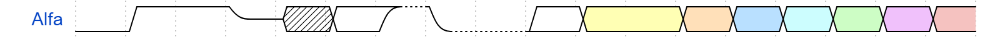

解析：

首先，`name`指定了所显示波形的名称，而`wave`中的每一个字符代表一个周期的波形。

这里的`0`和`1`应该指的是高与低电平。如果下一周期的波形延续之前的状态，使用`.`即可。

`z`代表了高阻态，而`x`指的是未知状态。

`=`表示白色框框（虚线框后面一个周期的波形）。`u`是高虚线，`d`是低虚线。

`2`和`=`一样，都是白色框框，而`3` `4` `5` `6` `7` `7` `9`分别对应 黄/橙/蓝/青/绿/粉/红 颜色的框框。

## Step2.Adding Clock 时钟

关于时钟信号，有其专有代码。

```json
{ signal: [
  { name: "pclk", wave: 'p.......' },
  { name: "Pclk", wave: 'P.......' },
  { name: "nclk", wave: 'n.......' },
  { name: "Nclk", wave: 'N.......' },
  {},
  { name: 'clk0', wave: 'phnlPHNL' },
  { name: 'clk1', wave: 'xhlhLHl.' },
  { name: 'clk2', wave: 'hpHplnLn' },
  { name: 'clk3', wave: 'nhNhplPl' },
  { name: 'clk4', wave: 'xlh.L.Hx' },
]}
```

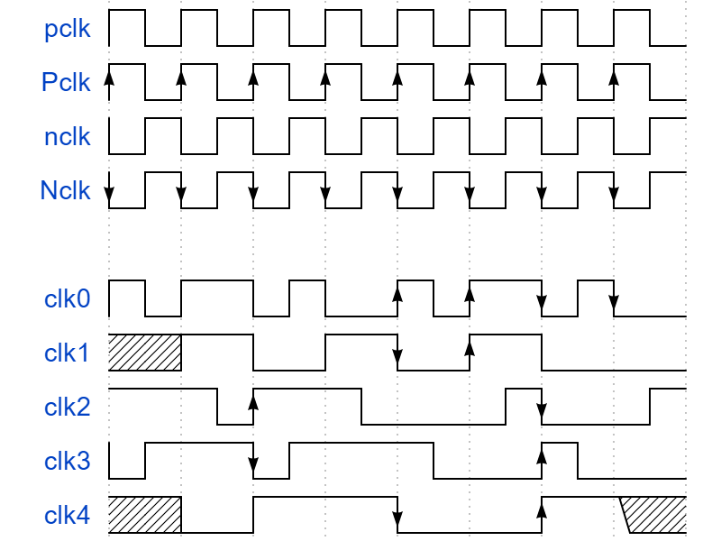

`p`代表上升沿时钟，其大写`P`代表绘有箭头的上升沿时钟。同样`n`和`N`对应下降沿时钟。

`h`代表持续一个周期的高电平，其大写`H`代表绘有箭头的高电平（如果有边沿）。同样`l`和`L`对应低电平。

`x`代表未知态，同时绘有边沿（如果有）；而其大写`X`不包括边沿。

## Step 3. Putting all together 信号与时钟组合起来

在典型的时序图中，会同时出现信号与时钟。

在Step1中所讲的带颜色的*框框*，表示multi-bit signal 多位信号。

```json
{ signal: [
  { name: "clk",  wave: "P......" },
  { name: "bus",  wave: "x.==.=x", data: ["head", "body"] },
  { name: "wire", wave: "0.1..0." }
]}
```

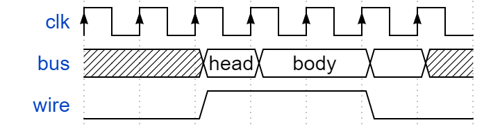

对多位信号（`=` `2~9`），会自动从`data`中获取标签，与所有的框框一一对应，绘制在波形图上。

## Step 4. Spacers and Gaps 省略

有时候需要对信号/时钟进行省略，使用`|`符号即可。

```json
{ signal: [
  { name: "clk",         wave: "p.....|..." },
  { name: "Data",        wave: "x.345x|=.x", data: ["head", "body", "tail", "data"] },
  { name: "Request",     wave: "0.1..0|1.0" },
  {},
  { name: "Acknowledge", wave: "1.....|01." }
]}
```

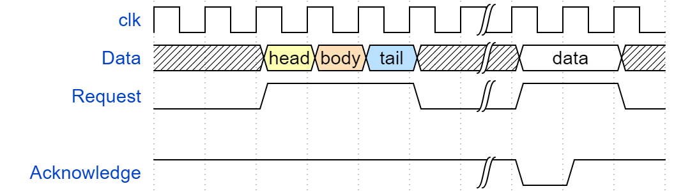

## Step 5. The groups 分组

信号可以分组，只需要将需要的信号使用一对`[]`包裹起来即可，在中括号内最前端加上`'name'`即可对组进行命名。分组可以嵌套。

```json
{ signal: [
  {    name: 'clk',   wave: 'p..Pp..P'},
  ['Master',
    ['ctrl',
      {name: 'write', wave: '01.0....'},
      {name: 'read',  wave: '0...1..0'}
    ],
    {  name: 'addr',  wave: 'x3.x4..x', data: 'A1 A2'},
    {  name: 'wdata', wave: 'x3.x....', data: 'D1'   },
  ],
  {},
  ['Slave',
    ['ctrl',
      {name: 'ack',   wave: 'x01x0.1x'},
    ],
    {  name: 'rdata', wave: 'x.....4x', data: 'Q2'},
  ]
]}
```

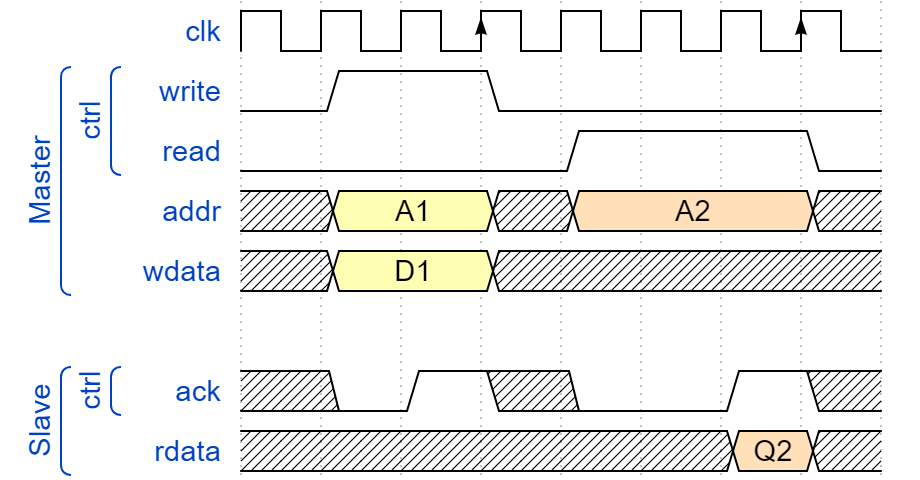

## Step 6. Period and Phase 周期和相位

Step1中说过，`wave`中的一个符号代表一个时间周期。但这不是固定的。通过调节`period`参数可以控制一个符号占据几个时间周期（只能是整数！如不是，会自动向上取整）。

同时，如果不同路信号之间有相位差，可以通过`phase`参数调节。注意，该参数范围为0-1.

```json
{ signal: [
  { name: "CK",   wave: "P.......",                                              period: 2  },
  { name: "CMD",  wave: "x.3x=x4x=x=x=x=x", data: "RAS NOP CAS NOP NOP NOP NOP", phase: 0.5 },
  { name: "ADDR", wave: "x.=x..=x........", data: "ROW COL",                     phase: 0.5 },
  { name: "DQS",  wave: "z.......0.1010z." },
  { name: "DQ",   wave: "z.........5555z.", data: "D0 D1 D2 D3" }
]}
```

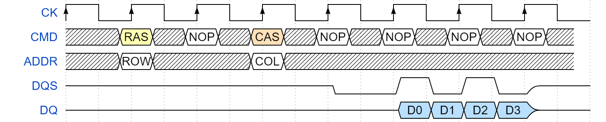

尽管示例代码中只对clk进行了周期调整、只对信号进行了相位调整，但实际上周期和相位调整对信号与时钟都可用。

## Step 7.The config{} property 配置一些属性

`config:{...}`语句能够调整渲染的很多属性，且听我一一道来。

### 7.1 hscale 横向比例

使用方式见代码

```json
{ signal: [
  { name: "clk",     wave: "p...." },
  { name: "Data",    wave: "x345x",  data: ["head", "body", "tail"] },
  { name: "Request", wave: "01..0" }
  ],
  config: { hscale: 1 }
}
```

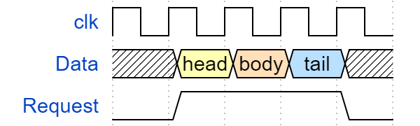

将1调整为2后：

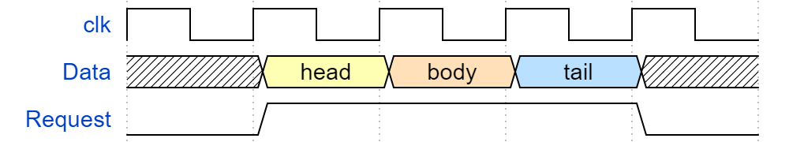

调整`hscale`参数大小能够调整一个时间单元对应的宽度。参数应当是大于0的整数。默认值为1.

### 7.2 skin 风格？

`config:{skin:'...'}`语句调整`skin`，只有两种：`default`和`narrow，前者是默认，后者更窄一点。

需要注意的是，如果需要同时调整`skin`与`hscale`，需要像下面这样写：

```json
{ signal: [
  { name: "clk",     wave: "p...." },
  { name: "Data",    wave: "x345x",  data: ["head", "body", "tail"] },
  { name: "Request", wave: "01..0" }
  ],
  config: { hscale: 2 },
  config:{skin:"default"},
}
```

### 7.3 head/foot 上下标注

`head:{...}`和`foot:{...}`分别定义了时序图上下区域中的内容。

- tick:添加与垂直标记（时间单元的边界）对齐的时间线标签
- tock:在垂直标记之间添加时间线标签
- text:添加标题或说明文字
- every:每隔N个周期进行tick/tock操作

多说无益，看代码：

```json
{signal: [
  {name:'clk',         wave: 'p....' },
  {name:'Data',        wave: 'x345x', data: 'a b c' },
  {name:'Request',     wave: '01..0' }
],
 head:{
   text:'WaveDrom example',
   tick:0,
   every:2
 },
 foot:{
   text:'Figure 100',
   tock:9
 },
}
```

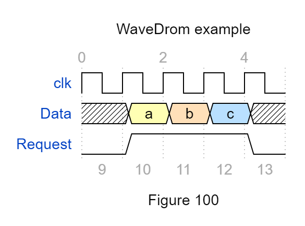

需要注意的点：

1. `tick/tock`语句后面跟的参数，意味着时间线标记开始的数字
2. `head`开启了`tick`，且`every=2`，每隔两个周期才会标记一次

`head/text`文本具有svg文本的所有属性。可以使用标准的svg`tspan`属性来修改文本的默认属性。使用`text`命令即可对文字标注进行调整。

- `h1` `h2` `h3` `h4` `h5` `h6` 定义了字体大小。`h1`最大。
- `muted` `warning` `error` `info` `success`定义了字体颜色风格。分别：灰/黄/红/蓝/绿。

看代码：

```json
{signal: [
  {name:'clk', wave: 'p.....PPPPp....' },
  {name:'dat', wave: 'x....2345x.....', data: 'a b c d' },
  {name:'req', wave: '0....1...0.....' }
],
head: {text:
  ['tspan',
    ['tspan', {class:'error h1'}, 'error '],
    ['tspan', {class:'warning h2'}, 'warning '],
    ['tspan', {class:'info h3'}, 'info '],
    ['tspan', {class:'success h4'}, 'success '],
    ['tspan', {class:'muted h5'}, 'muted '],
    ['tspan', {class:'h6'}, 'h6 '],
    'default ',
    ['tspan', {fill:'pink', 'font-weight':'bold', 'font-style':'italic'}, 'pink-bold-italic']
  ]
},
foot: {text:
  ['tspan', 'E=mc',
    ['tspan', {dy:'-5'}, '2'],
    ['tspan', {dy: '5'}, '. '],
    ['tspan', {'font-size':'25'}, 'B '],
    ['tspan', {'text-decoration':'overline'},'over '],
    ['tspan', {'text-decoration':'underline'},'under '],
    ['tspan', {'baseline-shift':'sub'}, 'sub '],
    ['tspan', {'baseline-shift':'super'}, 'super ']
  ],tock:-5
}
}
```

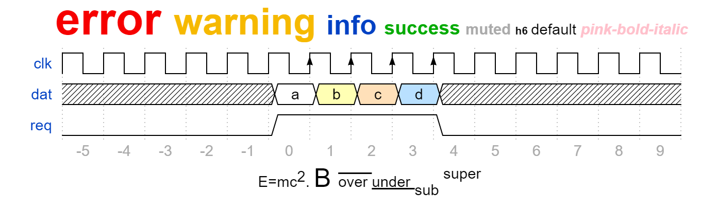

## Step 8. Arrows 箭头

可以对波形图中的两点进行连线，并附上文字。有两种：曲线和直线。

### 8.1 直线

先看代码：

```json
{ signal: [
  { name: 'A', wave: '01..0..',  node: '.a..e..' },
  { name: 'B', wave: '0.1..0.',  node: '..b..d.', phase:0.5 },
  { name: 'C', wave: '0..1..0',  node: '...c..f' },
  {                              node: '...g..h' },
  {                              node: '...I..J',  phase:0.5 },
  { name: 'D', wave: '0..1..0',  phase:0.5 }
  ],
  edge: [
    'b-|a t1', 'a-|c t2', 'b-|-c t3', 'c-|->e t4', 'e-|>f more text',
    'e|->d t6', 'c-g', 'f-h', 'g<->h 3 ms', 'I+J 5 ms'
  ]
}
```

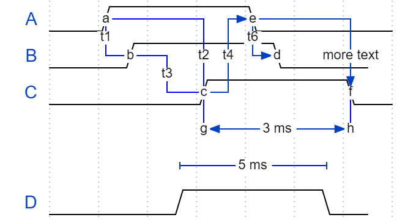

翻译：（其实符号本身能和形状能够对应起来）

- `-` 两点直接连线
- `-|` 带一个拐点的连线
- `-|-` 带两个拐点的连线
- `<->` 双箭头两点直线
- `<-|>` 带一个拐点的双箭头直线
- `<-|->` 带两个拐点的双箭头直线
- `->` 单箭头两点直线
- `-|>或|->` 带一个拐点的单箭头直线 两者方向不同
- `-|->` 带两个拐点的单箭头直线

### 8.2 曲线

```json
{ signal: [
  { name: 'A', wave: '01........0....',  node: '.a........j' },
  { name: 'B', wave: '0.1.......0.1..',  node: '..b.......i' },
  { name: 'C', wave: '0..1....0...1..',  node: '...c....h..' },
  { name: 'D', wave: '0...1..0.....1.',  node: '....d..g...' },
  { name: 'E', wave: '0....10.......1',  node: '.....ef....' }
  ],
  edge: [
    'a~b t1', 'c-~a t2', 'c-~>d time 3', 'd~-e',
    'e~>f', 'f->g', 'g-~>h', 'h~>i some text', 'h~->j'
  ]
}
```

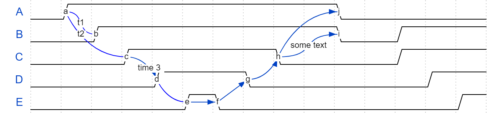

翻译：

- `~` S曲线
- `-~` 单段曲线
- `<~>` 双箭头S曲线
- `<-~>` 双箭头单段曲线
- `~>` 单箭头S曲线
- `-~>或~->` 单箭头单段曲线 二者弯向的方向不同

## Step 9. Some code 一些代码

```json
(function (bits, ticks) {
  var i, t, gray, state, data = [], arr = [];
  for (i = 0; i < bits; i++) {
    arr.push({name: i + '', wave: ''});
    state = 1;
    for (t = 0; t < ticks; t++) {
      data.push(t + '');
      gray = (((t >> 1) ^ t) >> i) & 1;
      arr[i].wave += (gray === state) ? '.' : gray + '';
      state = gray;
    }
  }
  arr.unshift('gray');
  return {signal: [
    {name: 'bin', wave: '='.repeat(ticks), data: data}, arr
  ]};
})(5, 16)
```

可能是某种自动化？不知道用什么语言运行，我也不会js，这一块压根没看hh。
